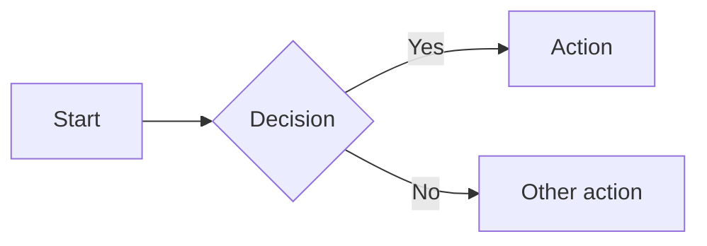

# Mintlify reference

Complete reference for building documentation with Mintlify. This skill contains inline syntax for all components, configuration options, and navigation patterns so you can work without external lookups.

## Before you start

Read the project's `docs.json` file first. It defines the site's navigation, theme, colors, and configuration. Understanding it tells you how the site is structured and what conventions to follow.

Search for existing content before creating new pages. You may need to update an existing page, add a section, or link to existing content rather than duplicating.

Read 2-3 similar pages to match the site's voice, structure, and formatting.

## File format

Mintlify uses MDX files (`.mdx` or `.md`) with YAML frontmatter. MDX combines Markdown with React components.

```
project/
├── docs.json           # Site configuration (required)
├── index.mdx
├── quickstart.mdx
├── guides/
│   └── example.mdx
├── openapi.yml         # API specification (optional)
├── images/             # Static assets
│   └── example.png
└── snippets/           # Reusable components
    └── component.jsx
```

### File naming

- Match existing patterns in the directory
- If no existing files or mixed file naming patterns, use kebab-case: `getting-started.mdx`
- Add new pages to `docs.json` navigation or they won't appear in the sidebar

### Internal links

- Use root-relative paths without file extensions: `/getting-started/quickstart`
- Do not use relative paths (`../`) or absolute URLs for internal pages

## Page frontmatter

Every page requires `title` in its frontmatter. Include `description` and `keywords` for SEO.

```yaml
---
title: "Clear, descriptive title"
description: "Concise summary for SEO and navigation."
keywords: ["relevant", "search", "terms"]
---
```

### Frontmatter fields

| Field | Type | Required | Description |
|-------|------|----------|-------------|
| `title` | string | Yes | Page title in navigation and browser tabs. |
| `description` | string | No | Brief description for SEO. Displays under the title. |
| `sidebarTitle` | string | No | Short title for sidebar navigation. |
| `icon` | string | No | Lucide, Font Awesome, or Tabler icon name. Also accepts a URL or file path. |
| `iconType` | string | No | Font Awesome icon style: `regular`, `solid`, `light`, `thin`, `sharp-solid`, `duotone`, `brands`. |
| `tag` | string | No | Label next to page title in sidebar (e.g., "NEW"). |
| `hidden` | boolean | No | Remove from sidebar. Page still accessible by URL. |
| `noindex` | boolean | No | Prevent search engine indexing. |
| `mode` | string | No | Page layout: `default`, `wide`, `custom`, `frame`, `center`. |
| `keywords` | array | No | Search terms for internal search and SEO. |
| `api` | string | No | API endpoint for interactive playground (e.g., `"POST /users"`). |
| `openapi` | string | No | OpenAPI endpoint reference (e.g., `"GET /endpoint"`). |
| `url` | string | No | External URL. Makes the nav entry link externally. |
| `timestamp` | boolean | No | Override global timestamp setting for this page. |

### Page modes

```yaml
# Default: standard layout with sidebar and table of contents
---
title: "Page title"
---

# Wide: hides table of contents for extra horizontal space
---
title: "Page title"
mode: "wide"
---

# Custom: blank canvas, only top navbar visible
---
title: "Page title"
mode: "custom"
---

# Frame: like custom but keeps sidebar (Aspen and Almond themes only)
---
title: "Page title"
mode: "frame"
---

# Center: removes sidebar and TOC, centers content (Mint and Linden themes only)
---
title: "Page title"
mode: "center"
---
```

## docs.json configuration

The `docs.json` file controls the entire site. Required fields: `theme`, `name`, `colors.primary`, and `navigation`.

```json
{
  "$schema": "https://mintlify.com/docs.json",
  "theme": "mint",
  "name": "Your Docs",
  "colors": {
    "primary": "#3B82F6"
  },
  "navigation": {
    "groups": [
      {
        "group": "Getting started",
        "pages": ["index", "quickstart"]
      }
    ]
  }
}
```

### Theme

One of: `mint`, `maple`, `palm`, `willow`, `linden`, `almond`, `aspen`, `sequoia`.

| Theme | Character |
|-------|-----------|
| `mint` | Classic, time-tested |
| `maple` | Modern, clean, good for AI/SaaS |
| `palm` | Sophisticated, fintech-focused |
| `willow` | Stripped-back, minimal |
| `linden` | Retro terminal, monospace |
| `almond` | Card-based, minimalist |
| `aspen` | Modern, supports complex navigation |
| `sequoia` | Minimal, elegant, large-scale content |

### Colors

```json
"colors": {
  "primary": "#3B82F6",
  "light": "#F8FAFC",
  "dark": "#0F172A"
}
```

- `primary` (required): Main color, generally for emphasis in light mode.
- `light`: Color for emphasis in dark mode.
- `dark`: Color for buttons and hover states.

All values must be hex codes starting with `#`.

### Logo

```json
"logo": {
  "light": "/logo/light.svg",
  "dark": "/logo/dark.svg",
  "href": "https://example.com"
}
```

### Favicon

Single file or light/dark variants:

```json
"favicon": "/favicon.ico"
```

```json
"favicon": {
  "light": "/favicon.png",
  "dark": "/favicon-dark.png"
}
```

### Icons

```json
"icons": {
  "library": "lucide"
}
```

Options: `lucide` or `fontawesome`. You can only use one library per project. Individual icons can still use URLs or file paths regardless of this setting.

### Fonts

```json
"fonts": {
  "family": "Inter"
}
```

Google Fonts load automatically by family name. For custom fonts:

```json
"fonts": {
  "family": "CustomFont",
  "source": "/fonts/CustomFont.woff2",
  "format": "woff2",
  "weight": 400,
  "heading": {
    "family": "HeadingFont",
    "weight": 700
  },
  "body": {
    "family": "BodyFont",
    "weight": 400
  }
}
```

### Appearance

```json
"appearance": {
  "default": "system",
  "strict": false
}
```

- `default`: `"system"`, `"light"`, or `"dark"`.
- `strict`: Set `true` to hide the light/dark mode toggle.

### Background

```json
"background": {
  "image": {
    "light": "/bg-light.svg",
    "dark": "/bg-dark.svg"
  },
  "decoration": "gradient",
  "color": {
    "light": "#FFFFFF",
    "dark": "#000000"
  }
}
```

- `decoration`: `"gradient"`, `"grid"`, or `"windows"`.

### Styling

```json
"styling": {
  "eyebrows": "breadcrumbs",
  "latex": true,
  "codeblocks": {
    "theme": {
      "light": "github-light",
      "dark": "github-dark"
    }
  }
}
```

- `eyebrows`: `"section"` (default) or `"breadcrumbs"`.
- `latex`: Override automatic LaTeX detection.
- `codeblocks`: `"system"` (default), `"dark"`, a Shiki theme name, or an object with `light`/`dark` themes.

### Navbar

```json
"navbar": {
  "links": [
    {
      "label": "Community",
      "href": "https://example.com/community"
    },
    {
      "type": "github",
      "href": "https://github.com/example/repo"
    }
  ],
  "primary": {
    "type": "button",
    "label": "Get Started",
    "href": "https://example.com/start"
  }
}
```

Link types: omit `type` for standard text link, `"github"` for repo with star count, `"discord"` for server with online count.

Primary button types: `"button"`, `"github"`, `"discord"`.

### Footer

```json
"footer": {
  "socials": {
    "x": "https://x.com/example",
    "github": "https://github.com/example",
    "linkedin": "https://linkedin.com/company/example"
  },
  "links": [
    {
      "header": "Resources",
      "items": [
        { "label": "Blog", "href": "https://example.com/blog" }
      ]
    }
  ]
}
```

Valid social keys: `x`, `website`, `facebook`, `youtube`, `discord`, `slack`, `github`, `linkedin`, `instagram`, `hacker-news`, `medium`, `telegram`, `bluesky`, `threads`, `reddit`, `podcast`.

### Banner

```json
"banner": {
  "content": "Version 2.0 is live! [Learn more](/changelog)",
  "dismissible": true
}
```

Supports basic Markdown in content (links, bold, italic). Language-specific banners can be set inside the `navigation.languages` entries.

### Redirects

```json
"redirects": [
  {
    "source": "/old-page",
    "destination": "/new-page",
    "permanent": true
  }
]
```

### Metadata

```json
"metadata": {
  "timestamp": true
}
```

Shows "Last modified on [date]" on all pages. Override per-page with `timestamp` frontmatter.

### Interaction

```json
"interaction": {
  "drilldown": false
}
```

Controls whether clicking a navigation group navigates to its first page (`true`) or only expands/collapses (`false`).

### SEO

```json
"seo": {
  "metatags": {
    "canonical": "https://docs.example.com",
    "og:locale": "en_US"
  },
  "indexing": "navigable"
}
```

- `indexing`: `"navigable"` (only nav pages) or `"all"` (every page including hidden).

### Search

```json
"search": {
  "prompt": "Search documentation..."
}
```

### Contextual menu

```json
"contextual": {
  "options": ["copy", "chatgpt", "claude", "cursor", "vscode"]
}
```

Options: `copy`, `view`, `chatgpt`, `claude`, `perplexity`, `mcp`, `cursor`, `vscode`, or custom objects.

### Thumbnails

```json
"thumbnails": {
  "appearance": "light",
  "background": "/images/thumbnail-bg.svg",
  "fonts": {
    "family": "Inter"
  }
}
```

### Error handling

```json
"errors": {
  "404": {
    "redirect": true,
    "title": "Page not found",
    "description": "This page doesn't exist."
  }
}
```

### API configuration

```json
"api": {
  "openapi": "openapi.json",
  "playground": {
    "display": "interactive",
    "proxy": true
  },
  "examples": {
    "languages": ["bash", "javascript", "python"],
    "defaults": "all",
    "prefill": false,
    "autogenerate": true
  },
  "mdx": {
    "server": "https://api.example.com",
    "auth": {
      "method": "bearer"
    }
  }
}
```

- `openapi`: Single file, array, or object with `source` and `directory`.
- `asyncapi`: Same format as `openapi` for AsyncAPI specs.
- `playground.display`: `"interactive"`, `"simple"`, or `"none"`.
- `examples.languages`: `bash`, `go`, `java`, `javascript`, `node`, `php`, `powershell`, `python`, `ruby`, `swift`.
- `examples.defaults`: `"required"` or `"all"` (include optional params).
- `mdx.auth.method`: `"bearer"`, `"basic"`, `"key"`, `"cobo"`.

### Integrations

```json
"integrations": {
  "ga4": { "measurementId": "G-XXXXXXXXXX" },
  "gtm": { "tagId": "GTM-XXXXX" },
  "posthog": { "apiKey": "phc_xxx", "apiHost": "https://app.posthog.com" },
  "amplitude": { "apiKey": "xxx" },
  "mixpanel": { "projectToken": "xxx" },
  "segment": { "key": "xxx" },
  "clarity": { "projectId": "xxx" },
  "fathom": { "siteId": "xxx" },
  "hotjar": { "hjid": "xxx", "hjsv": "xxx" },
  "logrocket": { "appId": "xxx" },
  "heap": { "appId": "xxx" },
  "pirsch": { "id": "xxx" },
  "plausible": { "domain": "xxx", "server": "optional" },
  "hightouch": { "writeKey": "xxx", "apiHost": "optional" },
  "clearbit": { "publicApiKey": "xxx" },
  "intercom": { "appId": "xxx" },
  "frontchat": { "snippetId": "xxx" },
  "telemetry": { "enabled": true },
  "cookies": { "key": "consent_key", "value": "accepted" }
}
```

## Navigation

The `navigation` property in `docs.json` controls site structure. Choose one primary pattern at the root level.

### Pages

```json
{
  "navigation": {
    "pages": ["index", "quickstart", "guides/example"]
  }
}
```

### Groups

```json
{
  "navigation": {
    "groups": [
      {
        "group": "Getting started",
        "icon": "rocket",
        "pages": ["index", "quickstart"]
      },
      {
        "group": "Guides",
        "icon": "book-open",
        "tag": "NEW",
        "pages": [
          "guides/overview",
          {
            "group": "Advanced",
            "expanded": false,
            "pages": ["guides/advanced/config", "guides/advanced/deploy"]
          }
        ]
      }
    ]
  }
}
```

Group properties:
- `group` (required): Section title.
- `pages` (required): Array of page paths or nested groups.
- `icon`: Icon name.
- `tag`: Label displayed next to group name.
- `root`: Page that opens when clicking the group title.
- `expanded`: Default open state for nested groups (`true`/`false`). Top-level groups are always expanded.

### Tabs

```json
{
  "navigation": {
    "tabs": [
      {
        "tab": "Documentation",
        "icon": "book-open",
        "groups": [
          {
            "group": "Getting started",
            "pages": ["index", "quickstart"]
          }
        ]
      },
      {
        "tab": "API reference",
        "icon": "square-terminal",
        "pages": ["api/overview", "api/endpoints"]
      },
      {
        "tab": "Blog",
        "icon": "newspaper",
        "href": "https://example.com/blog"
      }
    ]
  }
}
```

#### Menus (within tabs)

```json
{
  "tab": "Developer tools",
  "menu": [
    {
      "item": "API reference",
      "icon": "rocket",
      "groups": [
        {
          "group": "Endpoints",
          "pages": ["api/get", "api/post"]
        }
      ]
    },
    {
      "item": "SDKs",
      "icon": "code",
      "description": "Client libraries",
      "pages": ["sdk/javascript", "sdk/python"]
    }
  ]
}
```

### Anchors

```json
{
  "navigation": {
    "anchors": [
      {
        "anchor": "Documentation",
        "icon": "book-open",
        "groups": [
          {
            "group": "Getting started",
            "pages": ["quickstart", "tutorial"]
          }
        ]
      },
      {
        "anchor": "Blog",
        "href": "https://example.com/blog"
      }
    ]
  }
}
```

#### Global anchors

Appear on all pages regardless of active section:

```json
{
  "navigation": {
    "global": {
      "anchors": [
        {
          "anchor": "Changelog",
          "icon": "list",
          "href": "/changelog"
        }
      ]
    },
    "tabs": [...]
  }
}
```

### Dropdowns

```json
{
  "navigation": {
    "dropdowns": [
      {
        "dropdown": "Documentation",
        "icon": "book-open",
        "groups": [
          {
            "group": "Getting started",
            "pages": ["index", "quickstart"]
          }
        ]
      },
      {
        "dropdown": "API reference",
        "icon": "square-terminal",
        "pages": ["api/overview"]
      }
    ]
  }
}
```

### Products

```json
{
  "navigation": {
    "products": [
      {
        "product": "Core API",
        "description": "Core API documentation",
        "icon": "server",
        "tabs": [
          {
            "tab": "Documentation",
            "groups": [
              { "group": "Getting started", "pages": ["core/quickstart"] }
            ]
          }
        ]
      },
      {
        "product": "Mobile SDK",
        "icon": "smartphone",
        "pages": ["mobile/overview"]
      }
    ]
  }
}
```

### Versions

```json
{
  "navigation": {
    "versions": [
      {
        "version": "2.0.0",
        "groups": [
          { "group": "Getting started", "pages": ["v2/overview", "v2/quickstart"] }
        ]
      },
      {
        "version": "1.0.0",
        "groups": [
          { "group": "Getting started", "pages": ["v1/overview", "v1/quickstart"] }
        ]
      }
    ]
  }
}
```

### Languages

```json
{
  "navigation": {
    "languages": [
      {
        "language": "en",
        "groups": [
          { "group": "Getting started", "pages": ["en/overview", "en/quickstart"] }
        ]
      },
      {
        "language": "es",
        "groups": [
          { "group": "Comenzando", "pages": ["es/overview", "es/quickstart"] }
        ]
      }
    ]
  }
}
```

Each language entry can include its own `banner` configuration.

### OpenAPI in navigation

```json
{
  "navigation": {
    "groups": [
      {
        "group": "API reference",
        "openapi": "/path/to/openapi.json",
        "pages": [
          "overview",
          "GET /users",
          "POST /users",
          {
            "group": "Products",
            "openapi": "/path/to/openapi-v2.json",
            "pages": ["GET /products", "POST /products"]
          }
        ]
      }
    ]
  }
}
```

When you add `openapi` to a navigation element without specifying pages, Mintlify auto-generates pages for all endpoints.

### Choosing a navigation pattern

| Pattern | When to use |
|---------|-------------|
| Groups | Default. Single audience, straightforward hierarchy. |
| Tabs | Distinct sections with different audiences or content types. |
| Anchors | Persistent section links at sidebar top. |
| Dropdowns | Multiple sections users switch between. |
| Products | Multi-product company with separate docs per product. |
| Versions | Multiple API/product versions. |
| Languages | Localized content. |

Navigation elements can nest within each other. Common combinations:
- Tabs containing groups
- Products containing tabs
- Versions containing tabs
- Anchors containing groups

## Components

### Callouts

Styled alert boxes for important information.

```mdx
<Note>Supplementary information, safe to skip.</Note>
<Info>Helpful context such as permissions or prerequisites.</Info>
<Tip>Recommendations or best practices.</Tip>
<Warning>Potentially destructive actions or important caveats.</Warning>
<Check>Success confirmation or completed status.</Check>
<Danger>Critical warnings about data loss or breaking changes.</Danger>
```

Custom callout with icon and color:

```mdx
<Callout icon="key" color="#FFC107" iconType="regular">
  Custom callout with specific icon and color.
</Callout>
```

### Accordions

Expandable/collapsible content sections.

```mdx
<Accordion title="Click to expand" icon="star" defaultOpen={false}>
  Hidden content revealed on click.
</Accordion>
```

Group multiple accordions:

```mdx
<AccordionGroup>
  <Accordion title="First section">Content one.</Accordion>
  <Accordion title="Second section">Content two.</Accordion>
</AccordionGroup>
```

Props:
- `title` (string, required): Header text.
- `description` (string): Detail text below title.
- `defaultOpen` (boolean, default: false): Initially expanded.
- `icon` (string): Icon name.
- `iconType` (string): Font Awesome style.

### Cards

Visual containers with titles, icons, and optional links.

```mdx
<Card title="Card title" icon="rocket" href="/quickstart">
  Card description text.
</Card>
```

```mdx
<Card
  title="With image"
  img="/images/example.png"
  href="/guide"
  cta="Read guide"
  horizontal
>
  Card with image and custom CTA.
</Card>
```

Props:
- `title` (string, required): Card title.
- `icon` (string): Icon name.
- `iconType` (string): Font Awesome style.
- `color` (string): Hex color for icon.
- `href` (string): Link destination.
- `horizontal` (boolean): Compact horizontal layout.
- `img` (string): Image URL or path for top of card.
- `cta` (string): Custom action button text.
- `arrow` (boolean): Show link arrow.

### Columns

Multi-column responsive grid layout. Use with Cards or other content.

```mdx
<Columns cols={3}>
  <Card title="First" icon="one">Content</Card>
  <Card title="Second" icon="two">Content</Card>
  <Card title="Third" icon="three">Content</Card>
</Columns>
```

Props:
- `cols` (number, default: 2): Number of columns, 1-4.

### Steps

Numbered step-by-step procedures.

```mdx
<Steps>
  <Step title="Install the CLI">
    ```bash
    npm i -g mint
    ```
  </Step>
  <Step title="Initialize your project">
    ```bash
    mint init
    ```
  </Step>
  <Step title="Start development server">
    ```bash
    mint dev
    ```
  </Step>
</Steps>
```

Step props:
- `title` (string): Step title.
- `icon` (string): Icon name.
- `iconType` (string): Font Awesome style.
- `stepNumber` (number): Override automatic numbering.
- `titleSize` (string, default: "p"): `"p"`, `"h2"`, or `"h3"`.

### Tabs

Switchable tabbed content sections.

```mdx
<Tabs>
  <Tab title="npm">
    ```bash
    npm install package-name
    ```
  </Tab>
  <Tab title="yarn">
    ```bash
    yarn add package-name
    ```
  </Tab>
</Tabs>
```

Tabs props:
- `sync` (boolean, default: true): Sync tab selection with other tabs and code groups with matching titles.
- `borderBottom` (boolean): Add bottom border and padding.

Tab props:
- `title` (string, required): Tab name.
- `icon` (string): Icon name.
- `iconType` (string): Font Awesome style.

### Code groups

Tabbed code examples in multiple languages. Tabs sync with `<Tabs>` components that have matching titles.

```mdx
<CodeGroup>

```javascript example.js
const greeting = "Hello, world!";
console.log(greeting);
```

```python example.py
greeting = "Hello, world!"
print(greeting)
```

</CodeGroup>
```

For dropdown style instead of tabs:

```mdx
<CodeGroup dropdown>
  ...code blocks...
</CodeGroup>
```

### Expandables

Show/hide nested properties. Primarily used in API documentation.

```mdx
<Expandable title="properties" defaultOpen={false}>
  <ResponseField name="id" type="string">Unique identifier.</ResponseField>
  <ResponseField name="name" type="string">Display name.</ResponseField>
</Expandable>
```

Props:
- `title` (string): Toggle label.
- `defaultOpen` (boolean, default: false): Initially expanded.

### Fields

Document API parameters and response structures.

#### ParamField

```mdx
<ParamField path="query.limit" type="number" required default="10" placeholder="1-100">
  Maximum number of results to return.
</ParamField>

<ParamField path="body.email" type="string" required>
  User email address.
</ParamField>

<ParamField path="header.Authorization" type="string" required>
  Bearer token for authentication.
</ParamField>
```

Props:
- First parameter format: `query.name`, `path.name`, `body.name`, or `header.name`.
- `type` (string): `number`, `string`, `boolean`, `object`. Append `[]` for arrays.
- `required` (boolean): Mark as required.
- `deprecated` (boolean): Mark as deprecated.
- `default` (any): Default value.
- `placeholder` (string): Playground input placeholder.

#### ResponseField

```mdx
<ResponseField name="user_id" type="string" required>
  Unique user identifier.
</ResponseField>

<ResponseField name="data" type="object">
  <Expandable title="properties">
    <ResponseField name="id" type="string">Record ID.</ResponseField>
    <ResponseField name="status" type="string">Current status.</ResponseField>
  </Expandable>
</ResponseField>
```

Props:
- `name` (string, required): Field name.
- `type` (string, required): Field type.
- `required` (boolean): Required indicator.
- `deprecated` (boolean): Deprecation flag.
- `default` (string): Default value.

### Request and response examples

Display code examples in the right sidebar on API pages.

```mdx
<RequestExample>

```bash cURL
curl --request POST \
  --url https://api.example.com/users \
  --header 'Authorization: Bearer TOKEN'
```

```python Python
import requests
response = requests.post(
    "https://api.example.com/users",
    headers={"Authorization": "Bearer TOKEN"}
)
```

</RequestExample>

<ResponseExample>

```json 200
{
  "id": "usr_123",
  "status": "active"
}
```

</ResponseExample>
```

### Frames

Styled container for images with optional captions.

```mdx
<Frame caption="Dashboard overview">
  
</Frame>
```

Props:
- `caption` (string): Text below image. Supports Markdown.
- `hint` (string): Text above image.

### Icons

Display icons inline.

```mdx
<Icon icon="rocket" size={24} color="#3B82F6" />

Text with <Icon icon="check" iconType="solid" /> inline icon.
```

Props:
- `icon` (string, required): Icon name, URL, or file path.
- `iconType` (string): Font Awesome style.
- `size` (number): Pixel size.
- `color` (string): Hex color.

### Tooltips

Hover-triggered contextual help.

```mdx
<Tooltip tip="Application Programming Interface" headline="API" cta="Read API guide" href="/api">
  API
</Tooltip> requests are sent over HTTPS.
```

Props:
- `tip` (string, required): Tooltip text.
- `headline` (string): Text above tip.
- `cta` (string): Call-to-action link text.
- `href` (string): Link URL (required if using `cta`).

### Badge

Inline labels and status indicators.

```mdx
<Badge color="green" size="md" shape="pill" icon="check">
  Active
</Badge>
```

Props:
- `color` (string, default: "gray"): `gray`, `blue`, `green`, `yellow`, `orange`, `red`, `purple`, `white`, `surface`.
- `size` (string, default: "md"): `xs`, `sm`, `md`, `lg`.
- `shape` (string, default: "rounded"): `rounded`, `pill`.
- `icon` (string): Icon name.
- `stroke` (boolean): Outline style instead of filled.
- `disabled` (boolean): Reduced opacity.

### Tree

Display hierarchical file/folder structures.

```mdx
<Tree>
  <Tree.Folder name="src" defaultOpen>
    <Tree.File name="index.ts" />
    <Tree.Folder name="components" defaultOpen>
      <Tree.File name="Button.tsx" />
      <Tree.File name="Input.tsx" />
    </Tree.Folder>
  </Tree.Folder>
  <Tree.File name="package.json" />
</Tree>
```

Tree.Folder props:
- `name` (string, required): Folder name.
- `defaultOpen` (boolean, default: false): Expanded by default.
- `openable` (boolean, default: true): Can expand/collapse.

Tree.File props:
- `name` (string, required): File name.

### Mermaid diagrams

Use mermaid code blocks for flowcharts, sequence diagrams, and more.

````mdx

````

### Panel

Customize right sidebar content, replacing the table of contents.

```mdx
<Panel>
  <Info>Custom sidebar content goes here.</Info>
</Panel>
```

### Prompt

Display copyable AI prompts.

```mdx
<Prompt description="Generate a README" actions={["copy", "cursor"]}>
You are a technical writer. Generate a README for a Node.js project
that includes installation, usage, and contributing sections.
</Prompt>
```

Props:
- `description` (string, required): Card header. Supports Markdown.
- `actions` (array, default: ["copy"]): `"copy"`, `"cursor"`.
- `icon` (string): Icon name.

### Color

Display color palettes with click-to-copy.

```mdx
<Color variant="compact">
  <Color.Item name="primary" value="#3B82F6" />
  <Color.Item name="success" value="#22C55E" />
  <Color.Item name="theme-aware" value={{ light: "#000", dark: "#FFF" }} />
</Color>
```

Table variant with rows:

```mdx
<Color variant="table">
  <Color.Row title="Brand">
    <Color.Item name="primary" value="#3B82F6" />
    <Color.Item name="secondary" value="#8B5CF6" />
  </Color.Row>
</Color>
```

### Tiles

Visual preview cards, typically used in grid layouts.

```mdx
<Columns cols={3}>
  <Tile href="/components/accordions" title="Accordion" description="Expandable content">
    
  </Tile>
</Columns>
```

Props:
- `href` (string, required): Link destination.
- `title` (string): Tile title.
- `description` (string): Short description.

### Update

Display changelog entries and release notes.

```mdx
<Update label="2024-10-11" description="v2.0.0" tags={["Feature", "Release"]}>
  ## What's new

  - Added dark mode support
  - Improved search performance
</Update>
```

Props:
- `label` (string, required): Date or version identifier.
- `description` (string): Version or release name.
- `tags` (string[]): Filterable tags.
- `rss` (object): Custom RSS entry with `title` and `description`.

### View

Language/framework-specific content sections that switch with a multi-view dropdown.

```mdx
<View title="JavaScript" icon="js">
  ```javascript
  console.log("Hello from JavaScript!");
  ```
</View>

<View title="Python" icon="python">
  ```python
  print("Hello from Python!")
  ```
</View>
```

Props:
- `title` (string, required): View selector label.
- `icon` (string): Icon name.

## API documentation

### OpenAPI setup

Add your OpenAPI spec to `docs.json`:

```json
"api": {
  "openapi": "openapi.json"
}
```

Multiple specs:

```json
"api": {
  "openapi": ["openapi/v1.json", "openapi/v2.json"]
}
```

Reference individual endpoints in navigation:

```json
{
  "group": "Users",
  "openapi": "openapi.json",
  "pages": ["GET /users", "POST /users", "GET /users/{id}"]
}
```

### OpenAPI extensions

- `x-hidden`: Creates page but hides from navigation.
- `x-excluded`: Completely excludes endpoint from docs.
- `x-codeSamples`: Custom code examples per endpoint.

```yaml
paths:
  /users:
    get:
      x-codeSamples:
        - lang: "bash"
          label: "List users"
          source: |
            curl https://api.example.com/users
```

### MDX manual API pages

For endpoints without an OpenAPI spec:

```yaml
---
title: "Create user"
api: "POST https://api.example.com/users"
---
```

Or with a base URL configured in `docs.json`:

```yaml
---
title: "Create user"
api: "POST /users"
---
```

### AsyncAPI

For WebSocket and event-driven APIs:

```json
"api": {
  "asyncapi": "asyncapi.yaml"
}
```

Reference channels in frontmatter:

```yaml
---
title: "WebSocket channel"
asyncapi: "/path/to/asyncapi.json channelName"
---
```

## Reusable snippets

Store reusable content in the `/snippets/` directory.

### MDX snippets

```mdx
<!-- snippets/prerequisites.mdx -->
Before you begin, make sure you have:
- Node.js 18+
- A Mintlify account
```

Import in any page:

```mdx
import Prerequisites from "/snippets/prerequisites.mdx";

<Prerequisites />
```

### JSX components

```jsx
// snippets/counter.jsx
export const Counter = () => {
  const [count, setCount] = useState(0);
  return (
    <div>
      <button onClick={() => setCount(count - 1)}>-</button>
      <span>{count}</span>
      <button onClick={() => setCount(count + 1)}>+</button>
    </div>
  );
};
```

Import in any page:

```mdx
import { Counter } from "/snippets/counter.jsx";

<Counter />
```

JSX components must be in `/snippets/`. Nested imports between snippets are not supported.

## Hidden pages and .mintignore

### Hidden pages

Set `hidden: true` in frontmatter to remove from sidebar. Page remains accessible by URL.

```yaml
---
title: "Internal reference"
hidden: true
---
```

Or omit the page from `docs.json` navigation entirely.

### .mintignore

Exclude files completely from the published docs. Place `.mintignore` in the docs root. Uses `.gitignore` syntax.

```
drafts/
*.draft.mdx
private-notes.md
**/internal/**
!important.mdx
```

Files in `.mintignore` are not published, not indexed, and not accessible by URL.

## Custom CSS and JavaScript

### CSS

Add `.css` files to your repository. Class names become available in all MDX files.

```css
/* styles.css */
#navbar {
  background: #fffff2;
}
```

Built-in Tailwind CSS v3 classes are available. Arbitrary values (e.g., `w-[350px]`) are not supported — use inline `style` instead.

### JavaScript

Any `.js` file in the content directory is included globally on all pages.

## CLI commands

- `npm i -g mint` — Install the Mintlify CLI.
- `mint dev` — Local preview at localhost:3000.
- `mint broken-links` — Check internal links.
- `mint a11y` — Check for accessibility issues.
- `mint rename` — Rename/move files and update references.
- `mint validate` — Validate documentation builds.
- `mint upgrade` — Upgrade from `mint.json` to `docs.json`.

## Writing standards

- Second-person voice ("you").
- Active voice, direct language.
- Sentence case for headings ("Getting started", not "Getting Started").
- Sentence case for code block titles.
- All code blocks must have language tags.
- All images must have descriptive alt text.
- No marketing language, filler phrases, or emoji.
- Keep code examples simple, practical, and tested.
