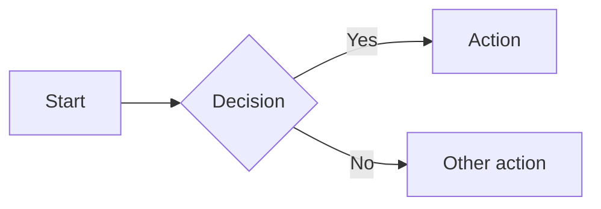

# Components reference

Full syntax and props for all Mintlify components.

## Callouts

Styled alert boxes for important information.

```mdx
<Note>Supplementary information, safe to skip.</Note>
<Info>Helpful context such as permissions or prerequisites.</Info>
<Tip>Recommendations or best practices.</Tip>
<Warning>Potentially destructive actions or important caveats.</Warning>
<Check>Success confirmation or completed status.</Check>
<Danger>Critical warnings about data loss or breaking changes.</Danger>
```

Custom callout with icon and color:

```mdx
<Callout icon="key" color="#FFC107" iconType="regular">
  Custom callout with specific icon and color.
</Callout>
```

## Accordions

Expandable/collapsible content sections.

```mdx
<Accordion title="Click to expand" icon="star" defaultOpen={false}>
  Hidden content revealed on click.
</Accordion>
```

Group multiple accordions:

```mdx
<AccordionGroup>
  <Accordion title="First section">Content one.</Accordion>
  <Accordion title="Second section">Content two.</Accordion>
</AccordionGroup>
```

Props:
- `title` (string, required): Header text.
- `description` (string): Detail text below title.
- `defaultOpen` (boolean, default: false): Initially expanded.
- `icon` (string): Icon name.
- `iconType` (string): Font Awesome style.

## Cards

Visual containers with titles, icons, and optional links.

```mdx
<Card title="Card title" icon="rocket" href="/quickstart">
  Card description text.
</Card>
```

```mdx
<Card
  title="With image"
  img="/images/example.png"
  href="/guide"
  cta="Read guide"
  horizontal
>
  Card with image and custom CTA.
</Card>
```

Props:
- `title` (string, required): Card title.
- `icon` (string): Icon name.
- `iconType` (string): Font Awesome style.
- `color` (string): Hex color for icon.
- `href` (string): Link destination.
- `horizontal` (boolean): Compact horizontal layout.
- `img` (string): Image URL or path for top of card.
- `cta` (string): Custom action button text.
- `arrow` (boolean): Show link arrow.

## Columns

Multi-column responsive grid layout. Use with Cards or other content.

```mdx
<Columns cols={3}>
  <Card title="First" icon="one">Content</Card>
  <Card title="Second" icon="two">Content</Card>
  <Card title="Third" icon="three">Content</Card>
</Columns>
```

Props:
- `cols` (number, default: 2): Number of columns, 1-4.

## Steps

Numbered step-by-step procedures.

```mdx
<Steps>
  <Step title="Install the CLI">
    ```bash
    npm i -g mint
    ```
  </Step>
  <Step title="Initialize your project">
    ```bash
    mint init
    ```
  </Step>
  <Step title="Start development server">
    ```bash
    mint dev
    ```
  </Step>
</Steps>
```

Step props:
- `title` (string): Step title.
- `icon` (string): Icon name.
- `iconType` (string): Font Awesome style.
- `stepNumber` (number): Override automatic numbering.
- `titleSize` (string, default: "p"): `"p"`, `"h2"`, or `"h3"`.

## Tabs

Switchable tabbed content sections.

```mdx
<Tabs>
  <Tab title="npm">
    ```bash
    npm install package-name
    ```
  </Tab>
  <Tab title="yarn">
    ```bash
    yarn add package-name
    ```
  </Tab>
</Tabs>
```

Tabs props:
- `sync` (boolean, default: true): Sync tab selection with other tabs and code groups with matching titles.
- `borderBottom` (boolean): Add bottom border and padding.

Tab props:
- `title` (string, required): Tab name.
- `icon` (string): Icon name.
- `iconType` (string): Font Awesome style.

## Code groups

Tabbed code examples in multiple languages. Tabs sync with `<Tabs>` components that have matching titles.

```mdx
<CodeGroup>

```javascript example.js
const greeting = "Hello, world!";
console.log(greeting);
```

```python example.py
greeting = "Hello, world!"
print(greeting)
```

</CodeGroup>
```

For dropdown style instead of tabs:

```mdx
<CodeGroup dropdown>
  ...code blocks...
</CodeGroup>
```

## Expandables

Show/hide nested properties. Primarily used in API documentation.

```mdx
<Expandable title="properties" defaultOpen={false}>
  <ResponseField name="id" type="string">Unique identifier.</ResponseField>
  <ResponseField name="name" type="string">Display name.</ResponseField>
</Expandable>
```

Props:
- `title` (string): Toggle label.
- `defaultOpen` (boolean, default: false): Initially expanded.

## Fields

Document API parameters and response structures.

### ParamField

```mdx
<ParamField path="query.limit" type="number" required default="10" placeholder="1-100">
  Maximum number of results to return.
</ParamField>

<ParamField path="body.email" type="string" required>
  User email address.
</ParamField>

<ParamField path="header.Authorization" type="string" required>
  Bearer token for authentication.
</ParamField>
```

Props:
- First parameter format: `query.name`, `path.name`, `body.name`, or `header.name`.
- `type` (string): `number`, `string`, `boolean`, `object`. Append `[]` for arrays.
- `required` (boolean): Mark as required.
- `deprecated` (boolean): Mark as deprecated.
- `default` (any): Default value.
- `placeholder` (string): Playground input placeholder.

### ResponseField

```mdx
<ResponseField name="user_id" type="string" required>
  Unique user identifier.
</ResponseField>

<ResponseField name="data" type="object">
  <Expandable title="properties">
    <ResponseField name="id" type="string">Record ID.</ResponseField>
    <ResponseField name="status" type="string">Current status.</ResponseField>
  </Expandable>
</ResponseField>
```

Props:
- `name` (string, required): Field name.
- `type` (string, required): Field type.
- `required` (boolean): Required indicator.
- `deprecated` (boolean): Deprecation flag.
- `default` (string): Default value.

## Request and response examples

Display code examples in the right sidebar on API pages.

```mdx
<RequestExample>

```bash cURL
curl --request POST \
  --url https://api.example.com/users \
  --header 'Authorization: Bearer TOKEN'
```

```python Python
import requests
response = requests.post(
    "https://api.example.com/users",
    headers={"Authorization": "Bearer TOKEN"}
)
```

</RequestExample>

<ResponseExample>

```json 200
{
  "id": "usr_123",
  "status": "active"
}
```

</ResponseExample>
```

## Frames

Styled container for images with optional captions.

```mdx
<Frame caption="Dashboard overview">
  
</Frame>
```

Props:
- `caption` (string): Text below image. Supports Markdown.
- `hint` (string): Text above image.

## Icons

Display icons inline.

```mdx
<Icon icon="rocket" size={24} color="#3B82F6" />

Text with <Icon icon="check" iconType="solid" /> inline icon.
```

Props:
- `icon` (string, required): Icon name, URL, or file path.
- `iconType` (string): Font Awesome style.
- `size` (number): Pixel size.
- `color` (string): Hex color.

## Tooltips

Hover-triggered contextual help.

```mdx
<Tooltip tip="Application Programming Interface" headline="API" cta="Read API guide" href="/api">
  API
</Tooltip> requests are sent over HTTPS.
```

Props:
- `tip` (string, required): Tooltip text.
- `headline` (string): Text above tip.
- `cta` (string): Call-to-action link text.
- `href` (string): Link URL (required if using `cta`).

## Badge

Inline labels and status indicators.

```mdx
<Badge color="green" size="md" shape="pill" icon="check">
  Active
</Badge>
```

Props:
- `color` (string, default: "gray"): `gray`, `blue`, `green`, `yellow`, `orange`, `red`, `purple`, `white`, `surface`.
- `size` (string, default: "md"): `xs`, `sm`, `md`, `lg`.
- `shape` (string, default: "rounded"): `rounded`, `pill`.
- `icon` (string): Icon name.
- `stroke` (boolean): Outline style instead of filled.
- `disabled` (boolean): Reduced opacity.

## Tree

Display hierarchical file/folder structures.

```mdx
<Tree>
  <Tree.Folder name="src" defaultOpen>
    <Tree.File name="index.ts" />
    <Tree.Folder name="components" defaultOpen>
      <Tree.File name="Button.tsx" />
      <Tree.File name="Input.tsx" />
    </Tree.Folder>
  </Tree.Folder>
  <Tree.File name="package.json" />
</Tree>
```

Tree.Folder props:
- `name` (string, required): Folder name.
- `defaultOpen` (boolean, default: false): Expanded by default.
- `openable` (boolean, default: true): Can expand/collapse.

Tree.File props:
- `name` (string, required): File name.

## Mermaid diagrams

Use mermaid code blocks for flowcharts, sequence diagrams, and more.

````mdx

````

## Panel

Customize right sidebar content, replacing the table of contents.

```mdx
<Panel>
  <Info>Custom sidebar content goes here.</Info>
</Panel>
```

## Prompt

Display copyable AI prompts.

```mdx
<Prompt description="Generate a README" actions={["copy", "cursor"]}>
You are a technical writer. Generate a README for a Node.js project
that includes installation, usage, and contributing sections.
</Prompt>
```

Props:
- `description` (string, required): Card header. Supports Markdown.
- `actions` (array, default: ["copy"]): `"copy"`, `"cursor"`.
- `icon` (string): Icon name.

## Color

Display color palettes with click-to-copy.

```mdx
<Color variant="compact">
  <Color.Item name="primary" value="#3B82F6" />
  <Color.Item name="success" value="#22C55E" />
  <Color.Item name="theme-aware" value={{ light: "#000", dark: "#FFF" }} />
</Color>
```

Table variant with rows:

```mdx
<Color variant="table">
  <Color.Row title="Brand">
    <Color.Item name="primary" value="#3B82F6" />
    <Color.Item name="secondary" value="#8B5CF6" />
  </Color.Row>
</Color>
```

## Tiles

Visual preview cards, typically used in grid layouts.

```mdx
<Columns cols={3}>
  <Tile href="/components/accordions" title="Accordion" description="Expandable content">
    
  </Tile>
</Columns>
```

Props:
- `href` (string, required): Link destination.
- `title` (string): Tile title.
- `description` (string): Short description.

## Update

Display changelog entries and release notes.

```mdx
<Update label="2024-10-11" description="v2.0.0" tags={["Feature", "Release"]}>
  ## What's new

  - Added dark mode support
  - Improved search performance
</Update>
```

Props:
- `label` (string, required): Date or version identifier.
- `description` (string): Version or release name.
- `tags` (string[]): Filterable tags.
- `rss` (object): Custom RSS entry with `title` and `description`.

## View

Language/framework-specific content sections that switch with a multi-view dropdown.

```mdx
<View title="JavaScript" icon="js">
  ```javascript
  console.log("Hello from JavaScript!");
  ```
</View>

<View title="Python" icon="python">
  ```python
  print("Hello from Python!")
  ```
</View>
```

Props:
- `title` (string, required): View selector label.
- `icon` (string): Icon name.
