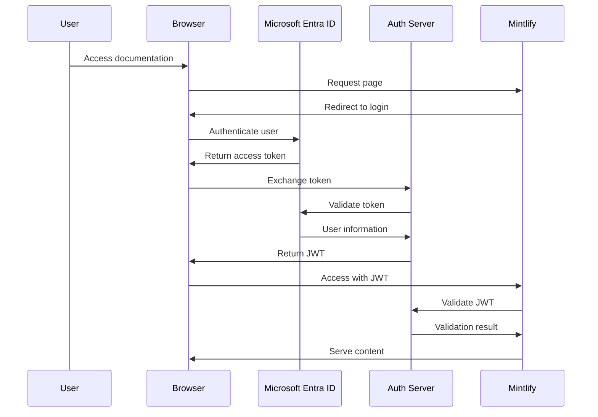

# JWT Authentication with Microsoft Entra ID

Microsoft Entra ID (formerly Azure Active Directory) is Microsoft's cloud-based identity and access management service. It provides secure authentication and authorization for applications, making it an excellent choice for protecting your Mintlify documentation with enterprise-grade security.

This guide will walk you through implementing JWT authentication with Microsoft Entra ID to secure your Mintlify documentation, ensuring only authorized users can access your content.

## Prerequisites

Before you begin, ensure you have:

- An active **Microsoft Entra ID tenant**
- **Global Administrator** or **Application Administrator** permissions in your Entra ID tenant
- A **Mintlify project** set up and ready for authentication configuration
- **Node.js** installed for running the authentication server
- Basic understanding of **JWT tokens** and OAuth 2.0 flows

## Step 1: Configure Microsoft Entra ID

### Register Your Application

1. Sign in to the [Microsoft Entra admin center](https://entra.microsoft.com/)

2. Navigate to **Applications** > **App registrations**

3. Click **New registration** and configure:
   - **Name**: Your application name (e.g., "Mintlify Documentation")
   - **Supported account types**: Choose based on your needs
   - **Redirect URI**: `https://your-domain.com/auth/callback`

4. Click **Register** to create the application

### Configure Authentication Settings

1. In your app registration, go to **Authentication**

2. Add platform configurations:
   - **Web**: Add your Mintlify domain URLs
   - **Single-page application**: If using client-side authentication

3. Configure **Implicit grant and hybrid flows** (if needed):
   - Check **Access tokens**
   - Check **ID tokens**

### Set Up API Permissions

1. Navigate to **API permissions**

2. Click **Add a permission** > **Microsoft Graph**

3. Add required permissions:
   - `User.Read` (Delegated)
   - `profile` (Delegated)
   - `openid` (Delegated)

4. Click **Grant admin consent** for your organization

### Generate Client Secret

1. Go to **Certificates & secrets**

2. Click **New client secret**

3. Add a description and set expiration

4. **Copy the secret value** immediately (you won't see it again)

<Warning>
Store your client secret securely. Never expose it in client-side code or public repositories.
</Warning>

## Step 2: Implementation

### Node.js Authentication Server

Create a Node.js server to handle JWT generation and validation:

```javascript
const express = require('express');
const jwt = require('jsonwebtoken');
const { Client } = require('@microsoft/microsoft-graph-client');
const { AuthenticationProvider } = require('@azure/msal-node');

const app = express();
app.use(express.json());

// Entra ID Configuration
const config = {
  auth: {
    clientId: process.env.ENTRA_CLIENT_ID,
    clientSecret: process.env.ENTRA_CLIENT_SECRET,
    authority: `https://login.microsoftonline.com/${process.env.ENTRA_TENANT_ID}`
  }
};

// JWT Secret for signing tokens
const JWT_SECRET = process.env.JWT_SECRET;

// Authentication endpoint
app.post('/auth/login', async (req, res) => {
  try {
    const { accessToken } = req.body;
    
    // Validate the Entra ID token
    const userInfo = await validateEntraToken(accessToken);
    
    if (!userInfo) {
      return res.status(401).json({ error: 'Invalid token' });
    }
    
    // Generate JWT for Mintlify
    const mintlifyToken = jwt.sign(
      {
        sub: userInfo.id,
        email: userInfo.mail || userInfo.userPrincipalName,
        name: userInfo.displayName,
        iat: Math.floor(Date.now() / 1000),
        exp: Math.floor(Date.now() / 1000) + (60 * 60) // 1 hour
      },
      JWT_SECRET,
      { algorithm: 'HS256' }
    );
    
    res.json({
      token: mintlifyToken,
      user: {
        id: userInfo.id,
        email: userInfo.mail || userInfo.userPrincipalName,
        name: userInfo.displayName
      }
    });
    
  } catch (error) {
    console.error('Authentication error:', error);
    res.status(500).json({ error: 'Authentication failed' });
  }
});

// Token validation function
async function validateEntraToken(accessToken) {
  try {
    const graphClient = Client.init({
      authProvider: {
        getAccessToken: async () => accessToken
      }
    });
    
    const user = await graphClient.api('/me').get();
    return user;
  } catch (error) {
    console.error('Token validation error:', error);
    return null;
  }
}

// JWT validation endpoint for Mintlify
app.post('/auth/validate', (req, res) => {
  try {
    const { token } = req.body;
    
    const decoded = jwt.verify(token, JWT_SECRET);
    
    res.json({
      valid: true,
      user: {
        id: decoded.sub,
        email: decoded.email,
        name: decoded.name
      }
    });
    
  } catch (error) {
    res.status(401).json({
      valid: false,
      error: 'Invalid token'
    });
  }
});

app.listen(3000, () => {
  console.log('Authentication server running on port 3000');
});
```

### Environment Variables

Create a `.env` file with your configuration:

```bash
ENTRA_CLIENT_ID=your-client-id
ENTRA_CLIENT_SECRET=your-client-secret
ENTRA_TENANT_ID=your-tenant-id
JWT_SECRET=your-jwt-secret-key
```

## Step 3: Configure Mintlify

Update your `mint.json` configuration file:

```json
{
  "auth": {
    "method": "jwt",
    "jwt": {
      "verification": {
        "endpoint": "https://your-auth-server.com/auth/validate",
        "method": "POST"
      }
    }
  }
}
```

## Step 4: Client-Side Integration

### HTML Login Page

Create a login page that integrates with Microsoft Entra ID:

```html
<!DOCTYPE html>
<html>
<head>
    <title>Login - Documentation</title>
    <script src="https://alcdn.msauth.net/browser/2.32.2/js/msal-browser.min.js"></script>
</head>
<body>
    <div id="login-container">
        <h2>Sign in to access documentation</h2>
        <button id="login-button">Sign in with Microsoft</button>
    </div>

    <script>
        const msalConfig = {
            auth: {
                clientId: 'your-client-id',
                authority: 'https://login.microsoftonline.com/your-tenant-id',
                redirectUri: window.location.origin + '/auth/callback'
            }
        };

        const msalInstance = new msal.PublicClientApplication(msalConfig);

        document.getElementById('login-button').addEventListener('click', async () => {
            try {
                const loginResponse = await msalInstance.loginPopup({
                    scopes: ['User.Read']
                });

                // Exchange Entra ID token for Mintlify JWT
                const response = await fetch('/auth/login', {
                    method: 'POST',
                    headers: {
                        'Content-Type': 'application/json'
                    },
                    body: JSON.stringify({
                        accessToken: loginResponse.accessToken
                    })
                });

                const data = await response.json();
                
                if (data.token) {
                    // Store JWT token
                    localStorage.setItem('mintlify_token', data.token);
                    
                    // Redirect to documentation
                    window.location.href = '/docs';
                } else {
                    alert('Authentication failed');
                }

            } catch (error) {
                console.error('Login failed:', error);
            }
        });
    </script>
</body>
</html>
```

## Authentication Flow

The authentication process follows this sequence:



1. **User Access**: User attempts to access protected documentation
2. **Redirect**: Mintlify redirects to login page
3. **Entra ID Auth**: User authenticates with Microsoft Entra ID
4. **Token Exchange**: Client exchanges Entra ID token for Mintlify JWT
5. **Validation**: Mintlify validates JWT with your auth server
6. **Access Granted**: User gains access to documentation

## Troubleshooting

### Common Issues and Solutions

<AccordionGroup>
  <Accordion title="CORS Errors">
    **Problem**: Cross-origin requests blocked by browser
    
    **Solution**: Configure CORS in your authentication server:
    ```javascript
    const cors = require('cors');
    app.use(cors({
      origin: ['https://your-mintlify-domain.com'],
      credentials: true
    }));
    ```
  </Accordion>

  <Accordion title="Token Validation Fails">
    **Problem**: JWT validation returns invalid token
    
    **Solutions**:
    - Check JWT secret matches between generation and validation
    - Verify token hasn't expired
    - Ensure proper token format (Bearer prefix if required)
    - Validate token signing algorithm matches
  </Accordion>

  <Accordion title="Entra ID Authentication Errors">
    **Problem**: Users can't authenticate with Entra ID
    
    **Solutions**:
    - Verify redirect URIs match exactly in app registration
    - Check API permissions are granted and consented
    - Ensure client ID and tenant ID are correct
    - Verify user has access to the application
  </Accordion>

  <Accordion title="Infinite Redirect Loops">
    **Problem**: User gets stuck in authentication redirect loop
    
    **Solutions**:
    - Check token storage and retrieval logic
    - Verify JWT expiration handling
    - Ensure proper error handling in auth flow
    - Clear browser storage/cookies and retry
  </Accordion>
</AccordionGroup>

## Security Best Practices

<CardGroup cols={2}>
  <Card title="Token Security" icon="shield">
    - Use HTTPS for all authentication endpoints
    - Set appropriate JWT expiration times
    - Store client secrets securely
    - Implement token refresh mechanisms
  </Card>

  <Card title="Access Control" icon="lock">
    - Implement proper RBAC in Entra ID
    - Use least privilege principle
    - Regular audit of user permissions
    - Monitor authentication attempts
  </Card>

  <Card title="Configuration" icon="gear">
    - Never expose secrets in client code
    - Use environment variables for config
    - Implement proper error handling
    - Log security events appropriately
  </Card>

  <Card title="Monitoring" icon="chart-line">
    - Monitor failed authentication attempts
    - Set up alerts for suspicious activity
    - Regular security reviews
    - Keep dependencies updated
  </Card>
</CardGroup>

### Additional Security Considerations

- **Certificate Validation**: Always validate SSL certificates in production
- **Rate Limiting**: Implement rate limiting on authentication endpoints
- **Session Management**: Properly handle session expiration and cleanup
- **Audit Logging**: Log all authentication events for security monitoring

<Info>
For production deployments, consider implementing additional security measures such as conditional access policies in Entra ID and multi-factor authentication requirements.
</Info>

## Next Steps

After implementing JWT authentication with Microsoft Entra ID:

1. **Test thoroughly** in a staging environment
2. **Set up monitoring** for authentication events
3. **Configure backup authentication** methods if needed
4. **Train users** on the new authentication process
5. **Plan for token renewal** and session management

Your Mintlify documentation is now secured with enterprise-grade Microsoft Entra ID authentication, providing seamless and secure access for your users.