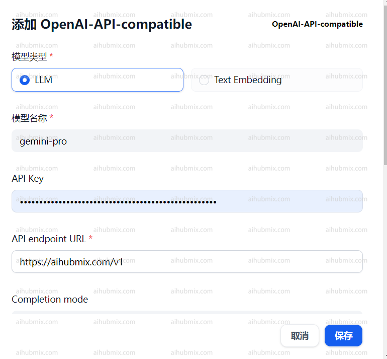

## 通常使用情况（使用OpenAI模型）
网页右上角点击自己的用户名，进入设置界面。  
在模型供应商中选择ApenAI并打开设置。  
 
- 在API Key一栏输入[本站的Key](https://aihubmix.com/token)。  
- 在API Base一栏输入：
```
https://aihubmix.com
```  
 

## 使用非OpenAI模型方法  
在模型供应商下拉找到OpenAI-API-compatible并点击添加模型。  

- 打开网站后台设置页面，找到模型列表。
- 复制你想要使用的模型名称（如gemini-pro或claude-3-opus-20240229）。
- 在API Key一栏输入[本站的Key](https://aihubmix.com/token)。  
- 在API endpoint URL一栏输入：
```
https://aihubmix.com/v1
```  
