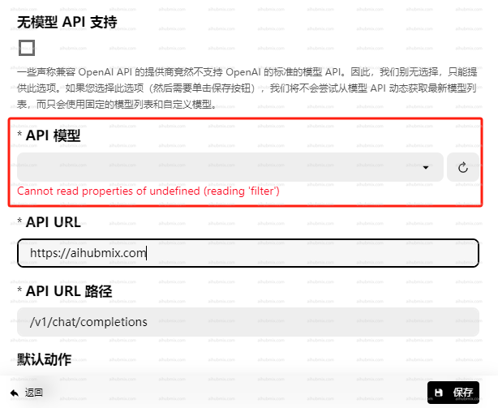
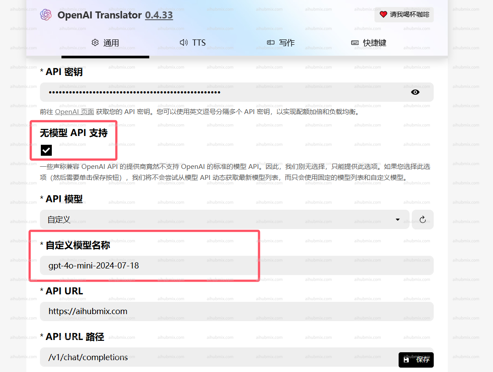

- 例如：OpenAI Translator；  
- API密钥 改成，从[本站的Key](https://aihubmix.com/token)中生成。  
- API URL改为：
```
https://aihubmix.com
```
(注意url结尾不要带"/")  
 

## 如果遇到模型刷不出来的问题看这里
**注：**
如果是0.4.33和0.4.34版本无法加载模型请退回老版本，
老板版本地址：https://github.com/openai-translator/openai-translator/releases/tag/v0.4.32  
如果遇到OpenAl Translator无法选择api模型的问题。
  
**可以尝试下列方法解决：**
- 勾选“无模型api支持”选项。
- 从我们网站的设置页面复制模型名，手动填入。

