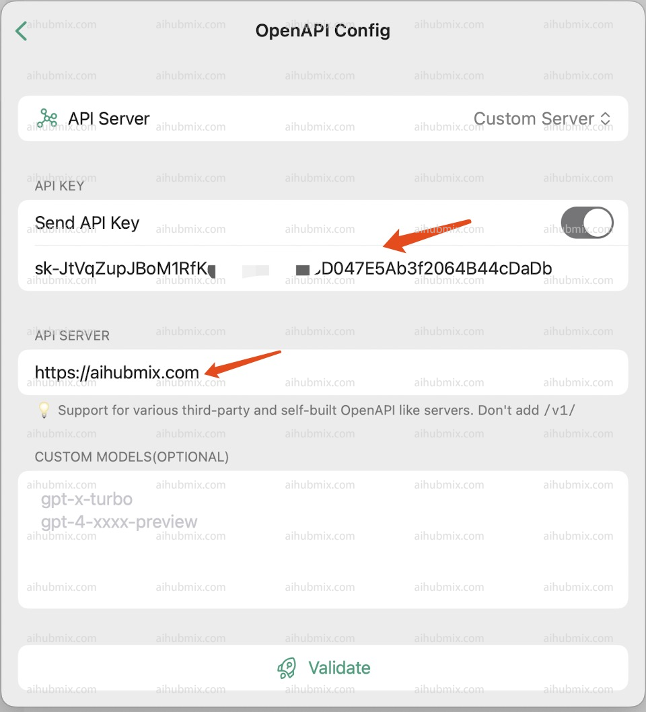

# 在Chatx中使用
Chatx下载地址：https://apps.apple.com/app/id6446304087
1. 打开设置，在设置中找到API Server Config。  


2. 选择OpenAPI。  

3. 上方API KEY一栏从[本站的Key](https://aihubmix.com/token)中生成。  
4. 下方API SERVER填：
```
https://aihubmix.com
```
