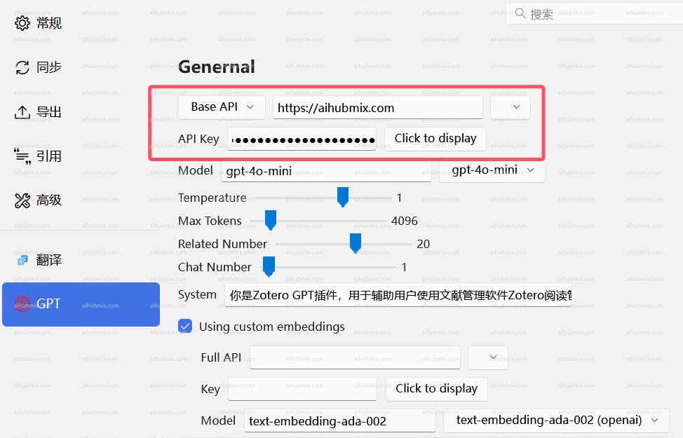
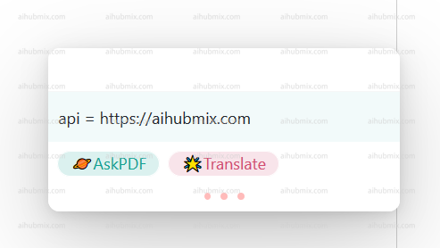

# 在Zotero中使用
## pdf阅读插件zotero-gpt
下载链接：https://github.com/MuiseDestiny/zotero-gpt/releases

安装好插件后在编辑中找到设置（老版本在编辑中首选项）。找到GPT的设置界面

按照如图所示配置Base API，并输入[API key](https://aihubmix.com/token)

或者使用以下命令设置

首选使用“ctrl＋/"打开使用窗口  
  
输入
```
/api https://aihubmix.com
```
并回车  
 
  
输入
```
/secretKey ＋密钥（从Key中生成， 记住别忘记带sk-）
```
 
  
切换模型命令  
```
/model gpt-3.5-turbo-0125 
```
  
选择自己要用的模型之后就可以使用了。  
  

## 翻译插件zotero-pdf-translate
下载链接：https://github.com/windingwind/zotero-pdf-translate/releases

编辑中找到设置（老版本在编辑中首选项）。找到翻译的设置界面  
接口地址填写: 
```
https://aihubmix.com/v1/chat/completions
```  
不用管状态是否显示可用 填上之后就可以了。  
 
