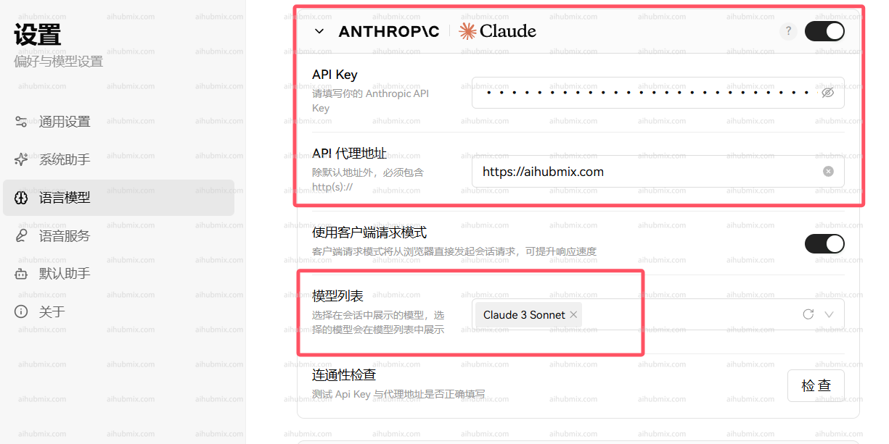

## 说明

Claude 系列模型支持通过官方原生接口调用，使用之前确保安装或升级 anthropic 依赖：

```bash
pip install -U anthropic
```
<Info>
非 claude 模型请用 openai 的接口格式调用。
</Info>

**端点（Endpoint）：** `POST` /v1/messages

## 调用

<CodeGroup>
```shell Curl
curl https://aihubmix.com/v1/messages \
     --header "x-api-key: $ANTHROPIC_API_KEY" \ #里换成 aihubmix 密钥
     --header "anthropic-version: 2023-06-01" \
     --header "content-type: application/json" \
     --data \
'{
    "model": "claude-3-5-sonnet-20241022",
    "max_tokens": 1024,
    "messages": [
        {"role": "user", "content": "Hello, world"}
    ]
}'
```

```py Python
import anthropic

client = anthropic.Anthropic(
    #将这里换成你在 aihubmix api keys 拿到的密钥
    api_key="ANTHROPIC_API_KEY",
    base_url="https://aihubmix.com"
)
message = client.messages.create(
    model="claude-3-5-sonnet-20241022",
    max_tokens=1024,
    messages=[
        {"role": "user", "content": "Hello, Claude"}
    ]
)
print(message.content)
```
</CodeGroup>

### Body 请求结构

```json
{
  "model": "claude-3-5-sonnet-20241022",
  "max_tokens": 1024,
  "messages": [
    {
      "role": "user",
      "content": "What is the meaning of life?"
    }
  ]
}
```

### 请求参数

|名称 | 位置 | 类型 | 必选 | 说明|
|---|---|---|---|---|
|x-api-key|header|string| 否 |Bearer AIHUBMIX_API_KEY|
|Content-Type|header|string| 否 |none|
|body|body|object| 否 |none|
|» model|body|string| 是 |none|
|» messages|body|[object]| 是 |none|
|»» role|body|string| 否 |none|
|»» content|body|string| 是 |none|
|» max_tokens|body|number| 是 |none|

### 返回示例

```json
200 Response
```

```json
{
  "id": "msg_013Uf6CwwyjSe35n3yVaPbLM",
  "type": "message",
  "role": "assistant",
  "model": "claude-3-5-sonnet-20241022",
  "content": [
    {
      "type": "text",
      "text": "That's one of humanity's most enduring and complex philosophical questions! While there's no universal answer, I aim to explore such questions thoughtfully while acknowledging their complexity. I try to focus on having meaningful conversations and helping where I can. What does meaning in life mean to you?"
    }
  ],
  "stop_reason": "end_turn",
  "stop_sequence": null,
  "usage": {
    "input_tokens": 14,
    "cache_creation_input_tokens": 0,
    "cache_read_input_tokens": 0,
    "output_tokens": 61
  }
}
```

### 返回结果

|状态码 | 状态码含义 | 说明 | 数据模型|
|---|---|---|---|
|200|OK|none|Inline|

## 在应用中使用（以 Lobe-Chat 为例）

- 进入设置页面选择模型服务商 Claude
- API key 输入[本站的 Key](https://aihubmix.com/token)
- 接口代理地址，直接输入下方的网址：

```
https://aihubmix.com
```

- 建议打开「使用客户端请求模式」
- 最后在模型列表添加自己要使用的模型（建议从我们网站的设置页面复制粘贴模型名后选择）\
  

  