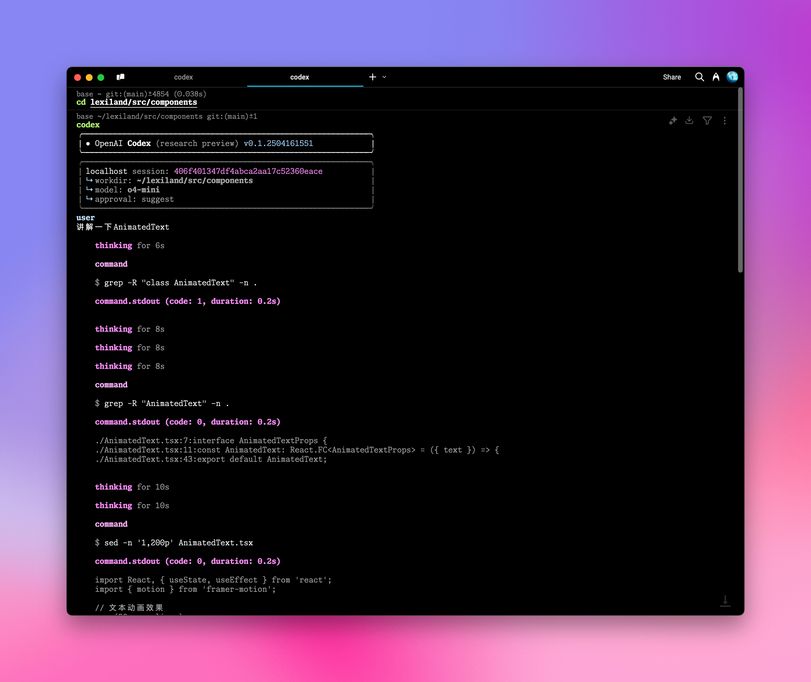

# OpenAI Codex CLI 集成

AiHubMix 提供了与 OpenAI [Codex CLI](https://github.com/openai/codex) 的无缝集成，让你可以在命令行环境中利用先进的 AI 编程助手。通过简单的配置步骤，即可在终端中直接使用自然语言执行各种编程和系统操作任务。

## 配置步骤

### 1. 环境变量设置

打开你的 Shell 配置文件（例如 `.zshrc` 或 `.bashrc`），添加以下环境变量：

```bash
export OPENAI_BASE_URL="https://api.aihubmix.com/v1"
export OPENAI_API_KEY="sk-***" # 替换为你的 AiHubMix API 密钥
```

<Warning>
这里的 `OPENAI_API_KEY` 应该使用 AiHubMix 的[密钥](https://aihubmix.com/token)，变量名保持为 `OPENAI_API_KEY` 是为了兼容 OpenAI 原生客户端。。
</Warning>

### 2. 应用配置更改

在终端中执行以下命令，使环境变量生效：

```bash
source ~/.zshrc  # 如果使用 zsh
# 或
source ~/.bashrc  # 如果使用 bash
```

### 3. 启动 Codex CLI

定位到你的项目目录，然后运行 `codex` 命令：

```bash
cd /你的项目路径
codex
```
  

### 4. 使用自然语言执行任务

现在你可以通过自然语言向 Codex CLI 输入指令，例如：

```bash
# 示例输入
讲解一下 AnimatedText
```
  

## 高级配置

<Tip>
-默认模型为极具性价比的 `o4-mini`，可以在 `~/.codex/config.json`修改
- 目前仅支持 OpenAI 家的模型，模型列表可在 [Responses API 文档](https://platform.openai.com/docs/api-reference/responses) 中查看
- 你可以通过编辑 `~/.codex/instructions.md` 文件来自定义系统提示词，定制 AI 助手的行为
</Tip>

## 实用命令参考

### 帮助命令
```bash
codex -h
```

### 完整命令选项
```bash
Usage
  $ codex [options] <prompt>

Options
  -h, --help                 显示帮助信息并退出
  -m, --model <model>        指定使用的模型 (默认: o4-mini)
  -i, --image <path>         包含图像输入的文件路径
  -v, --view <rollout>       查看之前保存的会话记录
  -q, --quiet                非交互模式，仅打印助手的最终输出
  -a, --approval-mode <mode> 覆盖审批策略: 'suggest', 'auto-edit', 或 'full-auto'

  --auto-edit                自动批准文件编辑；仍会提示确认命令
  --full-auto                自动批准沙箱环境中的编辑和命令

  --no-project-doc           不自动包含仓库中的 'codex.md' 文件
  --project-doc <file>       包含指定的 Markdown 文件作为上下文
  --full-stdout              不截断命令输出的 stdout/stderr

危险选项
  --dangerously-auto-approve-everything
                             跳过所有确认提示并直接执行命令（无沙箱保护）
                             仅用于临时本地测试环境

实验性选项
  -f, --full-context         以"完整上下文"模式启动，将整个仓库加载到上下文中
                             并在一次操作中应用批量编辑
                             仅兼容 --model 参数

示例
  $ codex "编写并运行一个打印 ASCII 艺术的 Python 程序"
  $ codex -q "修复构建问题"
```