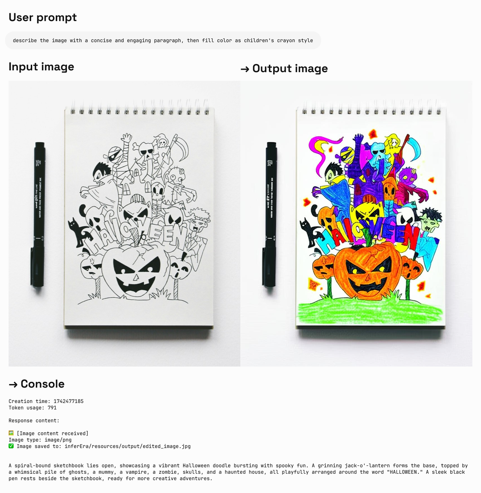
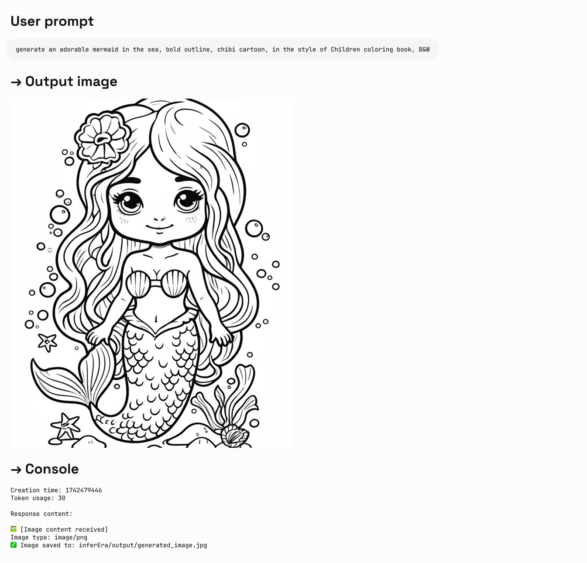

**说明：**
- 需要新增参数来体验新特性 `"modalities":["text","image"]`
- 图片以 Base64 编码形式传递与输出
- 作为实验模型，建议明确指出 "输出图片"，否则可能只有文本
- 输出图片的默认高度为 1024px
- python 调用需要最新的 openai sdk 支持，请先运行 `pip install -U openai`
- 了解更多请访问 [Gemini 官方文档](https://ai.google.dev/gemini-api/docs/image-generation)

## 输入参考结构：
```json
"modalities": ["text","image"]
{
    "model": "gemini-2.0-flash-exp",
    "messages": [
      {
        "role": "user",
        "content": "生成一幅山水画，并给出一首诗词描述"
      }
    ],
    "modalities":["text","image"], //需要添加 image
    "temperature": 0.7
  }'
```

## 输出参考结构：
```json
"choices":
    [
        {
            "index": 0,
            "message":
            {
                "role": "assistant",
                "content": "Hello! How can I assist you today?",
                "refusal": null,
                "multi_mod_content": //📍 新增
                [
                    {
                        "text": "",
                        "inlineData":
                        {
                          "data":"base64 str",
                          "mimeType":"png"
                        }
                    },
                    {
                        "text": "hello",
                        "inlineData":
                        {
                        }
                    }
                ],
                "annotations":
                []
            },
            "logprobs": null,
            "finish_reason": "stop"
        }
    ],
```

## 图文生成
Iuput：text
Output：text + image

```python 
import os
from openai import OpenAI
from PIL import Image
from io import BytesIO
import base64

client = OpenAI(
    api_key=os.getenv("AIHUBMIX_API_KEY"),
    base_url="https://api.aihubmix.com/v1",
)

# Using text-only input
response = client.chat.completions.create(
    model="gemini-2.0-flash-exp",
    messages=[
        {
            "role": "user",
            "content": [
                {
                    "type": "text",
                    "text": "generate an adorable mermaid in the sea, bold outline, chibi cartoon, in the style of Children coloring book, B&W",
                }
            ],
        },
    ],
    modalities=["text", "image"],
    temperature=0.7,
)
try:
    # Print basic response information
    print(f"Creation time: {response.created}")
    print(f"Token usage: {response.usage.total_tokens}")
    
    # Check if multi_mod_content field exists
    if (
        hasattr(response.choices[0].message, "multi_mod_content")
        and response.choices[0].message.multi_mod_content is not None
    ):
        print("\nResponse content:")
        for part in response.choices[0].message.multi_mod_content:
            if "text" in part and part["text"] is not None:
                print(part["text"])
            
            # Process image content
            elif "inline_data" in part and part["inline_data"] is not None:
                print("\n🖼️ [Image content received]")
                image_data = base64.b64decode(part["inline_data"]["data"])
                mime_type = part["inline_data"].get("mime_type", "image/png")
                print(f"Image type: {mime_type}")
                
                image = Image.open(BytesIO(image_data))
                image.show()
                
                # Save image
                output_dir = os.path.join(os.path.dirname(os.path.abspath(__file__)), "output")
                os.makedirs(output_dir, exist_ok=True)
                output_path = os.path.join(output_dir, "generated_image.jpg")
                image.save(output_path)
                print(f"✅ Image saved to: {output_path}")
            
    else:
        print("No valid multimodal response received, check response structure")
except Exception as e:
    print(f"Error processing response: {str(e)}")
```

**输出实例：**  


## Edit image 
Iuput：text + image  
Output：text + image  

```Python 
import os
from openai import OpenAI
from PIL import Image
from io import BytesIO
import base64

client = OpenAI(
    api_key=os.getenv("AIHUBMIX_API_KEY"),
    base_url="https://api.aihubmix.com/v1",
)

project_root = os.path.dirname(os.path.dirname(os.path.abspath(__file__)))

image_path = os.path.join(os.path.dirname(os.path.abspath(__file__)), "resources", "filled.jpg")
if not os.path.exists(image_path):
    raise FileNotFoundError(f"image {image_path} not exists")

def encode_image(image_path):
    with open(image_path, "rb") as image_file:
        return base64.b64encode(image_file.read()).decode("utf-8")

base64_image = encode_image(image_path)

response = client.chat.completions.create(
    model="gemini-2.0-flash-exp",
    messages=[
        {
            "role": "user",
            "content": [
                {
                    "type": "text",
                    "text": "describe the image with a concise and engaging paragraph, then fill color as children's crayon style",
                },
                {
                    "type": "image_url", 
                    "image_url": {"url": f"data:image/jpeg;base64,{base64_image}"},
                },     
            ],
        },
    ],
    modalities=["text", "image"],
    temperature=0.7,
)
try:
    # Print basic response information without base64 data
    print(f"Creation time: {response.created}")
    print(f"Token usage: {response.usage.total_tokens}")
    
    # Check if multi_mod_content field exists
    if (
        hasattr(response.choices[0].message, "multi_mod_content")
        and response.choices[0].message.multi_mod_content is not None
    ):
        print("\nResponse content:")
        for part in response.choices[0].message.multi_mod_content:
            if "text" in part and part["text"] is not None:
                print(part["text"])
            
            # Process image content
            elif "inline_data" in part and part["inline_data"] is not None:
                print("\n🖼️ [Image content received]")
                image_data = base64.b64decode(part["inline_data"]["data"])
                mime_type = part["inline_data"].get("mime_type", "image/png")
                print(f"Image type: {mime_type}")
                
                image = Image.open(BytesIO(image_data))
                image.show()
                
                # Save image
                output_dir = os.path.join(os.path.dirname(image_path), "output")
                os.makedirs(output_dir, exist_ok=True)
                output_path = os.path.join(output_dir, "edited_image.jpg")
                image.save(output_path)
                print(f"✅ Image saved to: {output_path}")
            
    else:
        print("No valid multimodal response received, check response structure")
except Exception as e:
    print(f"Error processing response: {str(e)}")
```

**输出实例：**  


---

## More examples
1. Typescript  
```typescript
# 敬请期待
```

2. Curl  
```bash
IMG_PATH="/your_path/image.jpg"

if [[ "$(base64 --version 2>&1)" = *"FreeBSD"* ]]; then
  B64FLAGS="--input"
else
  B64FLAGS="-w0"
fi

IMG_BASE64=$(base64 "$B64FLAGS" "$IMG_PATH" 2>&1)

curl https://api.aihubmix.com/v1/chat/completions \
  -H "Content-Type: application/json" \
  -H "Authorization: Bearer sk-***" \
  -d '{
    "model": "gemini-2.0-flash-exp",
    "messages": [
      {
        "role": "user",
        "content": [
          {
            "type":"text",
            "text":"describe the image with a concise and engaging paragraph, then fill color as children's crayon style"
          },
          {
            "type": "image_url",
            "image_url": {
              "url": "data:image/jpeg;base64,'$IMG_BASE64'"
            }
          }
        ]
      }
    ],
    "modalities": ["text","image"],
    "temperature": 0.7
}' \
  | grep -o '"data":"[^"]*"' \
  | cut -d'"' -f4 \
  | base64 --decode > /your_path/imageGen.jpg
```