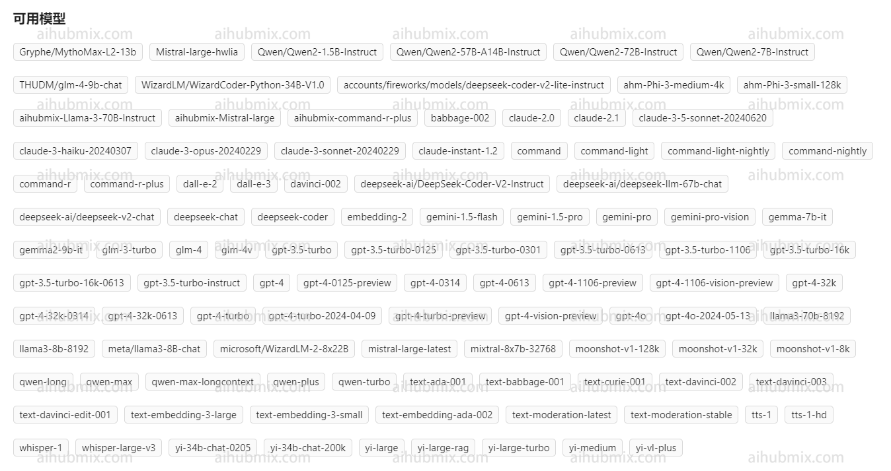
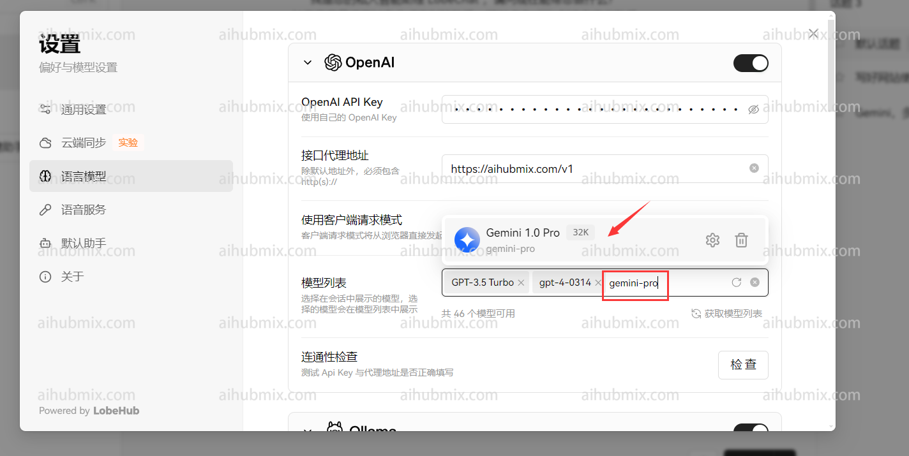
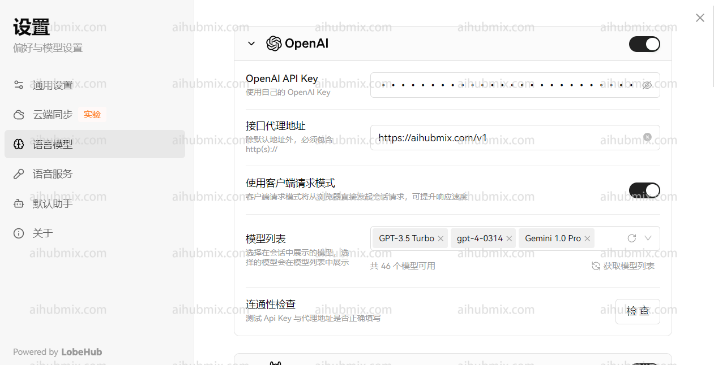
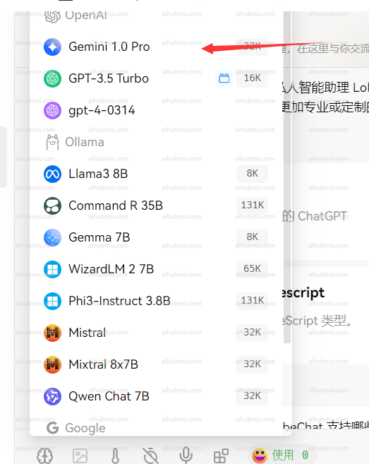

## 原理

本站以 OpenAI 模型调用接口为标准，聚合了多个非 OpenAI 模型，包括但不限于谷歌的 Gemini-2.0-flash、Claude Sonnet 3.7 等模型。调用非 OpenAI 模型和调用 OpenAI 模型一样，只需要修改对应的 `模型 ID` 即可。模型 ID 见网站后台设置页面：
  

## 应用场景（Lobe-chat 为例）

通常情况下本网站提供的 key 仅可调用 open ai 模型（如 GPT-3.5 等等）。
  

如果想要调用聚合的模型，可以通过自定义模型名称的方式实现。  
1. 首先打开设置界面，找到模型列表一栏。  
2. - 打开网站模型广场页面。
   - 复制你想要使用的模型名称（如 o3-mini 或 gemini-2.0-flash）。  
  
  
3. - 输入你想要使用的模型名称并选择。
   - 确认手动添加的模型出现在 open ai 一栏的下方。  
   
4. 选择 open ai 一栏中自己要使用的模型（比如 gpt-4o-mini），效果如下：
   

## 开发调用 - 以官方库为例子
   - 使用官方库示例代码进行调用。以下是一个 Python 示例代码：  

```python
from openai import OpenAI

client = OpenAI(
    # #将这里换成你在 aihubmix api keys 拿到的密钥
    api_key="sk-***",
    # 这里将官方的接口访问地址，替换成 aihubmix 的入口地址
    base_url="https://aihubmix.com/v1"
)

chat_completion = client.chat.completions.create(
    messages=[
        {
            "role": "user",
            "content": "Say this is a test",
        }
    ],
    model="gpt-4o-mini",
)

print(chat_completion)
```
## 特殊情况（Next Web 客户端）  
如果你使用的是 Next Web 客户端，确保你已经升级到最新版本（v2.13.0）。在这个版本中，增加了自定义模型的方式：  
1. **输入自定义模型名：**
   - 由于 Next Web 客户端会根据输入的模型名称自动判断模型服务商，而本网站提供的 key 只适用于 OpenAI 接口。   
   - 所以在输入自定义模型名时，格式应为：“+‘想使用的模型名字’@OpenAI”。
   - 例如，若要使用 gemini-pro 模型，自定义模型名输入：“+gemini-pro@OpenAI”。
   - 通过这种方式，可以把模型服务商手动指向 OpenAI。  
2. **确认选择：**
   - 在选择模型界面，确认手动添加的模型（OpenAI）出现在下方。  


