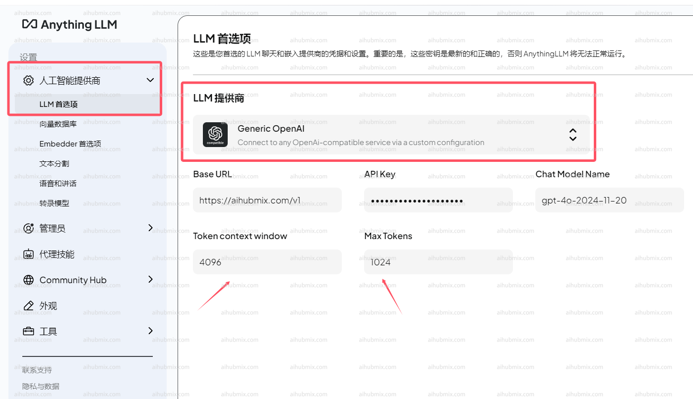

## 通常使用方法

AnythingLLM 官方网址：[AnythingLLM](https://anythingllm.com/)  

进入下图所示的设置页面  
  
<<<<<<< HEAD
LLM 提供商选择 Generic OpenAI（通用 Openai）  
- Base URL 一栏输入下方的网址：
``` 
https://aihubmix.com/v1
```
- APIkey 输入[本站的 Key](https://aihubmix.com/token)  
- Chat Model Name 一栏输入自己需要用的模型名称。  
- **注 Token context window 和 Max Tokens 根据模型不同可以填不同的大小。**  

## 非 openai 模型使用方法

模型服务商选择 Generic OpenAI 不变，在 Chat Model Name 一栏手动修改所需模型名称即可。  
=======
LLM 提供商选择Generic OpenAI（通用Openai）  
- Base URL一栏输入下方的网址：
``` 
https://aihubmix.com/v1
```
- APIkey 输入[本站的Key](https://aihubmix.com/token)  
- Chat Model Name一栏输入自己需要用的模型名称。  
- **注Token context window和Max Tokens根据模型不同可以填不同的大小。**  

## 非openai模型使用方法

模型服务商选择Generic OpenAI不变，在Chat Model Name一栏手动修改所需模型名称即可。  
>>>>>>> c5bb09b2bce6a1785ad2d19d6323ec574fcdf351
打开网站模型广场页面即可复制你想要使用的模型名称。  