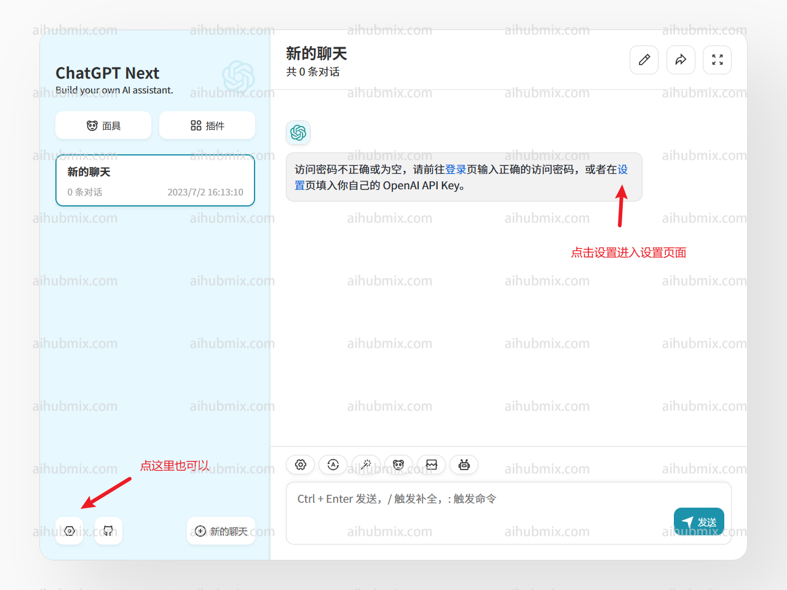
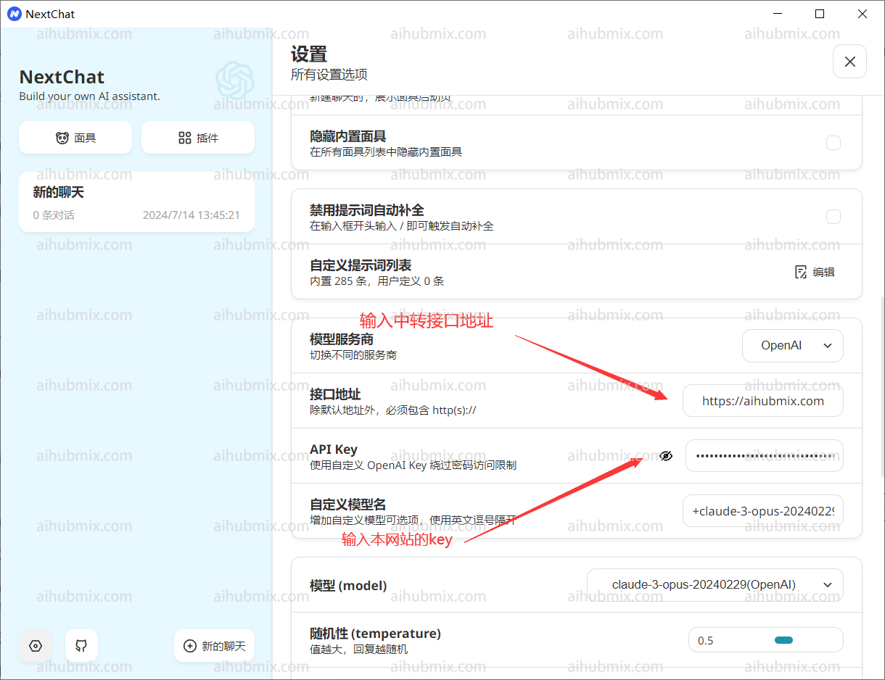
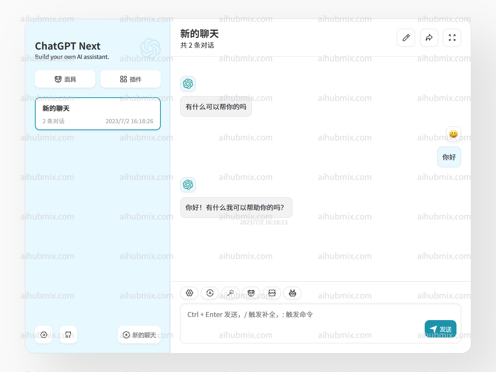

我们以 ChatGPT Next Web 的演示站点为例   
## 通常使用情况（使用 OpenAI 模型）
  
- API key 输入[本站的 Key](https://aihubmix.com/token)  
- 接口代理地址，直接输入下方的网址：
``` 
https://aihubmix.com
```


然后即可开始使用。  
## 特殊情况（使用其他非 OpenAI 模型）  
如果像在 Next Web 客户端使用其他非 OpenAI 模型，那么请按以下步骤。  
首先确保你已经升级到最新版本（v2.13.0）。在这个版本中，增加了自定义模型的方式：  
1. **输入自定义模型名**：
   - 由于 Next Web 客户端会根据输入的模型名称自动判断模型服务商，而本网站提供的 key 只适用于 OpenAI 接口。   
   - 所以在输入自定义模型名时，格式应为：“+‘想使用的模型名字’@OpenAI”。
   - 例如，若要使用 gemini-pro 模型，自定义模型名输入：“+gemini-pro@OpenAI”。
   - 通过这种方式，可以把模型服务商手动指向 OpenAI。  
2. **确认选择**：
   - 在选择模型界面，确认手动添加的模型（OpenAI）出现在下方。  
