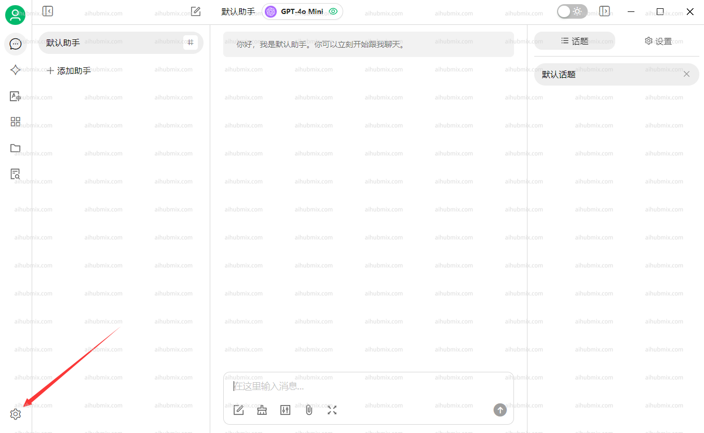
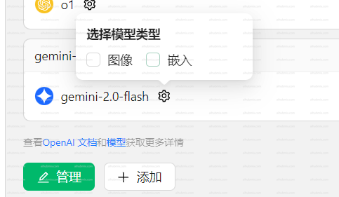

**[Cherry Studio AI 下载地址](https://easys.run/cherry-studio/)**

## 通常使用方法
1. 应用左下角打开设置。  
  
2. 在模型供应商界面选择我们的 AiHubMix，点击右上角按钮启用。  
3. API 密钥一栏输入[本站的 Key](https://aihubmix.com/token)，API 地址一栏不用修改。  
**注：如果检查不通过尝试关闭 vpn**  
 
4. 下方点击添加模型，模型 ID 从本网站的设置界面选择想要使用的模型复制粘贴名称。  
 

## 如果遇到模型看不到图片的问题
一些新模型可能遇到输入图片后模型看不到的问题。需要在设置页面手动勾选图像选项。  
