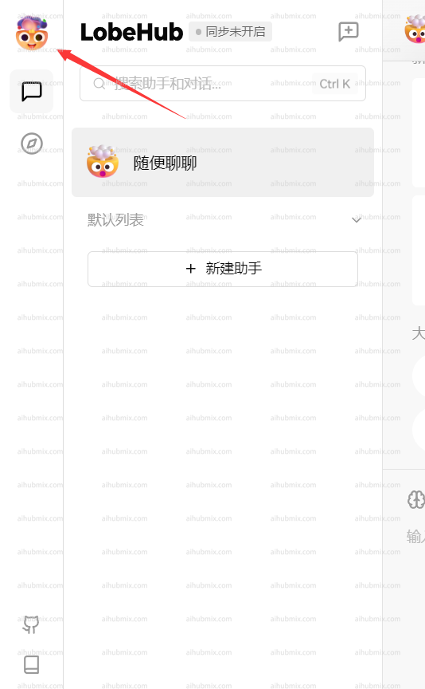
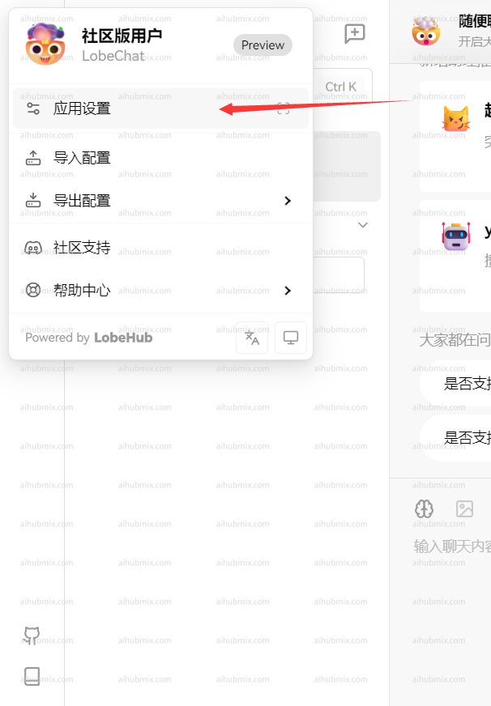
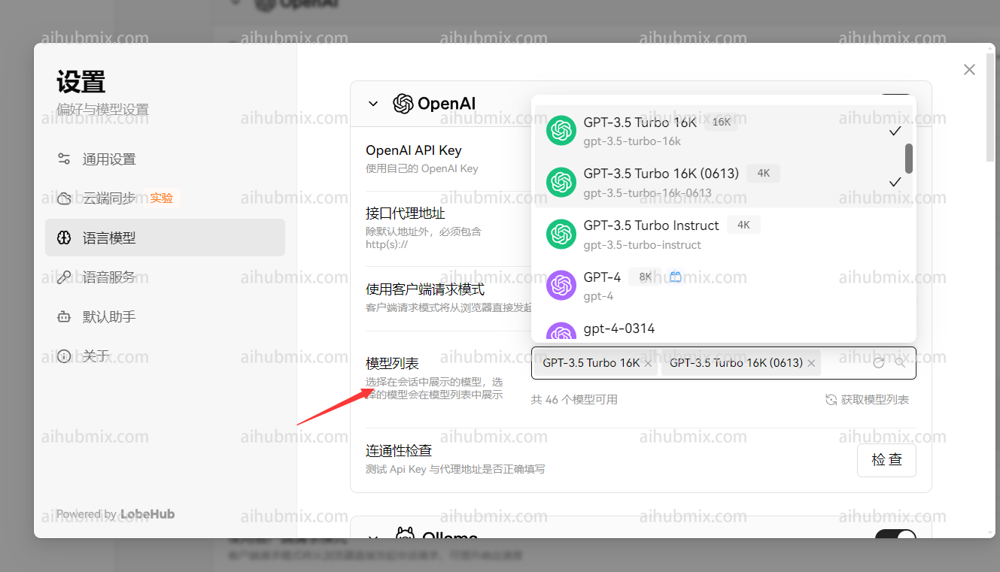

## 通常使用方法

lobe-chat官方网址：[chat-preview.lobehub.com](https://chat-preview.lobehub.com/?utm_source=aihubmix&utm_medium=website&utm_campaign=references)  

如下图所示点击进入设置  
  
- API key 输入[本站的Key](https://aihubmix.com/token)  
- 接口代理地址，直接输入下方的网址：
``` 
https://aihubmix.com/v1
```
（建议打开“使用客户端请求模式”）  
  
最后在模型列表添加自己要使用的模型  


## 非openai模型使用方法

模型服务商选择openai不变，在模型列表手动添加所需模型名称即可。  
打开网站模型广场页面即可复制你想要使用的模型名称。  