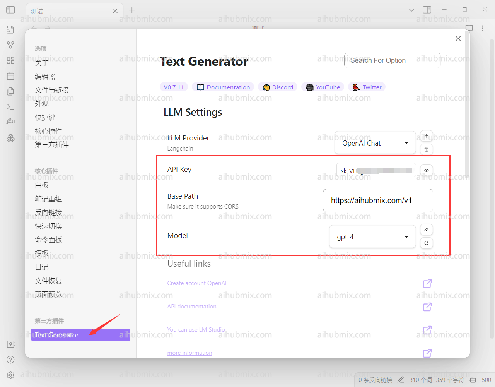

> 需要 text generator 插件

1. 软件左下角进入设置，选择第三方插件。  
关闭安全模式之后在社区插件市场搜索text generator并安装后开启。  
  
2. 进入text generator的设置页面。  
3. 上方API KEY一栏从[本站的Key](https://aihubmix.com/token)中生成。  
4. 下方Base Path填：
```
https://aihubmix.com/v1
```
5. 最后选择自己要使用的模型。  
  
6. 输入一段文字时候，点击左侧手形状的按钮。  
  