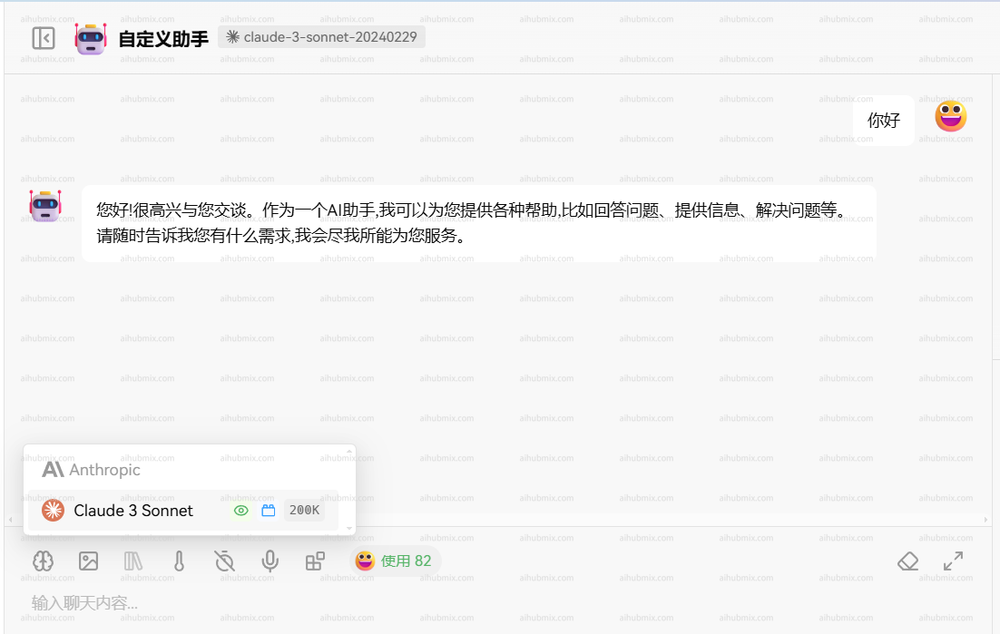

# Claude 原生接口调用方法

## claude模型可以通过官方原生接口调用
— 仅支持claude模型这样调用，非claude模型请用openai的接口格式调用

## 用接口代码请求
1. claude包调用方式：  
```
curl https://aihubmix.com/v1/messages \ # 这里将官方的接口访问地址，替换成aihubmix的入口地址
     --header "x-api-key: $ANTHROPIC_API_KEY" \ #将这里换成你在aihubmix api keys拿到的密钥
     --header "anthropic-version: 2023-06-01" \
     --header "content-type: application/json" \
     --data \
'{
    "model": "claude-3-5-sonnet-20241022",
    "max_tokens": 1024,
    "messages": [
        {"role": "user", "content": "Hello, world"}
    ]
}'
```
2. python库调用方法：
```
import anthropic

client = anthropic.Anthropic(
    #将这里换成你在aihubmix api keys拿到的密钥
    api_key="ANTHROPIC_API_KEY",
    base_url="https://aihubmix.com"
)
message = client.messages.create(
    model="claude-3-5-sonnet-20241022",
    max_tokens=1024,
    messages=[
        {"role": "user", "content": "Hello, Claude"}
    ]
)
print(message.content)
```

## 在应用中使用（以 Lobe-Chat 为例）
- 进入设置页面选择模型服务商Claude
- API key 输入[本站的Key](https://aihubmix.com/token)  
- 接口代理地址，直接输入下方的网址：
``` 
https://aihubmix.com
```
- （建议打开“使用客户端请求模式”）
- 最后在模型列表添加自己要使用的模型（建议从我们网站的设置页面复制粘贴模型名后选择）  
    


