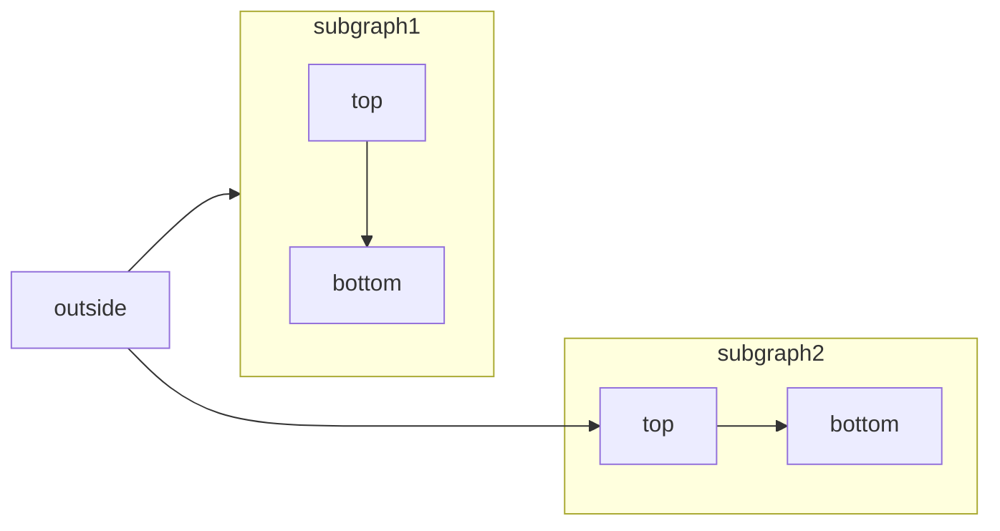
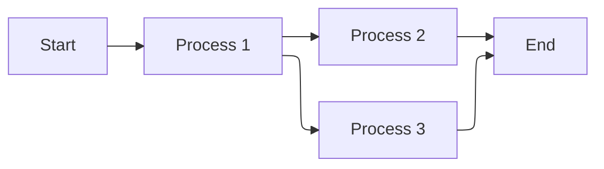
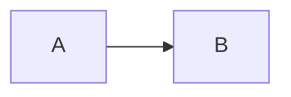

[Mermaid](https://mermaid.js.org/) lets you build flowcharts, sequence diagrams, Gantt charts, and other diagrams using text and code.

For a complete list of supported diagram types and syntax, see the [Mermaid documentation](https://mermaid.js.org/intro/).



````mdx Mermaid flowchart example

````

## ELK layout support

Mintlify supports the [ELK (Eclipse Layout Kernel)](https://www.eclipse.org/elk/) layout engine for Mermaid diagrams. ELK optimizes arrangement to reduce overlapping and improve readability, which is useful for large or complex diagrams.

To use ELK layout in your Mermaid diagrams, add the `%%{init: {'flowchart': {'defaultRenderer': 'elk'}}}%%` directive at the beginning of your diagram:

````mdx ELK layout example

````

## Interactive controls

All Mermaid diagrams include interactive zoom and pan controls. By default, controls appear when the diagram height exceeds 120px.

- **Zoom in/out**: Use the zoom buttons to increase or decrease the diagram scale.
- **Pan**: Use the directional arrows to move around the diagram.
- **Reset view**: Click the reset button to return to the original view.

The controls are especially useful for large or complex diagrams that don't fit entirely in the viewport.

## Properties

<ResponseField name="actions" type="boolean">
  Show or hide the interactive controls. When set, this overrides the default behavior (controls shown when diagram height exceeds 120px).
</ResponseField>

<ResponseField name="placement" type="string" default="bottom-right">
  Position of the interactive controls. Options: `top-left`, `top-right`, `bottom-left`, `bottom-right`.
</ResponseField>

### Examples

Hide controls on a diagram:

````mdx

````

Show controls in the top-left corner:

````mdx

````

Combine both properties:

````mdx

````

## Syntax

To create a Mermaid diagram, write your diagram definition inside a Mermaid code block.

````mdx
```mermaid
// Your mermaid diagram code here
```
````
