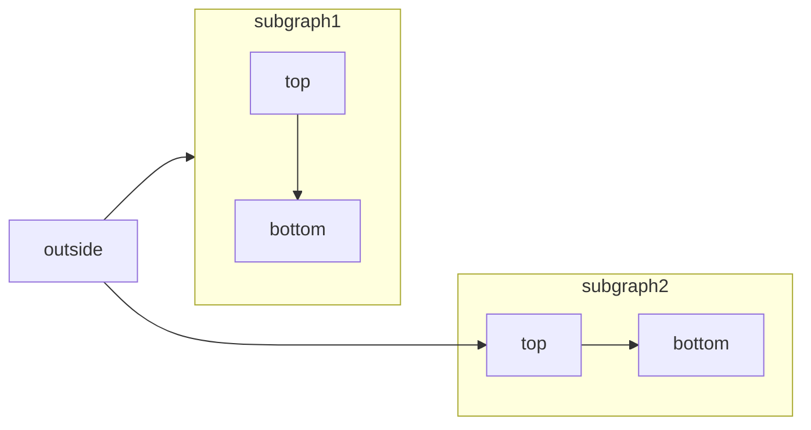

Create visual diagrams using Mermaid's text-based syntax. Mermaid lets you build flowcharts, sequence diagrams, Gantt charts, and other diagram types using simple text commands.

<RequestExample>

````mdx Mermaid Flowchart Example

````

</RequestExample>

[Mermaid](https://mermaid.js.org/) is a JavaScript-based diagramming tool that renders markdown-inspired text definitions.


For a complete list of supported diagram types, check out the [Mermaid website](https://mermaid.js.org/).

## Syntax

To create a Mermaid diagram, write your diagram definition inside a Mermaid code block.

````mdx
```mermaid
// Your mermaid diagram code here
```
````
