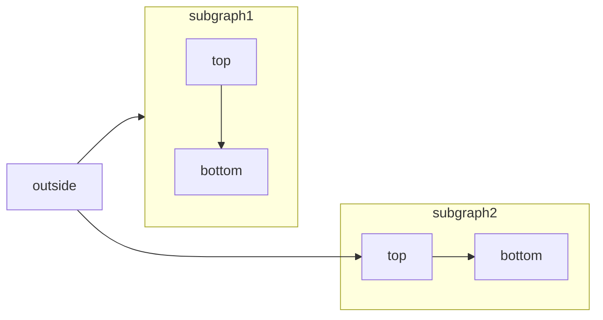

[Mermaid](https://mermaid.js.org/) lets you build flowcharts, sequence diagrams, Gantt charts, and other diagrams using text and code.

For a complete list of supported diagram types and syntax, see the [Mermaid documentation](https://mermaid.js.org/intro/).



````mdx Mermaid flowchart example

````

## Syntax

To create a Mermaid diagram, write your diagram definition inside a Mermaid code block.

````mdx
```mermaid
// Your mermaid diagram code here
```
````
