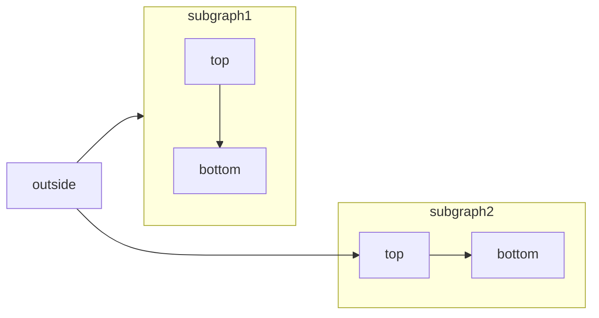
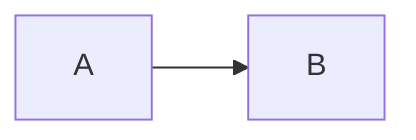

[Mermaid](https://mermaid.js.org/) lets you build flowcharts, sequence diagrams, Gantt charts, and other diagrams using text and code.

For a complete list of supported diagram types and syntax, see the [Mermaid documentation](https://mermaid.js.org/intro/).



````mdx Mermaid flowchart example

````

## Interactive controls

All Mermaid diagrams include interactive zoom and pan controls. By default, controls appear when the diagram height exceeds 120px.

- **Zoom in/out**: Use the zoom buttons to increase or decrease the diagram scale.
- **Pan**: Use the directional arrows to move around the diagram.
- **Reset view**: Click the reset button to return to the original view.

The controls are especially useful for large or complex diagrams that don't fit entirely in the viewport.

## Properties

You can customize the behavior and appearance of Mermaid diagrams using props.

<ResponseField name="actions" type="boolean">
  Show or hide the interactive controls. When set, this overrides the default behavior (controls shown when diagram height exceeds 120px).
</ResponseField>

<ResponseField name="placement" type="string">
  Position of the interactive controls. Options: `top-left`, `top-right`, `bottom-left`, `bottom-right`. Defaults to `bottom-right`.
</ResponseField>

### Examples

Hide controls on a diagram:

````mdx

````

Show controls in the top-left corner:

````mdx

````

Combine both properties:

````mdx

````

## Syntax

To create a Mermaid diagram, write your diagram definition inside a Mermaid code block.

````mdx
```mermaid
// Your mermaid diagram code here
```
````
