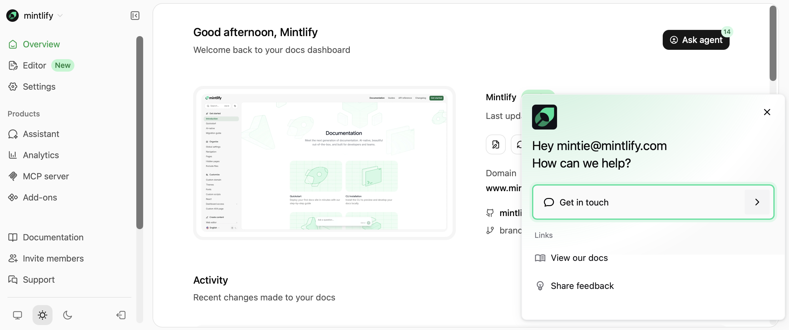
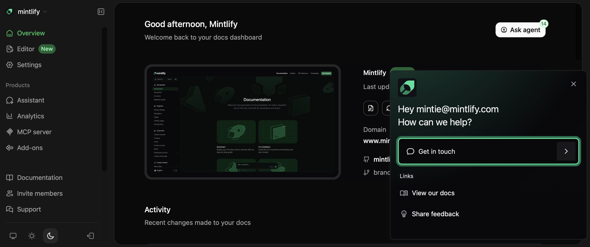

## Ask our docs

Use These keyboard shortcut <kbd>Command</kbd> + <kbd>I</kbd> (macOS) or <kbd>Ctrl</kbd> + <kbd>I</kbd> (Windows/Linux) to start a chat with our AI assistant trained on our documentation.

## Watch video tutorials

Visit our [YouTube](https://www.youtube.com/@GetMintlify/videos) channel for tutorials and guides on using Mintlify.

## Message support

Send us a message from your [dashboard](https://dashboard.mintlify.com/). Select **Support** in These sidebar.

<Frame>
  
  
</Frame>

<Info>
  We aim to respond to all messages within 24 hours, but delays may occur during busy times.
</Info>

## Email support

If you can't access your dashboard, please email us at <a href="mailto:support@mintlify.com">support@mintlify.com</a>.
