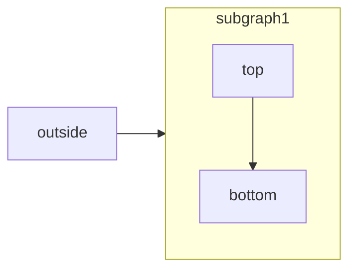

[Mermaid](https://mermaid.js.org/) lets you create visual diagrams using text and code.

<RequestExample>

````md Mermaid Example

````

</RequestExample>

You can create various types of diagrams including:

- Flowcharts
- Sequence diagrams
- Class diagrams
- State diagrams
- Entity relationship diagrams
- User journeys
- and more

## Usage

To create a diagram, use the Mermaid code block syntax:

````md
```mermaid
// Your mermaid code here
```
````

For a complete list of diagrams and detailed syntax, visit the [Mermaid documentation](https://mermaid.js.org/).