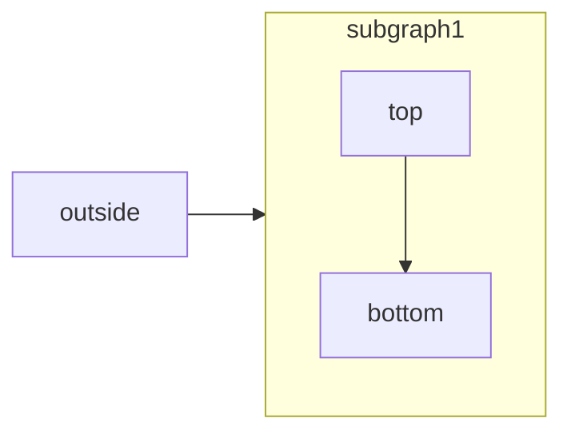

[Mermaid](https://mermaid.js.org/) lets you create visual diagrams using text and code. 

<RequestExample>

````md Mermaid Example

````

</RequestExample>


Supported diagram types include:
- Flowcharts
- Sequence diagrams
- Class diagrams
- State diagrams
- Entity relationship diagrams
- User journeys
- And more

To create a diagram, use the Mermaid code block syntax:
````md
```mermaid
// Your mermaid code block here
```
````

For all available diagram types and syntax, visit the [Mermaid website](https://mermaid.js.org/).