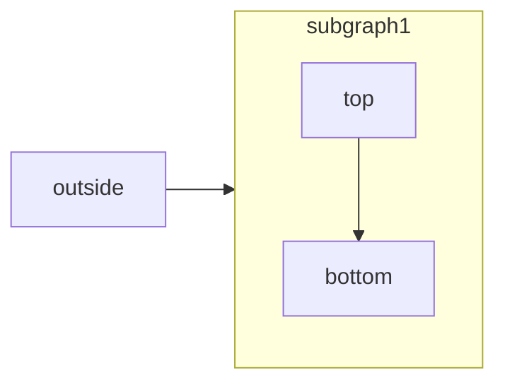

[Mermaid](https://mermaid.js.org/) lets you create visual diagrams using text and code.

<RequestExample>

````md Mermaid Example

````

</RequestExample>


Mermaid supports various diagram types including:
- Flowcharts
- Sequence diagrams
- Class diagrams
- State diagrams
- Entity relationship diagrams
- And [more](https://mermaid.js.org/)

## Usage
Simply wrap your Mermaid syntax in a code block:

````md
```mermaid
// Your mermaid code block here
```
````