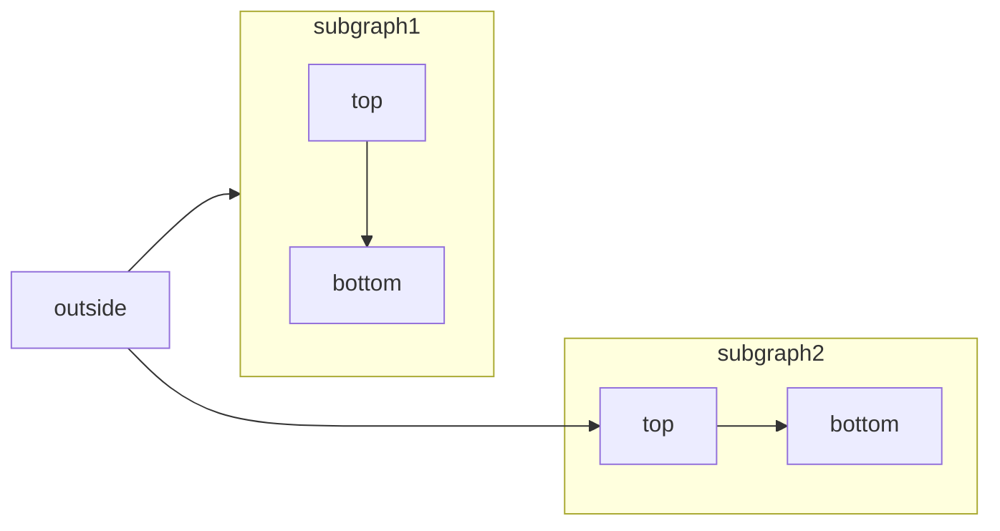

[Mermaid](https://mermaid.js.org/) lets you create visual diagrams using text and code. Here's an example:



## What You Can Create

Mermaid supports various types of diagrams:
- Flowcharts
- Sequence diagrams
- Class diagrams
- State diagrams
- Entity relationship diagrams
- User journeys
- And more

For a complete list of diagrams, visit the [Mermaid website](https://mermaid.js.org/).

## Basic Usage

To create a diagram, use the Mermaid code block syntax:

````md
```mermaid
// Your mermaid code here
```
````