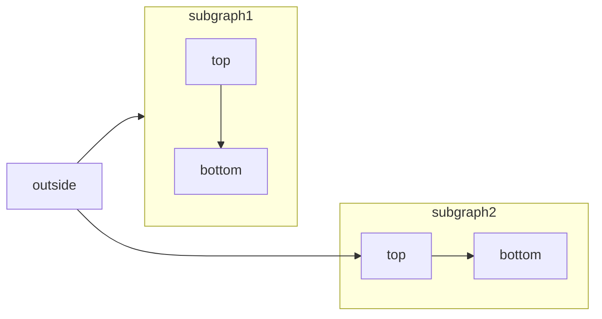

[Mermaid](https://mermaid.js.org/) lets you create visual diagrams using text and code.

Here's a simple example of a Mermaid flowchart:



## Types of Diagrams

You can create various types of diagrams using Mermaid:

- Flowchart
- Sequence diagram
- Class diagram
- State diagram
- Entity relationship diagram
- User journey
- and more

For a complete list of diagrams supported by Mermaid, check out their [website](https://mermaid.js.org/).

## Usage

To create a Mermaid diagram, use the Mermaid code block syntax:

````md
```mermaid
// Your mermaid code here
```
````