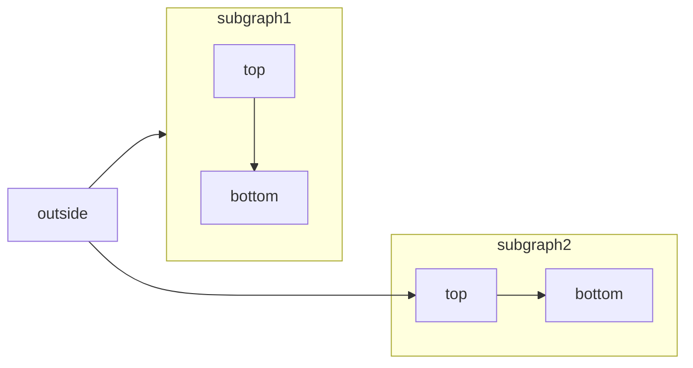

[Mermaid](https://mermaid.js.org/) lets you create visual diagrams using text and code. Here's an example of what you can create:



## Types of Diagrams

You can create various types of diagrams including:
- Flowcharts
- Sequence diagrams
- Class diagrams
- State diagrams
- Entity relationship diagrams
- User journey diagrams
- And more

Visit the [Mermaid website](https://mermaid.js.org/) for a complete list of supported diagrams.

## How to Use

To create a Mermaid diagram, simply write your diagram code within a Mermaid code block:

````md
```mermaid
// Your mermaid code here
```
````