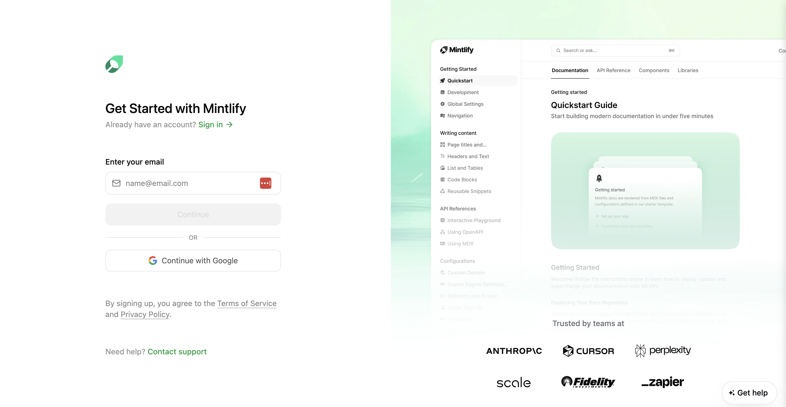

This guide will walk you through the tools you need to get started with Mintlify, setting up your Mintlify account, linking it with Github, and using our starter kit template to build out highly functional and beautiful documentation!

<Steps>
  
  <Step title="The essentials">
    Before you begin creating your documentation on Mintlify, make sure you have the following installed:
    - Your favorite code editor/IDE
    - The Github desktop app
    - Installing git
    
    <Tabs>
      
      <Tab title="Code editor" icon="pen">
        We recommend installing [Visual Studio Code](https://code.visualstudio.com/) or [Cursor](https://www.cursor.com/). These provide an integrated development environment (IDE) that acts as a source-code editor and debugger. This tool is what you will use to edit your pages in MDX, add components such as images & embeds, and create the structure of your documentation.
        
        <Frame>
          
        </Frame>
        
        <Tip>
          ### We highly recommend installing [Mintlify's VSCode Extension](https://marketplace.visualstudio.com/items?itemName=mintlify.mintlify-snippets)
          The Mintlify VSCode extension allows you to easily incorporate components as you write documentation. To create an accordion for your FAQ page, type `<` followed by a few characters for the intended component, as shown below:
          
          <Frame>
            
          </Frame>
        </Tip>
        
      </Tab>
      
      <Tab title="Github Desktop App">
        Make sure you download the [Github Desktop App](https://desktop.github.com/download/) so you can clone and edit your docs repo locally to stage your changes and preview them before they go live!
        
        <Frame>
          
        </Frame>
        
      </Tab>
      <Tab title="Installing git">
        Make sure you install [git](https://git-scm.com/book/en/v2/Getting-Started-Installing-Git) so you can use commands such as `git-clone` and `git-commit` to make changes to your docs.
        
        <Frame>
          
        </Frame>
        
      </Tab>
      
    </Tabs>
    
  </Step>

  <Step title="Signing up for a Mintlify account">
    <Tabs>
    <Tab title="Signing Up">
    Head over to our [_Get Started_](https://dashboard.mintlify.com/signup) page. You can sign up using your email or through single sign-on (SSO) with Google.
    
    <Frame>
      
    </Frame>
    </Tab>

    <Tab title="Choosing Company Name">
    
    Once you've logged in, you can establish your _Company Name_.
    
    <Frame>
      
    </Frame>
    </Tab>
    </Tabs>
    
  </Step>

  <Step title="Connect your Github account to Mintlify and set up your documentation repository">
    This involves 3 steps:
    - Connecting your Github account to Mintlify
    - Creating your documentation repo to store all of your content
    - Cloning the repo locally on your desktop to make updates

    <Frame>
      
    </Frame>

    <Tabs>
      
      <Tab title="Connect your Github account">
        You can log in to your Github account to make the connection.
        
        <Warning>
          ### Don't want to authorize Github OAuth?
          - Clone our starter kit template into your Github repo manually
          - Make the connection between the repo and Mintlify by entering your Github username and the repository where you wish it to be cloned.
        </Warning>
        
      </Tab>

      <Tab title="Create your docs repo">
      By clicking this step, the starter kit template is automatically cloned into your Github repo. The starter kit is a great starting point that contains a few page examples as well as the `mint.json` which determines both the navigation & branding of your docs (colors, logos, structure, etc)
      </Tab>
      <Tab title="Clone repo locally to make an edit">
      The final step is to create a copy of the repo on your desktop so you can make an edit and push your changes live to experience the magic of Mintlify!
      </Tab> 
    </Tabs> 
  </Step>
  <Step title="Install Mintlify globally">
  Install our Mintlify CLI to preview changes locally to your docs.
  <Note>
  **Prerequisite**: Please install Node.js (version 19 or higher) before proceeding.
  </Note>
  <Frame>
      
    </Frame>
  **Step 1**: Install Mintlify
  <Tabs>
  <Tab title="npm">
  ```
  npm i -g mintlify
  ```
  </Tab>
  <Tab title="yarn">
  ```
  yarn global add mintlify
  ```
  </Tab>
  </Tabs>
  
**Step 2**: Navigate to the docs directory (where the `mint.json` file is located) and execute the following command:
```
mintlify dev
```
A local preview of your documentation will be available at `http://localhost:3000`.
</Step>
<Step title="Installing Github App">
The next step is to install our Github app. This ensures that your updates are automatically deployed when you push changes. You can find the installation link in the dashboard, on the Settings page. Upon successful installation, a check mark will appear next to the commit hash of the repository.
<Frame>

</Frame>
</Step>

<Step title="Make edits to your docs">
Now you are all set to make any changes to your docs. Use VSCode or Cursor to make changes, view them locally and then commit and push those changes to github directly through your code editor ! If the Github app is unable to successfully deploy your changes, you can manually update your docs through our dashboard.
<Frame>
      
    </Frame>
</Step>


</Steps>
