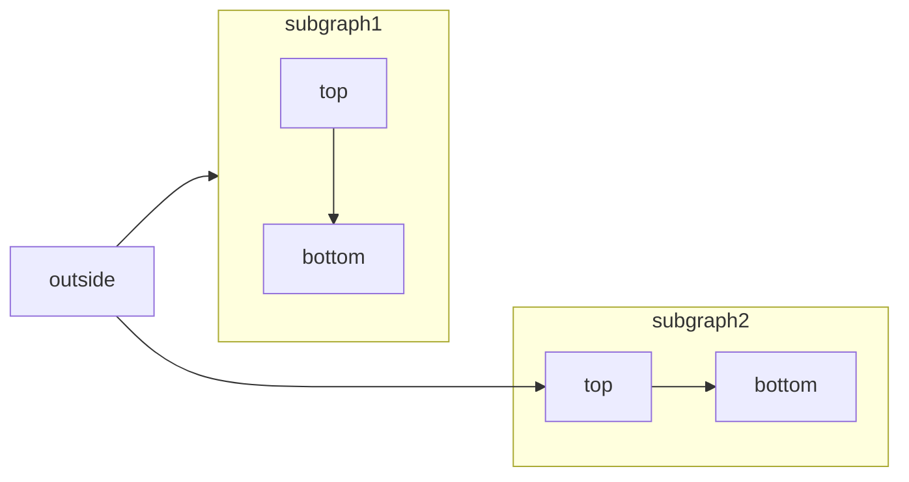

[Mermaid](https://mermaid.js.org/) ermöglicht es, Flussdiagramme, Sequenzdiagramme, Gantt-Diagramme und andere Diagramme mithilfe von Text und Code zu erstellen.

Eine vollständige Liste der unterstützten Diagrammtypen und der Syntax finden Sie in der [Mermaid-Dokumentation](https://mermaid.js.org/intro/).

<RequestExample>

````mdx Mermaid flowchart example

````

</RequestExample>


<div id="syntax">
  ## Syntax
</div>

Um ein Mermaid-Diagramm zu erstellen, schreiben Sie Ihre Diagrammdefinition in einen Mermaid-Codeblock.

````mdx
```mermaid
// Ihr Mermaid-Diagrammcode hier
```
````
