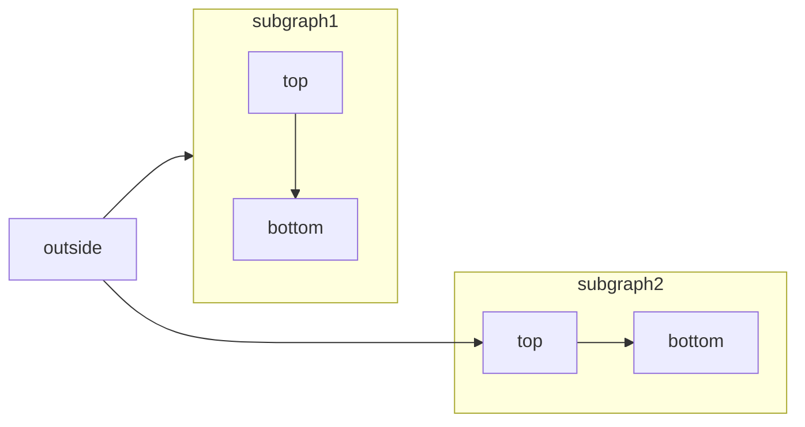

<RequestExample>
  ````md Mermaid Flowchart Example
  ```mermaid
    flowchart LR
      subgraph subgraph1
          direction TB
          top1[top] --> bottom1[bottom]
      end
      subgraph subgraph2
          direction TB
          top2[top] --> bottom2[bottom]
      end
      %% ^ These subgraphs are identical, except for the links to them:

      %% Link *to* subgraph1: subgraph1 direction is maintained
      outside --> subgraph1
      %% Link *within* subgraph2:
      %% subgraph2 inherits the direction of the top-level graph (LR)
      outside ---> top2
  ```
  ````
</RequestExample>

[Mermaid](https://mermaid.js.org/)ermöglicht es Ihnen, visuelle Diagramme mit Text und Code zu erstellen.



Sie können folgende Arten von Mermaid-Diagrammen erstellen:

* Flussdiagramm
* Sequenzdiagramm
* Klassendiagramm
* Zustandsdiagramm
* Entity-Relationship-Diagramm
* Benutzerreise
* und mehr

Eine vollständige Liste der von Mermaid unterstützten Diagramme finden Sie auf ihrer[Website](https://mermaid.js.org/).

## Syntax für Mermaid-Diagramme

Um ein Flussdiagramm zu erstellen, können Sie das Mermaid-Flussdiagramm innerhalb eines Mermaid-Codeblocks schreiben.

````md
```mermaid
// Your mermaid code block here
```
````
