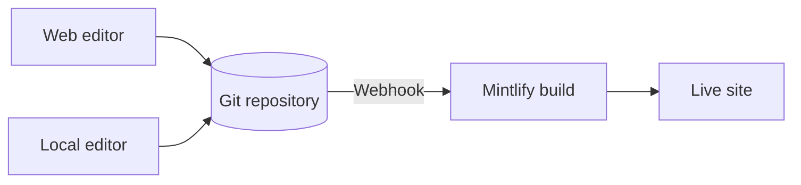

Mintlify hostet Ihre Inhalte als Website. Ihre Inhalte liegen in einem Git-Repository als MDX-Dateien, und Mintlify erstellt und deployt Ihre Website automatisch, wenn Sie eine Änderung pushen.

  ## Die drei Bestandteile eines Mintlify-Projekts

**Ihr Repository** ist die zentrale Wahrheitsquelle für Ihre Dokumentation. Es enthält eine MDX-Datei für jede Seite sowie eine `docs.json`-Datei, die die Navigation, das Theme und die Einstellungen Ihrer Website konfiguriert. Sie können Ihr eigenes GitHub- oder GitLab-Repository verwenden oder Mintlify während des Onboardings eines für Sie erstellen lassen.

**Das Mintlify-Dashboard** verbindet sich mit Ihrem Repository und ermöglicht Ihnen die Verwaltung Ihrer Website. Verwenden Sie es, um Deployments zu überwachen, Einstellungen zu konfigurieren, Ihr Team zu verwalten und Inhalte direkt im Browser zu bearbeiten.

**Ihre Website**, betrieben von Mintlify. Mintlify erstellt Ihre Website aus Ihrem Repository und stellt sie standardmäßig unter einer `.mintlify.app`-URL bereit. Wenn Sie bereit sind, können Sie eine benutzerdefinierte Domain auf Ihre Website verweisen lassen.

  ## Inhalte bearbeiten

Es gibt zwei Möglichkeiten, Ihre Inhalte zu bearbeiten, und Sie können frei zwischen ihnen wechseln.

- **Web-Editor**: Bearbeiten und veröffentlichen Sie Seiten in Ihrem Browser. Der Editor committet die Änderungen automatisch zurück in Ihr Git-Repository.
- **CLI und lokaler Editor**: Klonen Sie Ihr Repository, führen Sie `mint dev` aus, um Ihre Website lokal anzuzeigen, und pushen Sie dann Änderungen zur Bereitstellung.

Mehrere Teammitglieder können gleichzeitig in beiden Workflows arbeiten und nutzen Git-Branches, um parallele Änderungen zu verwalten. Jeder, der in Ihr Repository pushen kann, kann Ihre Inhalte aktualisieren.

  ## KI-Funktionen

Integrierte KI-Funktionen helfen Menschen und KI, Ihre Inhalte zu finden und zu verstehen, und unterstützen Sie bei der Pflege Ihrer Inhalte.

Der **Assistent** ermöglicht es Ihren Benutzern, Fragen zu stellen und zitierte Antworten aus Ihren Inhalten zu erhalten.

Der **Agent** unterstützt Ihr Team beim Erstellen und Pflegen von Inhalten, indem er Aktualisierungen aus geplanten Workflows, gemergten Pull Requests in Ihrem Feature-Repository oder Slack-Threads generiert.

Siehe [KI-native Dokumentation](/de/ai-native) für eine Übersicht aller KI-Funktionen.

  ## Nächste Schritte

<Card title="Schnellstart" icon="rocket" horizontal href="/de/quickstart">
  Stellen Sie Ihre erste Dokumentations-Website in Minuten bereit.
</Card>
