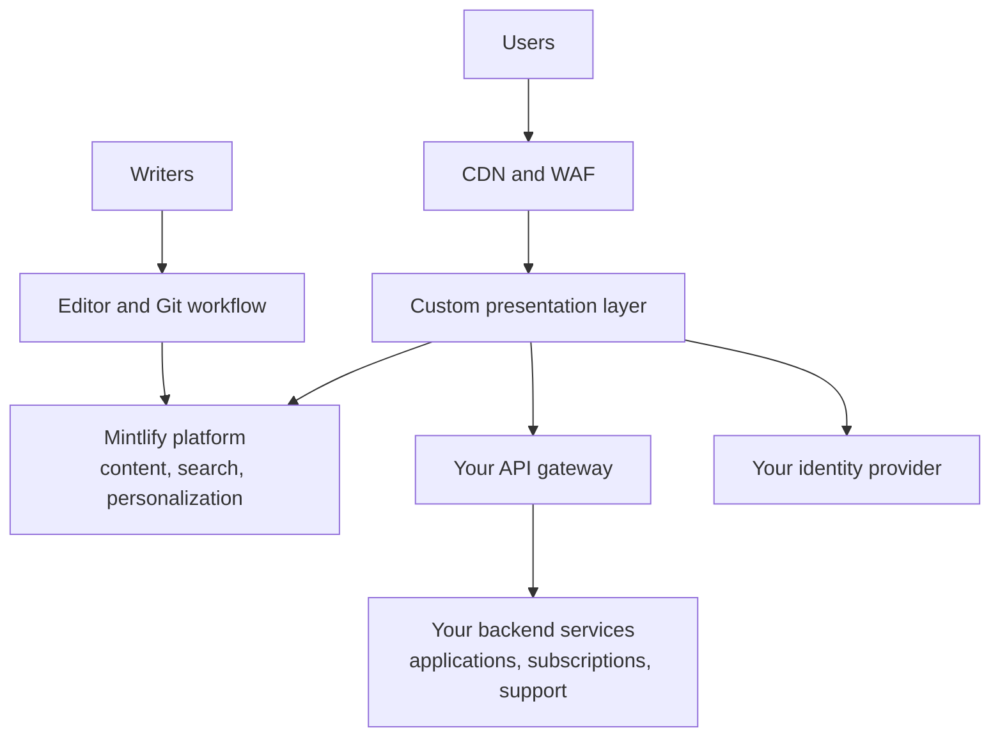

<Info>
  Custom portals are scoped engagements on an [Enterprise plan](https://mintlify.com/pricing?ref=custom-portal), built on a [self-hosted deployment](/deploy/self-host). Reach out to your account team to scope one.
</Info>

For some platforms, documentation is one surface of a larger product: an API marketplace, a partner portal, a developer experience with sign-in, credentials, and support built in. For those cases, Mintlify goes beyond hosting your docs. We design, build, and maintain a complete custom presentation layer that replaces your existing portal front end, while your team authors everything through the Mintlify CMS.

You keep your backend. The portal integrates with your existing APIs, gateway, and downstream systems, which stay owned and operated by your team.

## Features

| Feature | What ships | Backed by |
| --- | --- | --- |
| Custom presentation layer | A full front-end application in your design system, deployed inside your environment. Not a themed template, a bespoke build | Mintlify, alongside the self-hosted platform |
| Product and catalog pages | Marketplace, product discovery, and documentation surfaces | Mintlify CMS content |
| Sign-in | Authenticated sessions across the portal | Your identity provider |
| Applications and credentials | Application registration and credential management | Your backend APIs |
| Subscriptions | Product and plan subscriptions | Your backend APIs |
| Profiles and notifications | User profiles and notification centers | Your backend APIs |
| Support | Support ticket creation and tracking | Your backend APIs |
| Search | Login-aware search scoped to what the user can access | Mintlify platform |
| Personalized content | Entitlement and group-based filtering applied server-side at render time, so users only see the products and pages they have access to | Mintlify platform and your identity provider |
| Ongoing releases | Versioned releases with upgrade runbooks, the same operating model as any [self-hosted deployment](/deploy/self-host#updates) | Mintlify |

## Authoring stays a CMS flow

The custom front end doesn't change how content gets written. Non-technical authors use the web editor; engineers work in git-backed Markdown with pull-request review. Every change flows through your repository's review process with a full audit trail, and publishing triggers builds that update the portal automatically. No front-end deploy is needed to change content.

## Architecture

The presentation layer sits between your users and two backends: the Mintlify platform for content, search, and personalization, and your own services for everything transactional.

Everything runs inside your network boundary on the platforms described in [self-host](/deploy/self-host): your cluster, your data stores, your observability stack, no third-party egress. Your downstream systems of record are untouched; the portal consumes them through the APIs you already expose.

## How the engagement runs

<Steps>
  <Step title="Scope and design">
    Your account team maps the portal surfaces, your design system, and the backend APIs the portal will consume, and agrees on an integration contract with your platform team.
  </Step>
  <Step title="Public surfaces first">
    The engagement typically lands design system parity and public content surfaces first, so you can validate the experience against your existing portal before switching anything over.
  </Step>
  <Step title="Authenticated surfaces">
    Sign-in, credential management, subscriptions, and other logged-in experiences follow, integrated with your identity provider and backend APIs.
  </Step>
  <Step title="Search, personalization, and AI">
    Login-aware search and server-side personalization complete the experience. AI features ship disabled and turn on only after your security or AI governance review.
  </Step>
</Steps>

Throughout, your team reviews releases in non-production environments and controls every cutover.

## Next steps

<Columns cols={2}>
  <Card title="Talk to your account team" icon="messages-square" href="https://www.mintlify.com/enterprise">
    Scope a custom portal engagement and plan your rollout.
  </Card>
  <Card title="Self-host" icon="server" href="/deploy/self-host">
    The deployment foundation a custom portal runs on.
  </Card>
</Columns>
