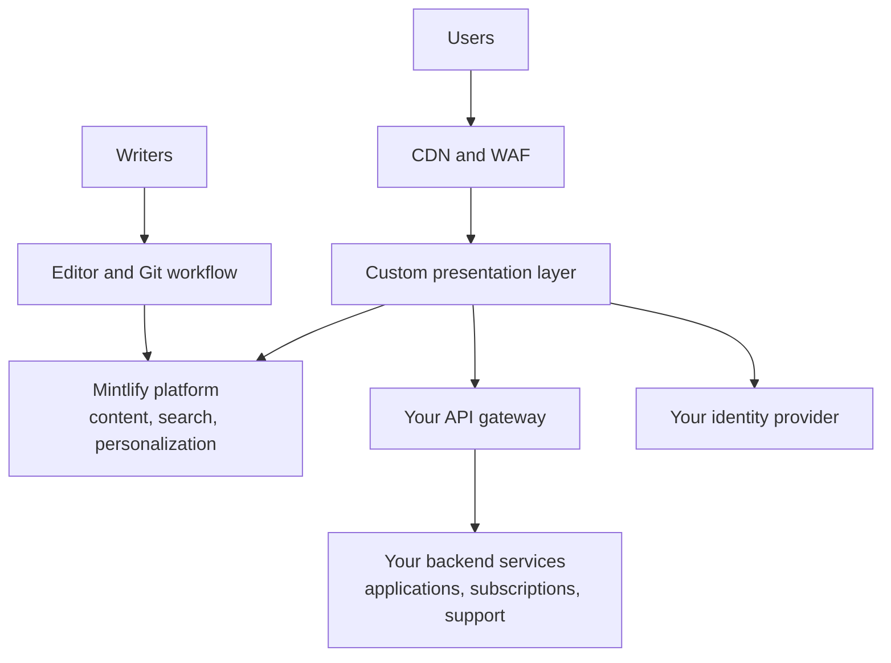

<Info>
  Custom portals require an [Enterprise plan](https://mintlify.com/pricing?ref=custom-portal) and a [self-hosted deployment](/deploy/self-host). Reach out to your account team to scope one.
</Info>

For some platforms, documentation is one surface of a larger product. The product might be an API marketplace, a partner portal, or a developer experience with sign-in, credentials, and support built in. Mintlify supports those use cases by designing, building, and maintaining a custom presentation layer that replaces your existing portal front end. Your team authors content through the Mintlify editor or a Git-backed workflow.

The portal integrates with your existing APIs, gateway, and downstream systems, which remain owned and operated by your team.

## Features

| Feature | What ships | Backed by |
| --- | --- | --- |
| Custom presentation layer | A full front-end application in your design system, deployed inside your environment | Mintlify, alongside the self-hosted platform |
| Product and catalog pages | Marketplace, product discovery, and documentation surfaces | Content maintained on Mintlify |
| Sign-in | Authenticated sessions across the portal | Your identity provider |
| Applications and credentials | Application registration and credential management | Your backend APIs |
| Subscriptions | Product and plan subscriptions | Your backend APIs |
| Profiles and notifications | User profiles and notification centers | Your backend APIs |
| Support | Support ticket creation and tracking | Your backend APIs |
| Search | Login-aware search scoped to what the user can access | Mintlify platform |
| Personalized content | Entitlement and group-based filtering applied server-side at render time, so users only see the products and pages they have access to | Mintlify platform and your identity provider |
| Ongoing releases | Versioned releases with upgrade guides, the same operating model as any [self-hosted deployment](/deploy/self-host#updates) | Mintlify |

## Authoring flow

The custom front end doesn't affect how content gets written. Maintain content with the editor or a local Git-based workflow. Every change flows through your repository's review process with a full audit trail, and publishing triggers builds that update the portal automatically. Content changes do not require a front-end deploy.

## Architecture

The custom presentation layer integrates with the self-hosted Mintlify platform for content, search, and personalization; your API gateway for applications, subscriptions, and support; and your identity provider for authentication.

```mermaid
flowchart TD
  U[Users] --> CDN[CDN and WAF]
  CDN --> PORTAL[Custom presentation layer]
  PORTAL --> PLAT[Mintlify platform<br/>content, search, personalization]
  PORTAL --> GW[Your API gateway]
  GW --> BE[Your backend services<br/>applications, subscriptions, support]
  PORTAL --> IDP[Your identity provider]
  W[Writers] --> ED[Editor and Git workflow]
  ED --> PLAT
```

The custom presentation layer and Mintlify platform run inside your network boundary, using your cluster, data stores, and observability stack, with no third-party egress. Your downstream systems of record remain unchanged; the portal accesses them through your existing APIs.

## How the engagement runs

<Steps>
  <Step title="Scope and design">
    Your account team maps the portal surfaces, your design system, and the backend APIs the portal consumes, and agrees on an integration contract with your platform team.
  </Step>
  <Step title="Public surfaces first">
    The engagement typically implements your design system and public content surfaces first, so you can validate the experience against your existing portal before cutover.
  </Step>
  <Step title="Authenticated surfaces">
    Sign-in, credential management, subscriptions, and other logged-in experiences follow, integrated with your identity provider and backend APIs.
  </Step>
  <Step title="Search, personalization, and AI">
    Login-aware search and server-side personalization complete the core experience. Optional AI features remain disabled until your security or AI governance team approves them.
  </Step>
</Steps>

Throughout, your team reviews releases in non-production environments and controls every cutover.

## Next steps

<Columns cols={2}>
  <Card title="Talk to your account team" icon="messages-square" href="https://www.mintlify.com/enterprise">
    Scope a custom portal engagement and plan your launch.
  </Card>
  <Card title="Self-host" icon="server" href="/deploy/self-host">
    The deployment foundation a custom portal runs on.
  </Card>
</Columns>
