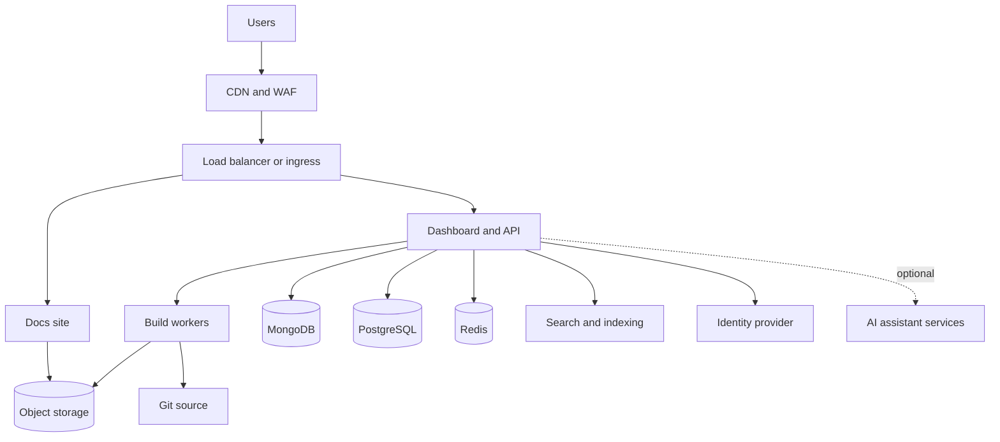

<Info>
  Self-hosting requires an [Enterprise plan](https://mintlify.com/pricing?ref=self-host). Reach out to your account team to scope a deployment.
</Info>

Self-hosting runs Mintlify inside your own cloud account or data center, so your documentation, build pipeline, analytics, and logs stay within your network boundary. It's designed for teams with data-residency, compliance, or air-gap requirements that a cloud-hosted deployment can't meet.

Every self-hosted deployment is a scoped engagement with your account team, not a self-serve install. This page describes what you provision, how the deployment runs, and the tradeoffs against cloud hosting so you can evaluate self-hosting before committing to it.

## Platform support

| Platform | Method |
| --- | --- |
| <Icon icon="/images/logos/aws.svg" /> Amazon Web Services | AWS Cloud Development Kit (CDK) app |
| <Icon icon="/images/logos/azure.svg" /> Microsoft Azure | Helm chart on Azure Kubernetes Service (AKS) |
| <Icon icon="/images/logos/gcp.svg" /> Google Cloud | Helm chart on Google Kubernetes Engine (GKE) |
| <Icon icon="/images/logos/oracle.svg" /> Oracle Cloud | Helm chart on Oracle Container Engine for Kubernetes (OKE) |
| <Icon icon="/images/logos/openshift.svg" /> Red Hat OpenShift | Helm chart |
| <Icon icon="/images/logos/kubernetes.svg" /> Any Kubernetes | Helm chart |

## How self-hosting compares to cloud hosting

Authoring works the same way in both models: writers use the web editor or their Git workflow, and every change flows through your repository's review process. What changes is who operates the platform and where data lives.

| Area | Cloud-hosted | Self-hosted |
| --- | --- | --- |
| Time to launch | Same day | Scoped engagement, typically weeks |
| Infrastructure | Mintlify operates everything | You operate the cluster, network, and data stores. Mintlify ships versioned releases with upgrade guides and supports the application tier |
| Platform updates | Continuous, automatic | Versioned releases that you review and deploy on your own schedule |
| Data boundary | Processed in Mintlify's cloud | Content, builds, analytics, and logs stay inside your network with no third-party egress |
| AI features | On by default | Ship disabled until your security or AI governance team approves them. Can run against your own model endpoint, your own API key, or Mintlify cloud |
| Integrations | Full catalog | Integrations that depend on Mintlify cloud services are unavailable |
| Monitoring | Managed by Mintlify | You connect your own observability stack |

Self-hosted deployments usually start narrow and expand. A common path is public documentation first, then authenticated content, the web editor, and AI features as your security reviews complete.

## Features

Everything core to authoring, building, and serving documentation ships in a self-hosted deployment:

| Feature | Availability | Notes |
| --- | :---: | --- |
| Documentation site | <Icon icon="circle-check" color="#16a34a" /> | Full rendering, components, and theming |
| Web editor | <Icon icon="circle-check" color="#16a34a" /> | Browser-based authoring for non-technical writers |
| Git-backed workflow | <Icon icon="circle-check" color="#16a34a" /> | GitHub, GitHub Enterprise Server, GitLab including self-managed, Bitbucket, or an internally owned proxy API |
| Search | <Icon icon="circle-check" color="#16a34a" /> | Runs inside your deployment. The index rebuilds on publish |
| Authenticated content | <Icon icon="circle-check" color="#16a34a" /> | Access control through your identity provider |
| Dashboard SSO | <Icon icon="circle-check" color="#16a34a" /> | OIDC or SAML |
| Analytics | <Icon icon="circle-check" color="#16a34a" /> | Collected and stored inside your network |
| Third-party analytics and support widgets | <Icon icon="circle-check" color="#16a34a" /> | Configured with your own keys, served from the docs site |
| Static export | <Icon icon="circle-check" color="#16a34a" /> | Self-contained bundles for air-gapped serving |
| Versioned releases and rollback | <Icon icon="circle-check" color="#16a34a" /> | Each release pins image versions. Roll back by redeploying the previous version |
| AI assistant and agent | <Icon icon="minus" color="#9ca3af" /> Optional | Ships disabled. Runs against your own model endpoint, your own API key, or Mintlify cloud |

What's not included is limited to smaller surfaces that depend on Mintlify-operated services: the Slack app, the Discord app, third-party connectors for agent workflows, and SDK generation integrations.

## Architecture

A self-hosted deployment is a set of services with clear dependencies. Provision the data stores first, then the services that depend on them, then the edge.



| Resource | Purpose | Required |
| --- | --- | :---: |
| Load balancer or ingress | TLS termination and routing | <Icon icon="circle-check" color="#16a34a" /> |
| Docs site | Serves rendered documentation | <Icon icon="circle-check" color="#16a34a" /> |
| Dashboard and API | Admin, auth, and build orchestration | <Icon icon="circle-check" color="#16a34a" /> |
| Build workers | Build and publish documentation sites | <Icon icon="circle-check" color="#16a34a" /> |
| MongoDB | Content store | <Icon icon="circle-check" color="#16a34a" /> |
| PostgreSQL | Deployment and user metadata | <Icon icon="circle-check" color="#16a34a" /> |
| Redis | Build queue and caching | <Icon icon="circle-check" color="#16a34a" /> |
| Object storage | Built site bundles and static exports | <Icon icon="circle-check" color="#16a34a" /> |
| Search and indexing | Docs search. The index rebuilds on publish | <Icon icon="circle-check" color="#16a34a" /> |
| Identity provider | OIDC or SAML SSO for the dashboard and authenticated content | <Icon icon="circle-check" color="#16a34a" /> |
| AI assistant services | Assistant and agent features | <Icon icon="minus" color="#9ca3af" /> Optional |

Your documentation source can be GitHub, GitHub Enterprise Server, GitLab (including self-managed), or Bitbucket. Organizations that can't grant repository credentials to a third-party service can instead front their Git hosting with an internally owned proxy API, and fully air-gapped environments use [static export](/api/static-export/overview) with no Git connection at all.

### Sizing

As a starting point, a production deployment runs on roughly 45 to 60 vCPU, 160 to 220 GB of memory, and about 1 TB of solid-state drive (SSD) storage across services, with non-production environments at about half that. Your account team sizes the deployment with you based on page count, traffic, and which features you enable.

## Set up your platform

<Tabs>
  <Tab title="AWS" icon="/images/logos/aws-mark.svg">
    AWS deployments use an AWS CDK app that provisions and updates the full stack in your account. The CDK app pins container images to specific versions, so every deployment is reproducible and reviewable.

    ### What you provide

    | Component | Requirement | Notes |
    | --- | --- | --- |
    | Compute | Amazon ECS cluster | Runs the Mintlify services |
    | Content store | Amazon DocumentDB | MongoDB-compatible |
    | Metadata store | Amazon RDS for PostgreSQL | Deployment and user metadata |
    | Cache and queue | Amazon ElastiCache for Redis | Build queue and caching |
    | Object storage | Amazon S3 | Built site bundles and static exports |
    | CDN | Amazon CloudFront | Serves the docs site at the edge |
    | Networking | VPC with public and private subnets, Application Load Balancer | Isolates workloads |
    | TLS and DNS | AWS Certificate Manager, Amazon Route 53 | HTTPS and routing for your domain |
    | Secrets | AWS Secrets Manager | Database credentials and signing secrets |
    | Identity | OIDC or SAML provider | Dashboard SSO |

    ### Setup

    <Steps>
      <Step title="Scope the deployment">
        Your account team reviews your network topology, Git hosting, identity provider, and compliance requirements, then delivers the CDK app and access to versioned container images.
      </Step>
      <Step title="Configure and deploy">
        Set your domain, certificate, and networking in the CDK context, review the change set, and deploy.

        ```bash
        cdk diff
        cdk deploy --all
        ```
      </Step>
      <Step title="Connect Git and SSO">
        Grant the deployment access to your documentation repositories and connect your identity provider.
      </Step>
      <Step title="Cut over">
        Verify builds and search on your staging domain, then point your production DNS at the deployment.
      </Step>
    </Steps>
  </Tab>

  <Tab title="Kubernetes" icon="/images/logos/kubernetes.svg">
    Kubernetes deployments use the Mintlify enterprise Helm chart and run on any certified Kubernetes cluster. The same chart covers managed Kubernetes on any cloud and on-premises clusters:

    - **Azure**: AKS, with Microsoft Entra ID for SSO and Azure managed data services.
    - **Google Cloud**: GKE, with Cloud SQL, Memorystore, and Cloud Storage.
    - **Oracle Cloud**: OKE, with OCI managed databases and OCI Object Storage.
    - **OpenShift**: ships OpenShift-compatible security contexts and uses Routes for ingress.

    ### What you provide

    | Component | Requirement | Notes |
    | --- | --- | --- |
    | Cluster | Kubernetes or OpenShift cluster | Hosts the Helm release |
    | Content store | MongoDB | Managed or in-cluster |
    | Metadata store | PostgreSQL | Managed or in-cluster |
    | Cache and queue | Redis | Build queue and caching |
    | Object storage | S3-compatible bucket | Built site bundles and static exports |
    | Ingress | Ingress controller or OpenShift Route with TLS | Serves HTTPS. A WAF in front is recommended |
    | Registry | Private container registry | Hosts the delivered images |
    | Identity | OIDC or SAML provider | Dashboard SSO |

    ### Setup

    <Steps>
      <Step title="Scope the deployment">
        Your account team reviews your cluster, Git hosting, identity provider, and compliance requirements, then delivers the Helm chart, a values template, and versioned container images for your registry.
      </Step>
      <Step title="Provision data stores">
        Stand up MongoDB, PostgreSQL, Redis, and object storage, managed by your cloud provider or in-cluster.
      </Step>
      <Step title="Configure and install">
        Point the values file at your data stores, ingress, and registry, then install the release.

        ```bash
        helm upgrade --install mintlify ./mintlify-enterprise \
          --namespace mintlify --create-namespace -f values.yaml
        ```
      </Step>
      <Step title="Connect Git and SSO, then cut over">
        Grant the deployment access to your documentation repositories, connect your identity provider, verify on staging, and point production DNS at the deployment.
      </Step>
    </Steps>
  </Tab>
</Tabs>

## Updates

Platform updates and content updates move independently. You control when the platform changes, and your documentation stays current on its own.

### Platform updates

Mintlify ships versioned releases with upgrade guides and release notes from your account team. Each release pins specific image versions, so you can test a release in a non-production environment before deploying it and roll back to the previous version if needed.

<CodeGroup>

```bash AWS (CDK)
# review the change set for the new release, then roll it out
cdk diff
cdk deploy --all
```

```bash Kubernetes (Helm)
# upgrade to a delivered release, or roll back
helm upgrade mintlify ./mintlify-enterprise \
  --namespace mintlify -f values.yaml
helm rollback mintlify
```

</CodeGroup>

Updates roll out with no downtime: new tasks or pods start, pass health checks, and replace the old ones.

### Content updates

Content flows through your Git source, not through platform releases. When you push to your documentation repository, the build workers rebuild the site and publish it to object storage automatically. Content changes never require a platform deploy.

## Air-gapped deployments

Environments with no Git webhook path serve documentation as [static export bundles](/api/static-export/overview): self-contained builds of your site published to object storage and served through your CDN. Regenerate the bundle when content changes, or automate the loop with the GitHub Action on that page. AI features that require outbound network access are disabled in air-gapped deployments.

## Next steps

<Columns cols={2}>
  <Card title="Talk to your account team" icon="messages-square" href="https://www.mintlify.com/enterprise">
    Scope a self-hosted deployment on your platform and plan your launch.
  </Card>
  <Card title="Static export" icon="package" href="/api/static-export/overview">
    Generate self-contained bundles of your documentation for air-gapped serving.
  </Card>
</Columns>
