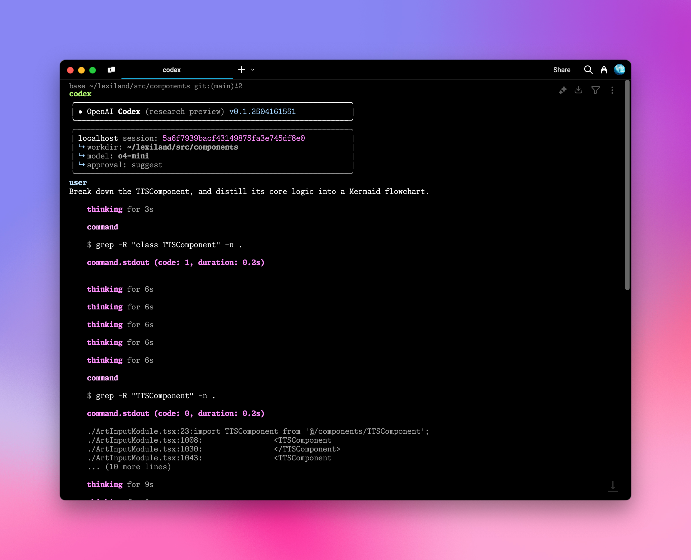
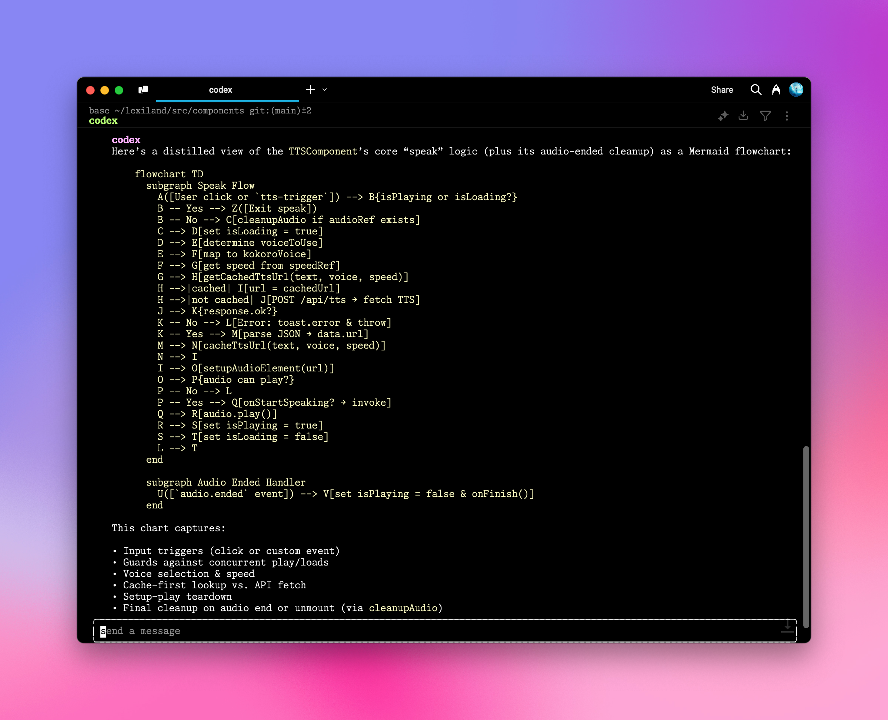

# OpenAI Codex CLI Integration

AiHubMix offers seamless integration with OpenAI [Codex CLI](https://github.com/openai/codex), enabling you to leverage advanced AI programming assistance directly in your command line environment. With simple configuration steps, you can use natural language to perform various programming and system operations from your terminal.

## Configuration Steps

### 1. Set Environment Variables

Open your shell configuration file (e.g., `.zshrc` or `.bashrc`) and add the following environment variables:

```bash
export OPENAI_BASE_URL="https://api.aihubmix.com/v1"
export OPENAI_API_KEY="sk-***" # Replace with your AiHubMix API key
```

<Warning>
The `OPENAI_API_KEY` should be your [AiHubMix key](https://aihubmix.com/token). The variable name remains `OPENAI_API_KEY` for compatibility with the OpenAI native client.
</Warning>

### 2. Apply Configuration Changes

Execute the following command in your terminal to apply the environment variables:

```bash
source ~/.zshrc  # If using zsh
# or
source ~/.bashrc  # If using bash
```

### 3. Launch Codex CLI

Navigate to your project directory and run the `codex` command:

```bash
cd /your_project_path
codex
```
  

### 4. Execute Tasks Using Natural Language

Now you can input instructions to Codex CLI using natural language, for example:

```bash
# Sample input
Break down the TTSComponent, and distill its core logic into a Mermaid flowchart.
```
  

## Advanced Configuration

<Tip>
- The default model is the cost-effective `o4-mini`, which can be modified in `~/.codex/config.json`
- Currently only OpenAI models are supported, you can find the model list in the [Responses API documentation](https://platform.openai.com/docs/api-reference/responses)
- You can customize the system prompt by editing the `~/.codex/instructions.md` file to tailor the AI assistant's behavior
</Tip>

## Useful Command Reference

### Help Command
```bash
codex -h
```

### Complete Command Options
```bash
  Usage
    $ codex [options] <prompt>

  Options
    -h, --help                 Show usage and exit
    -m, --model <model>        Model to use for completions (default: o4-mini)
    -i, --image <path>         Path(s) to image files to include as input
    -v, --view <rollout>       Inspect a previously saved rollout instead of starting a session
    -q, --quiet                Non-interactive mode that only prints the assistant's final output
    -a, --approval-mode <mode> Override the approval policy: 'suggest', 'auto-edit', or 'full-auto'

    --auto-edit                Automatically approve file edits; still prompt for commands
    --full-auto                Automatically approve edits and commands when executed in the sandbox

    --no-project-doc           Do not automatically include the repository's 'codex.md'
    --project-doc <file>       Include an additional markdown file at <file> as context
    --full-stdout              Do not truncate stdout/stderr from command outputs

  Dangerous options
    --dangerously-auto-approve-everything
                               Skip all confirmation prompts and execute commands without
                               sandboxing. Intended solely for ephemeral local testing.

  Experimental options
    -f, --full-context         Launch in "full-context" mode which loads the entire repository
                               into context and applies a batch of edits in one go. Incompatible
                               with all other flags, except for --model.

  Examples
    $ codex "Write and run a python program that prints ASCII art"
    $ codex -q "fix build issues"
```