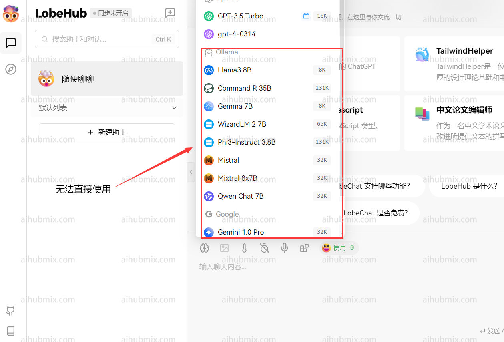
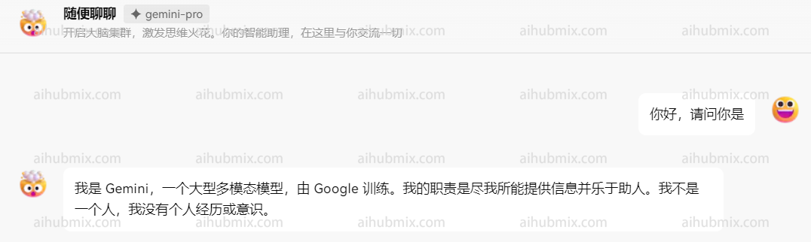
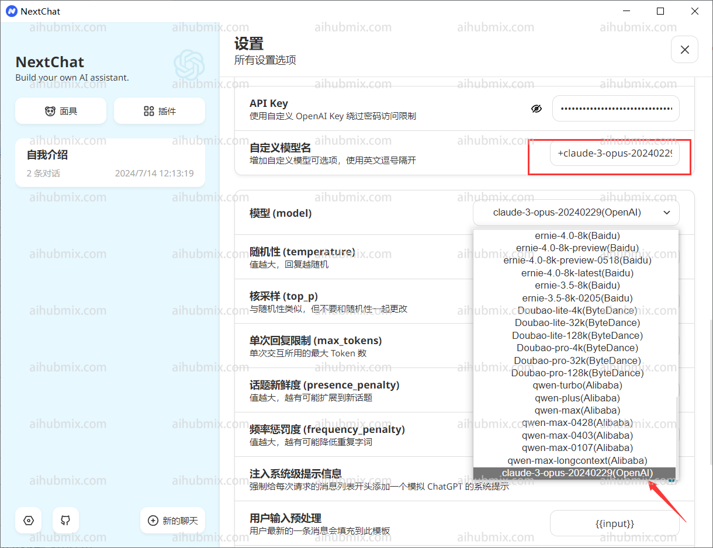

## How It Works

Our platform uses the OpenAI model API as a standard interface to aggregate multiple non-OpenAI models, including but not limited to Google's **Gemini** series and Anthropic Claude. To use a non-OpenAI model, simply **change the model name** just as you would when calling an OpenAI model. You can find the available model names in the settings page of our website.


## Using in Applications - Lobe Chat Example

Typically, the API key provided by our website only allows access to OpenAI models (such as GPT-3.5).


To use our aggregated models, you can add a custom model name. Here's how:

1. Open the settings interface and find the "Model List" section.
2. - Open the website model square page.
   - Copy the name of the model you want to use (e.g., gemini-pro or claude-3-opus-20240229).


3. - Enter the desired model name and select it.
   - Confirm that the manually added model appears below the OpenAI section.

4. Select the model you want to use from the OpenAI section (e.g., gemini-pro). The result should look like this:


## Developer Integration - Official Library Example

Here's an example of how to use our API with the official Python library:

```python
from openai import OpenAI

client = OpenAI(
    api_key="sk-***",
    base_url="https://aihubmix.com/v1"
)

chat_completion = client.chat.completions.create(
    messages=[
        {
            "role": "user",
            "content": "Say this is a test",
        }
    ],
    model="gemini-2.0-flash",
)

print(chat_completion)
```

## Special Case: Next Web Client

If you're using the Next Web client, make sure you've upgraded to the latest version (v2.13.0). This version introduces a new way to add custom models:

1. **Entering a custom model name**:
   - The Next Web client automatically determines the model provider based on the input model name. However, the API key from our website is only compatible with the OpenAI interface.
   - When entering a custom model name, use the format: "+'desired model name'@OpenAI".
   - For example, to use the gemini-pro model, enter: "+gemini-pro@OpenAI".
   - This method manually directs the model provider to OpenAI.

2. **Confirming your selection**:
   - On the model selection screen, confirm that your manually added model (OpenAI) appears at the bottom.
