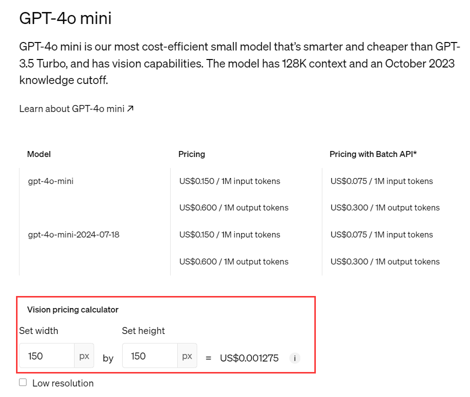

<Update label="April 12, 2025">
Added `:surfing` to the model id to [enable search functionality for any model Beta](/en/api/LLM-Search)
</Update>

<Update label="April 9, 2025">
Support Claude prompt caching, high-frequency prompts can save up to 76% of costs!
</Update>

<Update label="April 7, 2025">
Added support for Ideogram AI drawing interface, featuring powerful text-to-image capabilities, including image generation, remix, partial editing and upscaling.
</Update>

<Update label="April 5, 2025">
New docs published, bring you a better experience
</Update>

<Update label="March 30, 2025">
Added support for Claude Text Edit Tool
</Update>

<Update label="March 24, 2025">
Enabled new Trident Logo
</Update>

<Update label="March 16, 2025">
Added native search functionality support for OpenAI and Google Gemini models; future plans include extending this interface to support third-party search
</Update>

<Update label="March 15, 2025">
Added new models: gpt-4o-mini-search-preview and gpt-4o-search-preview
</Update>

<Update label="March 7, 2025">
o1 and o3-mini prices reduced by 10%, now aligned with official pricing
</Update>

<Update label="March 6, 2025">
aihubmix-DeepSeek-R1 price increased 7x due to Microsoft price increase; recommend using Volcano's DeepSeek-R1 for stability and affordability. Added new models: qwen-qwq-32b and qwen2.5-vl-72b-instruct
</Update>

<Update label="February 28, 2025">
Claude models price reduced by 15%; Added new model gpt-4.5-preview (Note: extremely expensive, please use with caution)
</Update>

<Update label="February 26, 2025">
Improved Deepseek stability; Most stable from ByteDance, recommended models: DeepSeek-R1 and DeepSeek-V3
</Update>

<Update label="February 25, 2025">
Added model claude-3-7-sonnet-20250219
</Update>

<Update label="February 24, 2025">
- gpt-4o occasionally experiencing slow responses due to vendor issues; temporarily recommend using gpt-4o-2024-11-20
- Perplexity API temporarily offline due to complex official pricing structure exceeding our platform's pricing structure; will relaunch after price adjustment
- ByteDance official limited-time discount ended, DeepSeek-R1 price has increased
- Added model details page and parameter information
</Update>

<Update label="February 23, 2025">
- ByteDance official limited-time discount ended, DeepSeek-V3 price has increased; expecting R1 price to increase soon, we will adjust accordingly
</Update>

<Update label="February 18, 2025">
- Added new model: kimi-latest (Official pricing based on input length tiers 8k/32k/128k, our platform uses 32k tier as standard, price-sensitive users please note)
- Optimized website structure
- Merged logs page into usage statistics page
- Moved announcements to model marketplace page
- Moved settings under profile picture
- aihubmix-DeepSeek-R1 price reduced by 50%
- Added new models: gemini-2.0-pro-exp-02-05-search, gemini-2.0-flash-exp-search with integrated Google official search functionality
- Added new models: gemini-2.0-flash, gemini-2.0-pro-exp-02-05, gemini-2.0-flash-lite-preview-02-05
- Added new models: o3-mini, o1 (Note: backend billing ~10% higher than official due to limited accounts)
</Update>

<Update label="February 4, 2025">
- o1 model: OpenAI official does not support stream parameter
- o3-mini does not support temperature parameter; added new parameter "Reasoning effort" accepting "low, medium, high" (defaults to medium)
</Update>

<Update label="February 1, 2025">
Feature: Added support for OpenAI voice model input/output functionality. Available on api.aihubmix.com server, main server support coming after 1 week of stability. Overall backend billing matches official rates. Currently, logs only show text tokens; voice costs not yet displayed but functionality unaffected.

New models added:
- o3-mini, o1 (Note: backend billing ~10% higher than official due to limited accounts)
- aihubmix-DeepSeek-R1 (Recommended, more stable)
- qwen-max-0125 (Qwen2.5-Max), sonar-reasoning
- deepseek-ai/DeepSeek-R1-Zero and deepseek-ai/DeepSeek-R1, deepseek-r1-distill-llama-70b
- aihub-Phi-4
- Doubao-1.5-pro-256k, Doubao-1.5-pro-32k, Doubao-1.5-lite-32k, Doubao-1.5-vision-pro-32k
- sonar, sonar-pro (latest from Perplexity AI)
- gemini-2.0-flash-thinking-exp-01-21
- deepseek-reasoner (aka DeepSeek-R1)
- MiniMax-Text-01
- codestral-latest (Mistral's new code model - Codestral 25.01)
</Update>

<Update label="January 23, 2025">
New models added:
- aihub-Phi-4
- Doubao-1.5-pro-256k, Doubao-1.5-pro-32k, Doubao-1.5-lite-32k, Doubao-1.5-vision-pro-32k
- sonar, sonar-pro (latest from Perplexity AI)
- gemini-2.0-flash-thinking-exp-01-21
- deepseek-reasoner (aka DeepSeek-R1)
</Update>

<Update label="January 19, 2025">
- Added Perplexity AI API models; currently only available on preview server api.aihubmix.com, will update to main server aihubmi.com if stable
- api.aihubmix.com is preview server, new features update here first, typically moving to main server aihubmix.com after 1 week of stability

New models added:
- MiniMax-Text-01
- codestral-latest (Mistral's new code model - Codestral 25.01)
- gpt-4o-zh: automatically translates any language input to English for the model, model output automatically translated back to Chinese; feature in testing phase, limited concurrent requests, only supports gpt-4o model
</Update>

<Update label="January 6, 2025">
- Added gemini-2.0-flash-exp-search with Google native web search functionality; official gemini 2.0 flash model's web search requires additional parameters, aihubmix integrated this - just add 'search' to model name to use
- Added new model deepseek-ai/DeepSeek-V3
</Update>

<Update label="January 1, 2025">
- Added model marketplace page replacing original model/pricing page
</Update>

<Update label="December 30, 2024">
- Fixed gemini-2.0-flash-thinking-exp-1219 model only outputting thoughts without answers
- Fixed issue with balance reminder emails not being received
</Update>

<Update label="December 22, 2024">
- Added usage statistics page and recharge record page
- Added Doubao series models: Doubao-lite-128k, Doubao-lite-32k, Doubao-lite-4k, Doubao-pro-128k, Doubao-pro-256k, Doubao-pro-32k, Doubao-pro-4k
- Added new models: gemini-2.0-flash-thinking-exp-1219, gemini-2.0-flash-exp, aihubmix-Mistral-Large-2411, aihubmix-Llama-3-3-70B-Instruct, grok-2-1212, grok-2-vision-1212
- Added new models: gemini-exp-1206, llama-3.3-70b-versatile, learnlm-1.5-pro-experimental
</Update>

<Update label="December 14, 2024">
- Added new models: gemini-2.0-flash-exp, aihubmix-Mistral-Large-2411, aihubmix-Llama-3-3-70B-Instruct
</Update>

<Update label="December 8, 2024">
- Added new models: gemini-exp-1206, llama-3.3-70b-versatile, learnlm-1.5-pro-experimental
- Added usage statistics page
</Update>

<Update label="November 21, 2024">
- Recently added models: gpt-4o-2024-11-20, step-2-16k, grok-vision-beta
- Qwen 2.5 Turbo Million Context Model: qwen-turbo-2024-11-01
</Update>

<Update label="November 7, 2024">
- Compatible with Claude native SDK, v1/messages interface now supported
- Cache and computer usage functions for Claude native interface not yet supported (prompt caching and computer use); will continue improving these features in next two weeks
</Update>

<Update label="November 5, 2024">
- Added new model: claude-3-5-haiku-20241022
- Added Elon Musk's x.ai latest model grok-beta
</Update>

<Update label="October 23, 2024">
- Added new model: claude-3-5-sonnet-20241022
</Update>

<Update label="October 10, 2024">
OpenAI's latest caching feature now online. Currently supports:
- GPT-4o
- GPT-4o-mini
- o1-preview
- o1-mini

Note: gpt-4o-2024-05-13 version not officially supported.

If request hits cache, you'll see relevant cache token data in backend logs.

For detailed information and usage rules, visit: [OpenAI Caching Feature Details](https://openai.com/index/api-prompt-caching/)
</Update>

<Update label="October 3, 2024">
- Reduced backend billing for gpt-4o model, synchronized with official pricing
- Added new models: aihubmix-Llama-3-2-90B-Vision, aihubmix-Llama-3-70B-Instruct
- Added Cohere's latest models: aihubmix-command-r-08-2024, aihubmix-command-r-plus-08-2024
</Update>

<Update label="September 19, 2024">
- Added new models: whisper-large-v3 and distil-whisper-large-v3-en
- Note: Whisper model billing based on input seconds; current page pricing display issue to be fixed. Backend billing accurate, fully synchronized with OpenAI official charges
</Update>

<Update label="September 13, 2024">
- Added models o1-mini and o1-preview
Note: These latest models require input parameter changes. Some wrapper software may report errors if default parameters not updated.

Important Notes:
Testing shows o1 models do not support:
- system field: 400 error
- tools field: 400 error
- image input: 400 error
- json_object output: 500 error
- structured output: 400 error
- logprobs output: 403 error
- stream output: 400 error
- o1 series: 20 RPM, 150,000,000 TPM, very low, 429 errors may occur anytime
- Others: temperature, top_p, and n fixed at 1; presence_penalty and frequency_penalty fixed at 0
</Update>

<Update label="September 10, 2024">
- Added new model: mattshumer/Reflection-Llama-3.1-70B (reportedly strongest fine-tuned version of llama3.1-70b)
- Increased Claude-3 model pricing to maintain stable supply, currently 10% more expensive than direct official API use; prices will gradually decrease
- Enhanced concurrent capabilities of OpenAI series models, theoretically supporting unlimited concurrency
</Update>

<Update label="August 11, 2024">
- Added new models: Phi3medium128k, ahm-Phi-3-medium-4k, ahm-Phi-3-small-128k
- Improved stability of Llama-related models
- Further optimized compatibility of Claude models
</Update>

<Update label="August 7, 2024">
- Added OpenAI's newly updated 4o version gpt-4o-2024-08-06, see https://platform.openai.com/docs/guides/structured-outputs
- Added Google's latest model: gemini-1.5-pro-exp-0801
</Update>

<Update label="August 4, 2024">
- Added online direct payment recharge
- Fixed Claude multi-turn conversation format error: messages roles must alternate between "user" and "assistant", but found multiple "user" roles in a row
- Optimized index issue when using function features of Claude models
- Backup server https://orisound.cn will be fully decommissioned on September 7; please switch to main server https://aihubmix.com or backup server https://api.aihubmix.com
</Update>

<Update label="July 27, 2024">
- Added support for Mistral Large 2, model name: Mistral-large-2407 or aihubmix-Mistral-large-2407
- System optimization
</Update>

<Update label="July 24, 2024">
- Added latest llama-3.1 models: llama-3.1-405b-instruct, llama-3.1-70b-versatile, and llama-3.1-8b-instant
</Update>

<Update label="July 20, 2024">
- Fixed pricing calculation issue for gpt-4o-mini model:
  Text input price: Official gpt-4o-mini model text input price is 1/33 of gpt-4o model price
  Image input price: Official gpt-4o-mini model image input price equals gpt-4o model price
- For accurate price calculation, we multiply token count for gpt-4o-mini model image input by 33x to align with official price
- More details at **[OpenAI Official Pricing](https://openai.com/api/pricing/)**

</Update>

<Update label="July 19, 2024">
- Added support for gpt-4o-mini model, backend billing synchronized with official
</Update>

<Update label="July 15, 2024">
- Supports official API parameter include_usage, passing parameters can return usage in stream mode, see **[Official Documentation](https://platform.openai.com/docs/api-reference/chat/create#chat-create-stream_options)**
</Update>

<Update label="July 14, 2024">
- New nextweb version supports calling non-OpenAI models **[Call Non-OpenAI Models on Our Site](https://doc.aihubmix.com/%E5%A6%82%E4%BD%95%E8%B0%83%E7%94%A8%E6%9C%AC%E7%AB%99%E9%9D%9EOpenAI%E6%A8%A1%E5%9E%8B)**
- Added backend billing for Alibaba Qwen models, overall cost ~10% higher than Alibaba Cloud official
- Optimized Azure OpenAI output compatibility with OpenAI interface
- Supports Claude-3's tool calling
- Added many new models, see Settings for available models
</Update>

<Update label="July 3, 2024">
- Overall backend interface optimized
- Each log request record now shows model unit price at time of request
- Added model and pricing page **[Model/Pricing](https://doc.aihubmix.com/%E5%A6%82%E4%BD%95%E8%B0%83%E7%94%A8%E6%9C%AC%E7%AB%99%E9%9D%9EOpenAI%E6%A8%A1%E5%9E%8B)**
</Update>

<Update label="June 20, 2024">
- Latest claude-3-5-sonnet-20240620 now supported, see usage instructions at **[How to Call Non-OpenAI Models on Our Site](https://doc.aihubmix.com/%E5%A6%82%E4%BD%95%E8%B0%83%E7%94%A8%E6%9C%AC%E7%AB%99%E9%9D%9EOpenAI%E6%A8%A1%E5%9E%8B)**
</Update>

<Update label="June 18, 2024">
- Backend log page now supports downloading usage request records
</Update>

<Update label="June 16, 2024">
- Reduced probability of randomly hitting Azure OpenAI, now almost negligible
</Update>

<Update label="June 13, 2024">
- Lowered fees for Claude-3 related models (Claude 3 Haiku, Claude 3 Sonnet, Claude 3 Opus) to align with official backend charges; current retail price ~14% off official price
</Update>

<Update label="June 10, 2024">
- Overall service architecture upgrade, all servers and data migrated to Microsoft Azure
- Future plans include secondary deep development and optimization based on open-source version of one API (commercial license obtained through sponsorship)
- Log data too large (over 100 million request logs) for temporary migration; contact customer service for previous log queries
- Optimized token billing for gpt-4o, tokenizer changed from cI100k_base to 0200k_base; results in decreased token count for streaming requests in Chinese, Korean, and Japanese
</Update>

<Update label="June 8, 2024">
- Added Alibaba's latest open-source models:
  - alibaba/Qwen2-7B-Instruct
  - alibaba/Qwen2-57B-A14B-Instruct
  - alibaba/Qwen2-72B-Instruct
</Update>

<Update label="May 20, 2024">
- Added new model gemini-1.5-flash
- Added new model gpt-4o
- Error accessing recharge page in Jiangsu region due to telecom hijacking of recharge domain, please **[contact customer service](https://doc.aihubmix.com/%E5%85%85%E5%80%BC%E4%B8%8E%E4%BA%BA%E5%B7%A5%E5%AE%A2%E6%9C%8D)** for recharge
- Added llama3 (llama3-70b-8192, llama3-8b-8192) gemini-1.5-pro, command-r, command-r-plus
- Claude-3 model supply restored; currently connecting to Claude-3 endpoints deployed on AWS and Google Cloud
- Claude-3 model and price backend billing 10% more expensive than official to cover server costs and team expenses
- Prices will gradually decrease to ~5% or lower as call volume increases
- Current concurrency needs testing; will apply for higher concurrent calls as usage increases
</Update>

