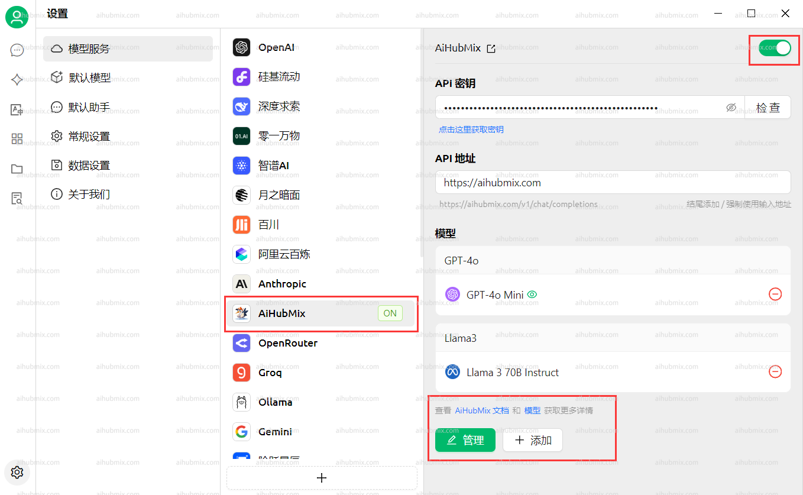

**[Download Cherry Studio AI here.](https://easys.run/cherry-studio/)**

## Common usage method
1. Open Settings in the bottom left corner of the application.  
  
2. In the Model Provider interface, select our AiHubMix and click the button in the upper right corner to enable it.  
3. Enter the API Key from [our site’s Key](https://aihubmix.com/token) in the API key field; you don't need to modify the API address field.  
**Note: If the check fails, try turning off your VPN.**  
 
4. Click Add Model below, and copy the model ID from the settings interface on our website to paste the desired model name.  
 

## If you encounter the problem where the model cannot see the image 
Some new models may encounter the issue where the model cannot see the input image.   
You need to manually check the image option on the settings page.  
