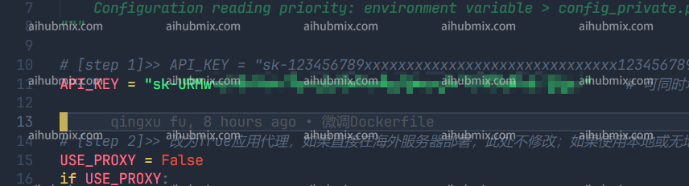

1. Open the gpt_academic/config.py file:  
 
2. Locate the API_KEY variable in config.py and enter [the Key from this site](https://aihubmix.com/token):  
 
3. Scroll down to find the API_URL_REDIRECT variable in config.py. Modify it by copying the following code block directly:  
```
API_URL_REDIRECT = {"https://api.openai.com/v1/chat/completions": "https://aihubmix.com/v1/chat/completions"}
```
 
4. Then you can use it  
 
