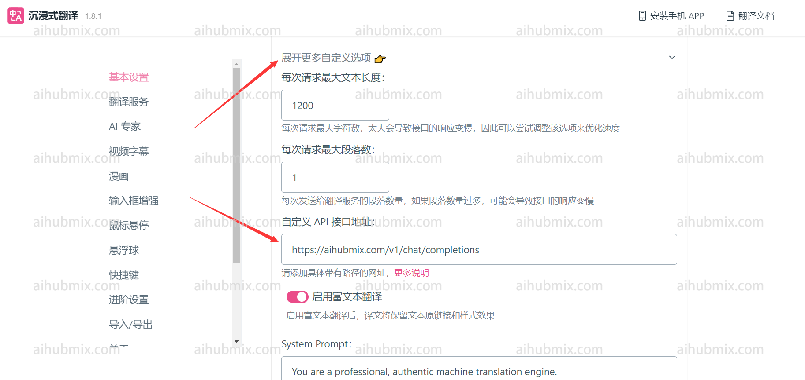

After entering the settings interface, select Custom API Key, and enter the [Key from our site](https://aihubmix.com/token) in the API Key field.  
 
Click on "Expand More Custom Settings"  
 
Enter the custom API endpoint URL:
```
https://aihubmix.com/v1/chat/completions
```  