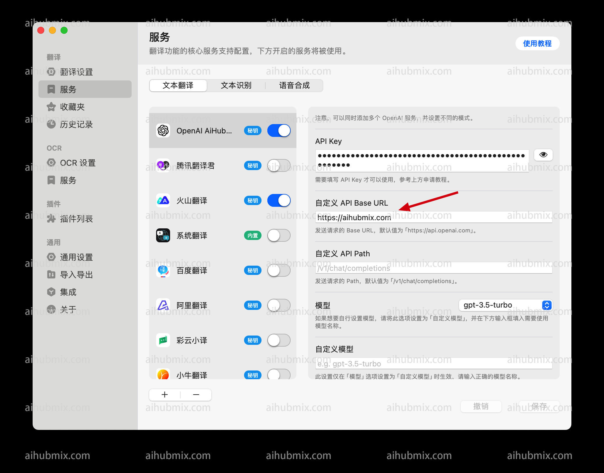

1. Open the settings in the Bob software.  
2. In the Services section, if OpenAI Translation is not listed, click to add it.  
3. Generate the API key from [our site’s Key](https://aihubmix.com/token).  
4. Change the API domain to our website's address:
```
https://aihubmix.com
```

 

