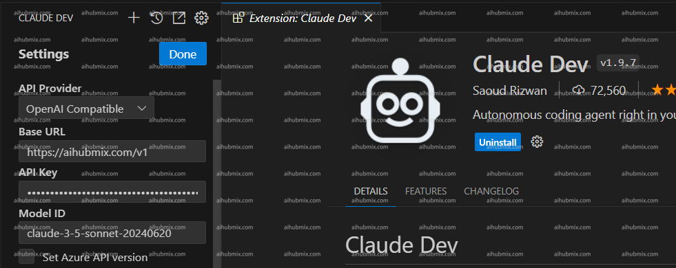

> Cline is the formerly Claude Dev

- Download the plugin and go to the settings page.  
- Select OpenAI Compatible in the API Provider field.  
- Enter the following in the Base URL field:
```
https://aihubmix.com/v1
```
- Generate the API Key from [our site’s Key](https://aihubmix.com/token).  
- Enter the model name and save the settings to start using it.
- **Note: It is recommended to copy and paste the model name from our site’s settings page. The image example shows the claude-3-5 model; gpt-4o can also be used.**
 
