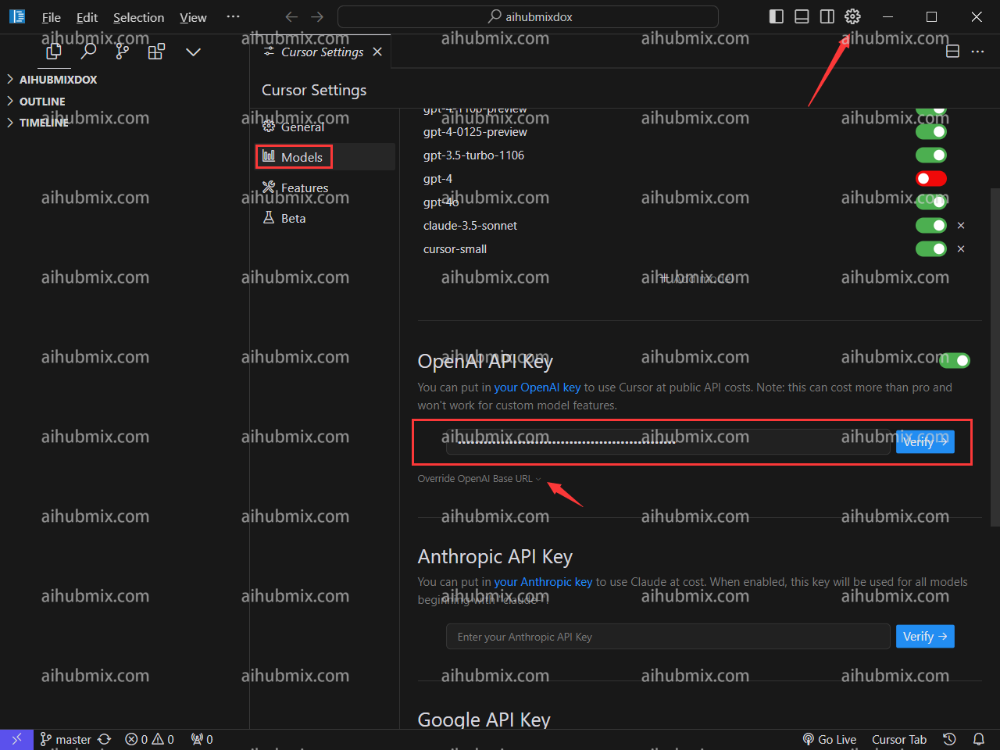
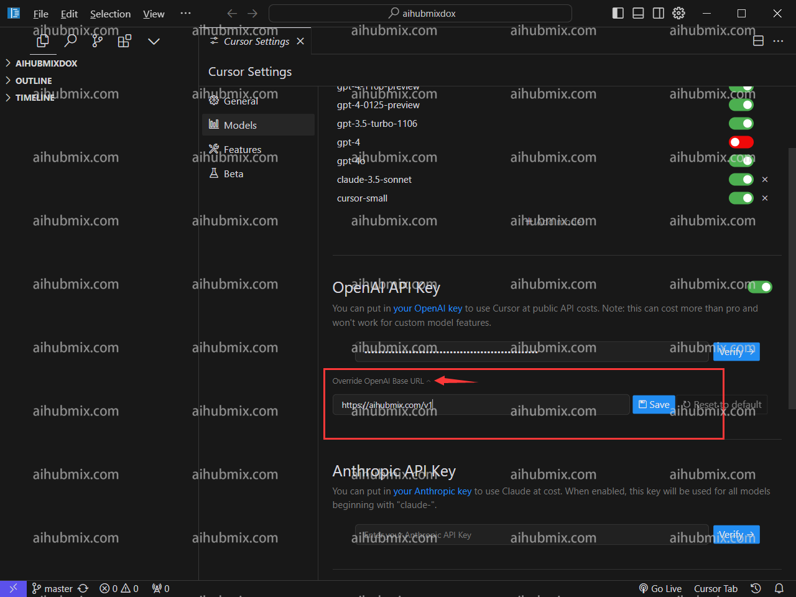
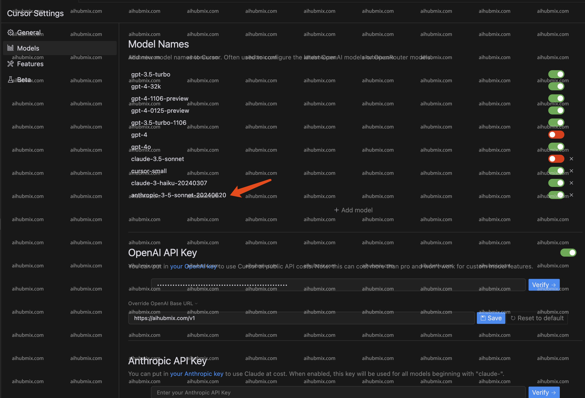

## Standard Usage Method
- Click the gear icon in the upper right corner to enter the settings page, and select Models.  
- Enter the [Key from our site](https://aihubmix.com/token) under Open API key.  

- Click Override OpenAI Base URL, and enter:  
```
https://aihubmix.com/v1
```  

- Finally, click Verify to ensure it's correctly set up.

## Special Instructions (Using claude-3.5 in Cursor)
Since Cursor automatically requests Claude's API based on request names, we have added a new name **anthropic-3-5-sonnet-20240620** to map to claude-3-5-sonnet-20240620. This bypasses Cursor's automatic request, allowing us to use the Claude API through our service.  
- The specific method is: Add a model named **anthropic-3-5-sonnet-20240620** to the model list. Select and enable this model.  
