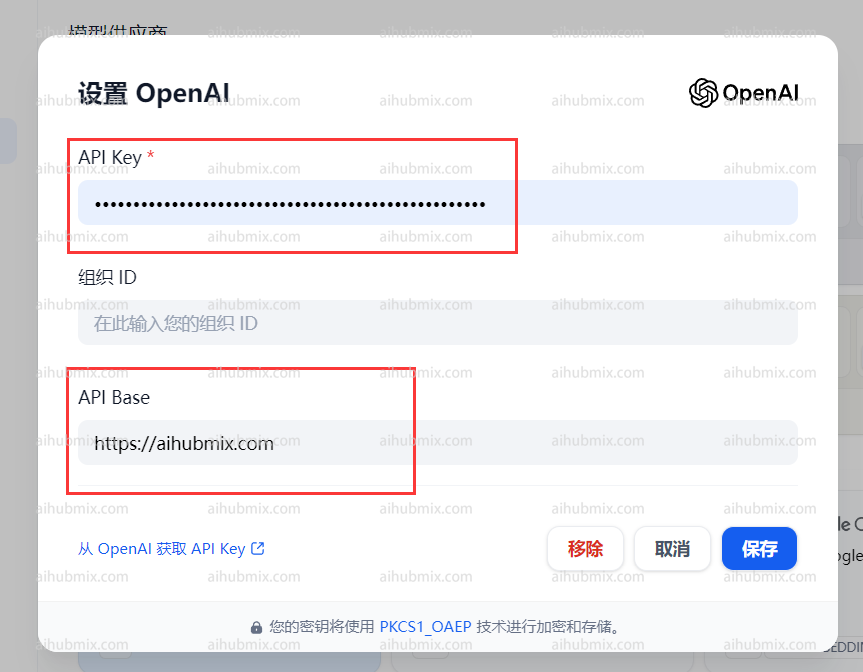

## Standard Usage (Using OpenAI Models)
Click your username in the top right corner of the webpage to enter the settings interface.  
Select OpenAI in the model provider section and open settings.  
 
- Enter the [Key from our site](https://aihubmix.com/token) in the API Key field.  
- Enter the following in the API Base field:
```
https://aihubmix.com
```  
 

## Using Non-OpenAI Models
In the model provider dropdown, find OpenAI-API-compatible and click to add a model.  

- Open the website's backend settings page and find the model list.
- Copy the name of the model you want to use (e.g., gemini-pro or claude-3-opus-20240229).
- Enter the [Key from our site](https://aihubmix.com/token) in the API Key field.  
- Enter the following in the API endpoint URL field:
```
https://aihubmix.com/v1
```  
