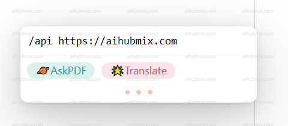
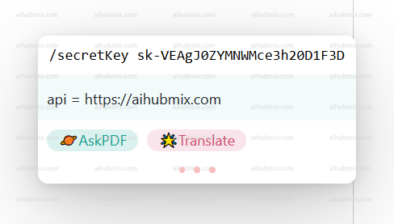

## PDF Reading Plugin: zotero-gpt
Download link: https://github.com/MuiseDestiny/zotero-gpt/releases

After installing the plugin,in the Edit menu, find Settings (Preferences in older versions). Locate the GPT settings interface.  
 
Configure the Base API as shown in the figure, and enter the [API key](https://aihubmix.com/token).

If use the following commands to set it up. 

First, use "Ctrl + /" to open the command window  
  
Enter
```
/api https://aihubmix.com
```
and press Enter  
 
  
Enter
```
/secretKey + your API key (generated from the Key, remember to include sk-)
```
 
  
Switch model command  
```
/model gpt-3.5-turbo-0125 
```
  
After selecting the model you want to use, you can start using it.  
  

## Translation Plugin: zotero-pdf-translate
Download link: https://github.com/windingwind/zotero-pdf-translate/releases

In the Edit menu, find Settings (Preferences in older versions). Locate the translation settings interface.  
Enter the API endpoint URL as: 
```
https://aihubmix.com/v1/chat/completions
```  
Don't worry about whether the status shows as available; just fill it in and it will work.  
 