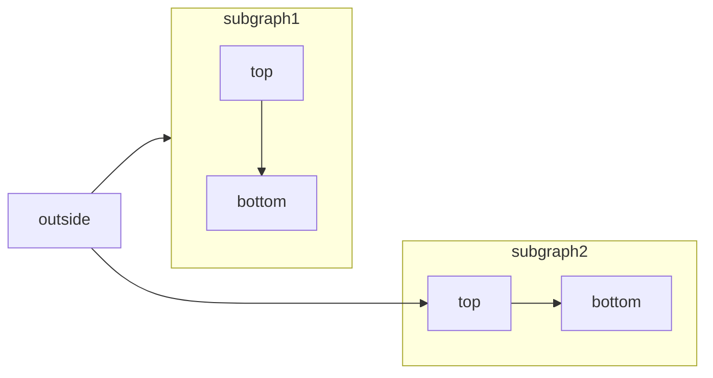

[Mermaid](https://mermaid.js.org/) te permite crear diagramas de flujo, de secuencia, de Gantt y otros diagramas usando texto y código.

Para ver la lista completa de tipos de diagramas compatibles y su sintaxis, consulta la [documentación de Mermaid](https://mermaid.js.org/intro/).

<RequestExample>

````mdx Ejemplo de diagrama de flujo en Mermaid

````

</RequestExample>


## Sintaxis

Para crear un diagrama de Mermaid, escribe la definición de tu diagrama dentro de un bloque de código de Mermaid.

````mdx
```mermaid
// Tu código de diagrama de Mermaid aquí
```
````
