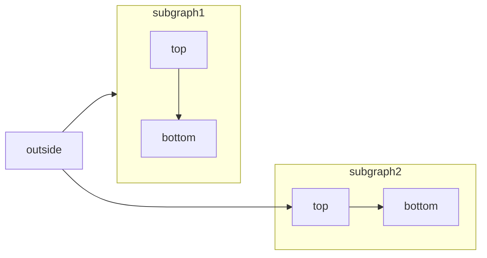
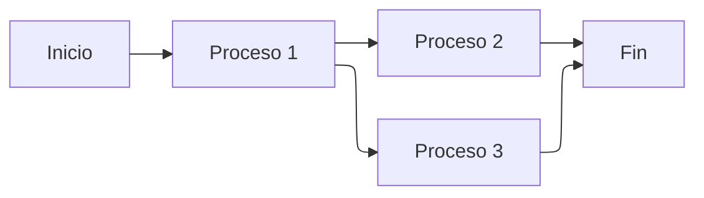
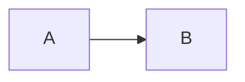

[Mermaid](https://mermaid.js.org/) te permite crear diagramas de flujo, diagramas de secuencia, diagramas de Gantt y otros tipos de diagramas con texto y código.

Para ver la lista completa de tipos de diagramas compatibles y su sintaxis, consulta la [documentación de Mermaid](https://mermaid.js.org/intro/).



````mdx Mermaid flowchart example

````


## Soporte para diseño ELK

Mintlify admite el motor de diseño [ELK (Eclipse Layout Kernel)](https://www.eclipse.org/elk/) para diagramas de Mermaid. ELK proporciona capacidades de diseño avanzadas que son especialmente útiles para diagramas grandes o complejos, ofreciendo una disposición optimizada que reduce la superposición y mejora la legibilidad.

Para usar el diseño ELK en tus diagramas de Mermaid, agrega la directiva `%%{init: {'flowchart': {'defaultRenderer': 'elk'}}}%%` al principio de tu diagrama:

````mdx Ejemplo de diseño ELK

````

Para obtener más información sobre los diseños ELK y las opciones de configuración, consulta la [documentación de Mermaid ELK](https://mermaid.js.org/config/setup/modules/mermaidAPI.html#elk-layout).

<div id="interactive-controls">
  ## Controles interactivos
</div>

Todos los diagramas de Mermaid incluyen controles interactivos de zoom y desplazamiento. De forma predeterminada, los controles aparecen cuando la height del diagrama supera los 120px.

- **Acercar/alejar**: Usa los botones de zoom para aumentar o disminuir la escala del diagrama.
- **Desplazar**: Usa las flechas direccionales para moverte por el diagrama.
- **Restablecer vista**: Haz clic en el botón de restablecer para volver a la vista original.

Los controles son especialmente útiles para diagramas grandes o complejos que no caben por completo en el área visible.

<div id="properties">
  ## Propiedades
</div>

<ResponseField name="actions" type="boolean">
  Muestra u oculta los controles interactivos. Cuando está configurada, esta propiedad anula el comportamiento predeterminado (controles visibles cuando el height del diagrama supera los 120 px).
</ResponseField>

<ResponseField name="placement" type="string" default="bottom-right">
  Posición de los controles interactivos. Opciones: `top-left`, `top-right`, `bottom-left`, `bottom-right`.
</ResponseField>

<div id="examples">
  ### Ejemplos
</div>

Ocultar los controles de un diagrama:

````mdx

````

Mostrar controles en la esquina superior izquierda:

````mdx

````

Combina las dos propiedades:

````mdx

````


<div id="syntax">
  ## Sintaxis
</div>

Para crear un diagrama de Mermaid, escribe la definición del diagrama dentro de un bloque de código de Mermaid.

````mdx
```mermaid
// Tu código de diagrama mermaid aquí
```
````
