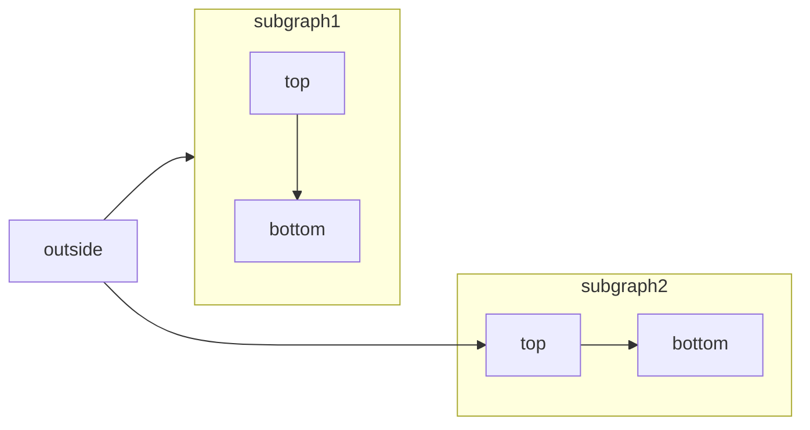

[Mermaid](https://mermaid.js.org/) te permite crear diagramas de flujo, diagramas de secuencia, diagramas de Gantt y otros tipos de diagramas con texto y código.

Para ver la lista completa de tipos de diagramas compatibles y su sintaxis, consulta la [documentación de Mermaid](https://mermaid.js.org/intro/).



````mdx Mermaid flowchart example

````


<div id="interactive-controls">
  ## Controles interactivos
</div>

Todos los diagramas de Mermaid incluyen controles interactivos de zoom y desplazamiento que aparecen en la esquina inferior derecha del diagrama.

- **Acercar/alejar**: Usa los botones de zoom para aumentar o disminuir la escala del diagrama.
- **Desplazar**: Usa las flechas direccionales para moverte por el diagrama.
- **Restablecer vista**: Haz clic en el botón de restablecer para volver a la vista original.

Los controles son especialmente útiles para diagramas grandes o complejos que no caben por completo en el área visible.

<div id="syntax">
  ## Sintaxis
</div>

Para crear un diagrama de Mermaid, escribe la definición del diagrama dentro de un bloque de código de Mermaid.

````mdx
```mermaid
// Tu código de diagrama mermaid aquí
```
````
