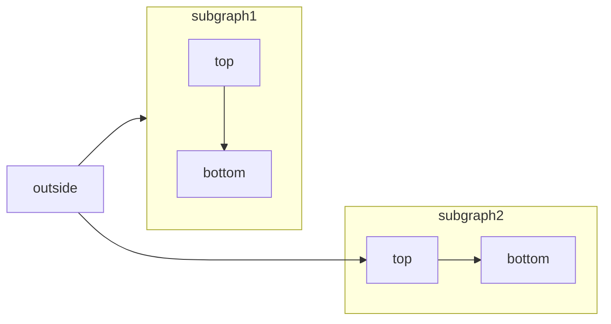

[Mermaid](https://mermaid.js.org/) te permite crear diagramas de flujo, de secuencia, de Gantt y otros diagramas usando texto y código.

Para ver la lista completa de tipos de diagramas admitidos y su sintaxis, consulta la [documentación de Mermaid](https://mermaid.js.org/intro/).



````mdx Ejemplo de diagrama de flujo en Mermaid

````


<div id="syntax">
  ## Sintaxis
</div>

Para crear un diagrama de Mermaid, escribe la definición del diagrama dentro de un bloque de código de Mermaid.

````mdx
```mermaid
// Coloca aquí el código de tu diagrama de Mermaid
```
````
